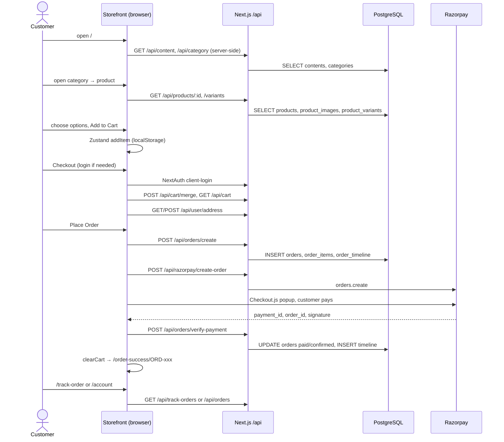
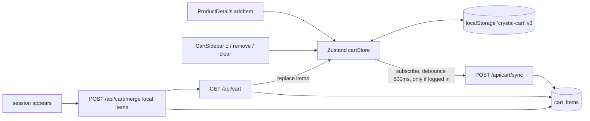
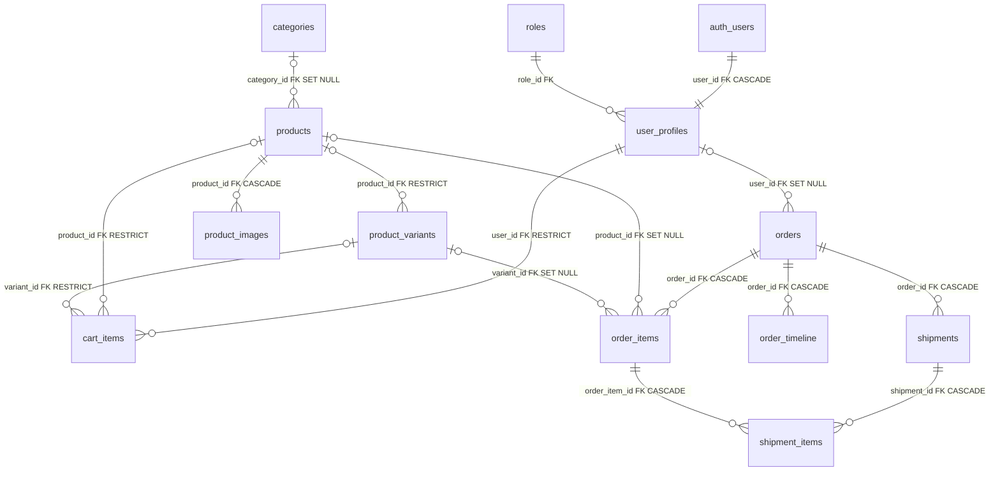

# Crystal Wall Art — Deep Project Analysis

> Second-pass handover analysis using **source code + the provided `.env`**.
> Date: 2026-09-26 · Branch: `main` @ `91404fb` · Companion to `PROJECT_ANALYSIS.md` (first pass).
>
> **Method & honesty notes**
> - Everything here comes from reading the repository, Git (read-only), the variable *names / shapes* in `.env`, and **read-only PostgreSQL catalog queries**. **No secret value is reproduced in this document.**
> - The application was **not run**, no packages were installed, no code/config/`.env`/database data was changed.
> - **Revision 2 (2026-09-26, gap-closing pass):** with explicit approval, the live schema was introspected as `app_reader` inside `BEGIN TRANSACTION READ ONLY … ROLLBACK`, using only catalog views (`information_schema`, `pg_class`, `pg_constraint`, `pg_indexes`, `pg_trigger`, `pg_proc`, `pg_enum`, `pg_policies`, ACLs). The only application table read was `roles (id, name)` — two non-personal rows — to verify role names. No customer/order data was read. Both `globals.css` files, all admin layout components, dialogs/animations and the `feature/firebase-auth` diff were read in this revision.
> - Several first-pass conclusions were **corrected by the live database** (role name `customer`, DB triggers that advance order status, reader-role write grants). Corrections are flagged with **⟲ Corrected**.
> - Confidence labels for every major finding are in the final section, **Analysis Confidence**.
> - Anything that cannot be known is stated as **"Cannot be determined from the repository."**

---

## Contents

1. Project Identity · 2. Architecture · 3. Folder Structure · 4. Routes · 5. Customer Workflow · 6. Admin Workflow · 7. Product System · 8. Cart System · 9. Checkout · 10. Payment · 11. Database Architecture · 12. Database Workflows · 13. Authentication · 14. API Reference · 15. UI/UX · 16. Colour Theme · 17. Typography · 18. Responsiveness · 19. Image System · 20. Performance · 21. Code Organisation · 22. Security · 23. Environment Configuration · 24. Third-Party Services · 25. Error Handling · 26. Deployment · 27. Git/Branches · 28. Current State · 29. Development Map · 30. Workflow Diagrams · 31. New Developer Explanation · 32. Takeover Summary

---

## 1. Project Identity

| Aspect | Evidence-based answer | Source |
|---|---|---|
| Brand | **Crystal Wall Art** ("CRYSTAL / WALL ART" wordmark; logo `public/logo/logo.svg`, `logo2.svg`) | `components/common/Header.tsx`, layouts' metadata |
| Legal entity | "A Brand of **Crystal Glass Art**" — refunds, shipping, service handled by Crystal Glass Art | `app/(client)/privacy-policies`, `refund-policy`, `shipping-policy` pages |
| What it sells | Premium **personalised wall décor**: Acrylic UV Prints, Wall Art, Canvas Prints, Spiritual Artwork, Photo Restoration Services | `app/(client)/terms-and-conditions/page.tsx`, `about/page.tsx` |
| Product configuration | Each product can offer **Size (inch)**, **Thickness**, **Mounting Method**, **Orientation** (`portrait`/`landscape`/`square`) | `schema/product.schema.ts`, `components/ProductDetails/ProductOptions/index.tsx` |
| Personalisation | The policies describe customer-uploaded photos (`/photo-upload-policy`), but **no customer photo-upload or text-personalisation feature exists in the code**. "Personalisation" today = choosing options on a catalogue product. | code search: no customer upload component/API |
| Market | India (INR, Razorpay, Indian pincode/phone validation). Shipping text: Kerala 3–8 days, India 3–12, International 7–25 business days | `schema/checkout.schema.ts`, `shipping-policy` |
| Main purpose | Online catalogue + checkout with online payment, plus an internal admin to manage catalogue, homepage banners and order fulfilment (shipments, labels) | whole codebase |

**Customer features:** home page (hero carousel from CMS, category tiles, marketing sections), category listing, product page with option chips & variant pricing, cart drawer, email/password account, saved addresses, checkout with Razorpay, order success, account page (profile, password, order history), order detail with timeline, public order tracking by order number, legal/policy pages.

**Admin features:** admin login, product CRUD (multi-image, variants, status toggle), category CRUD with image, content/banner CRUD, order list with filters/search, order detail with items/timeline, multi-shipment creation per order, shipment status updates, printable barcode shipping labels (A4/A6).

---

## 2. Complete Project Architecture

### 2.1 Classification

**A server-rendered-capable, client-heavy, hybrid modular monolith.**

- **Monolith:** one Next.js app, one `package.json`, one deploy unit; storefront, admin and API share code and process.
- **Modular:** code is layered by concern — `lib/api` (HTTP framework), `lib/db/{queries,repositories,dto}` (data), `schema/` (validation), `components/Admin` vs storefront components, route groups `(client)` / `(admin)`.
- **Hybrid rendering:** some Server Components fetch data on the server (home `HeroSection`, `CategoriesSection`, product page, products page, admin content/product-detail pages, `AdminLayout` session check), but most interactive screens are Client Components that fetch `/api/*` in `useEffect` (product list, product options/variants, cart, checkout, account, order detail, all admin listings/forms).
- **Not** a separate frontend/backend: the "backend" is Next.js Route Handlers under `app/api`, called over HTTP from the same origin (and, unusually, from Server Components via `NEXT_PUBLIC_URL`).

### 2.2 Layers

| Layer | Implementation | Files |
|---|---|---|
| Framework / runtime | Next.js 16.1.6 App Router, React 19.2, Node.js (Node runtime; no `edge` runtime declared) | `package.json`, `next.config.ts` |
| Frontend | Route group `app/(client)` with its own root `<html>` layout; `LayoutContext` provides header/footer/cart | `app/(client)/layout.tsx`, `components/common/**` |
| Admin | Route group `app/(admin)/admin` with its own root layout; server `AdminLayout` + shadcn `Sidebar` | `app/(admin)/layout.tsx`, `components/Admin/**` |
| API | Route Handlers wrapped by `withHandler` (CORS → rate limit → auth → handler → error mapping) | `app/api/**`, `lib/api/*` |
| Data | `pg` pools (reader/writer), raw SQL strings, repositories, DTO mappers | `lib/db.ts`, `lib/db/**` |
| Auth | NextAuth v4 Credentials + JWT; `middleware.ts` page guard; `getToken` API guard | `app/api/auth/[...nextauth]/route.ts`, `middleware.ts`, `lib/api/auth.ts` |
| Storage | Cloudinary (server-side SDK) | `lib/cloudinary.service.ts` |
| Payment | Razorpay Orders API (server) + Checkout.js (browser) | `lib/payment.service.ts`, `app/api/razorpay/**`, `app/api/orders/verify-payment` |
| State | Zustand cart (localStorage) + DB sync hook; React context for layout and admin loader | `store/cartStore.ts`, `hooks/useCartSync.ts`, `providers/loading-provider.tsx` |
| Validation | Zod (client forms + some APIs), hand-written sanitizers | `schema/*`, `lib/validation.ts` |
| Middleware | `next-auth/middleware` `withAuth` with custom redirects | `middleware.ts` |
| Shared utils | `cn()`, image helpers, constants | `lib/utils.ts`, `lib/utils/imageUtils.ts`, `lib/constants/*` |

### 2.3 Architecture diagram (confirmed relationships only)

```mermaid
flowchart TD
    B[Browser] --> N[Next.js 16 process]
    subgraph N[Next.js 16 app]
      MW[middleware.ts<br/>JWT page guard]
      CUI[Client UI<br/>app/(client) + components]
      AUI[Admin UI<br/>app/(admin)/admin + components/Admin]
      SC[Server Components<br/>Hero, Categories, product page, AdminLayout]
      API[Route Handlers app/api/**<br/>withHandler: CORS · rate limit · auth]
      NA[NextAuth /api/auth/*]
      DAL[lib/db: queries → repositories → dto]
    end
    B --> MW
    MW --> CUI
    MW --> AUI
    CUI -- fetch /api --> API
    AUI -- fetch /api/admin --> API
    SC -- fetch NEXT_PUBLIC_URL/api --> API
    CUI -- signIn/useSession --> NA
    AUI -- signIn --> NA
    NA --> DAL
    API --> DAL
    DAL -- readPool app_reader --> PG[(DigitalOcean PostgreSQL)]
    DAL -- writePool app_writer --> PG
    API -- upload/destroy --> CL[Cloudinary]
    API -- orders.create --> RZ[Razorpay API]
    CUI -- checkout.js popup --> RZ
```

---

## 3. Complete Folder Structure

```text
crystal-wall-art/
├── app/
│   ├── (client)/                 # Storefront route group (own root layout)
│   │   ├── layout.tsx            # <html>, Razorpay script, SessionProvider, LayoutContext
│   │   ├── globals.css           # storefront @theme tokens (light), scrollbar, pulse-scale loader (§16)
│   │   ├── page.tsx              # Home
│   │   ├── products/  product/[id]/  checkout/  order/[slug]/  order-success/[slug]/
│   │   ├── track-order/  account/  auth/login/
│   │   ├── about/ privacy-policies/ terms-and-conditions/ refund-policy/ shipping-policy/ photo-upload-policy/
│   │   ├── error.tsx  not-found.tsx  loading.tsx  favicon.ico
│   ├── (admin)/                  # Admin route group (own root layout)
│   │   ├── layout.tsx            # <html>, local fonts, Toaster, SessionProvider, AdminLayout, NetworkAlert
│   │   ├── globals.css           # admin dark HSL theme, sidebar tokens, admin-spinner (§16)
│   │   └── admin/ login/ products/ products/new/ products/[id]/ categories/ content/ orders/ orders/[slug]/ loading.tsx
│   └── api/                      # Backend (Route Handlers) — see §14
│       ├── auth/ [...nextauth]/ signup/ forgot-password/
│       ├── admin/ category/ content/ product/ orders/
│       ├── cart/ category/ content/ products/ orders/ razorpay/ track-orders/ user/ health/
│       └── coudinary/ (sic) upload/ delete/
├── components/
│   ├── Admin/                    # Admin UI: layout, sidebar, forms, tables, orders, shipments, labels, inputs
│   ├── Checkout/                 # Checkout page pieces
│   ├── ProductDetails/           # Product page pieces (gallery, info, options, size chart)
│   ├── ProductList/  Card/  skeletons/
│   ├── homePage/                 # Home sections
│   ├── common/                   # Header, Footer, MobileDrawerMenus, PageHeader, LayoutContext, BackHeader
│   ├── inputs/                   # Storefront input widgets (chips, radio, rating, color)
│   ├── ui/                       # shadcn/Radix primitives + Typography + Embla carousel
│   ├── AuthForm.tsx  CartSidebar.tsx  UserAccountProfile.tsx  OrderDetails/  Container/
├── lib/
│   ├── api/                      # handler.ts, auth.ts, errors.ts, rateLimit.ts, response.ts, security.ts
│   ├── db.ts                     # pg pools + helpers
│   ├── db/queries/{admin,public,user}/   # SQL strings
│   ├── db/repositories/{admin,public,user}/  # SQL execution
│   ├── db/dto/                   # row → response mappers
│   ├── db/content.db.ts          # legacy content functions (public /api/content)
│   ├── cloudinary.service.ts  payment.service.ts  razorpay.ts
│   ├── hash.ts  validation.ts  session.ts(unused)  auth.ts(dead)  utils.ts  utils/imageUtils.ts
│   └── constants/content.constants.ts
├── hooks/        # useCartSync, useCloudinaryUpload/Delete (unused), use-mobile, useNavbarHeight, useNetworkStatus
├── store/        # cartStore.ts (Zustand)
├── schema/       # zod: address, category, checkout, content, product
├── types/        # domain types, next-auth augmentation, razorpay window typings
├── providers/    # loading-provider.tsx (admin global spinner)
├── config/       # steps.ts (unused)
├── public/       # fonts (Geist, Inter, Poppins), logos, demo images (categories, products, images, frames)
├── middleware.ts  next.config.ts  tsconfig.json  eslint.config.mjs  postcss.config.mjs  components.json
├── package.json  package-lock.json  yarn.lock  README.md  .gitignore
├── .env                          # present locally, git-ignored (.env*)
└── PROJECT_ANALYSIS.md  DEEP_PROJECT_ANALYSIS.md   # documentation
```

Dependency directions (who uses what):

| Directory | Used by | Depends on |
|---|---|---|
| `app/api` | Client UI, Admin UI, Server Components | `lib/api`, `lib/db/repositories`, `lib/db.ts`, `lib/cloudinary.service`, `schema`, `razorpay` SDK |
| `lib/db/repositories` | API routes, NextAuth | `lib/db/queries`, `lib/db/dto`, `lib/db.ts` |
| `lib/api` | All `withHandler` routes | `next-auth/jwt` |
| `components/Admin` | Admin pages | `components/ui`, `schema`, `providers`, `hooks` |
| storefront `components` | Client pages | `components/ui`, `store`, `lib/payment.service`, `hooks` |
| `store/cartStore` | Header, CartSidebar, ProductDetails, Checkout, `useCartSync`, `payment.service` | zustand |
| `schema/` | Admin forms, checkout, admin APIs (category/content) | zod |
| `types/` | Everything | — |
| `middleware.ts` | Every matched request | `NEXTAUTH_SECRET` |

---

## 4. Route / Page Analysis

### 4.1 Customer routes

| Route | Type | Page / component | Auth | API calls | Displays / interactions |
|---|---|---|---|---|---|
| `/` | static path, server, `force-dynamic` | `app/(client)/page.tsx` → Hero, About, Categories, PremiumPhotos, ShopLook×2, Frames3DSlider | Public — middleware redirects a logged-in **admin** → `/admin` (404). Customers (role `customer`) are not redirected. | `GET /api/content?type=hero_section`, `GET /api/category` (server-side) | Carousel, category tiles → `/products?category=id` |
| `/products?category=<uuid>` | query-param driven | `products/page.tsx` → `ProductList` | Public | `GET /api/category/<id>` (server), `GET /api/products/<id>/category` (client) | Grid of product cards; blank page if category missing/invalid |
| `/product/[id]` | **dynamic** | `product/[id]/page.tsx` → `ProductDetails` | Public | `GET /api/products/<id>` (server), `GET /api/products/<id>/variants` | Gallery, price, option chips, size chart, Add to Cart |
| `/checkout` | static | `checkout/page.tsx` → `components/Checkout` | **Protected** (server `getServerSession` → `/auth/login`) | `GET/POST /api/user/address`, then payment flow APIs | Address, email, summary, payment method, Place Order |
| `/order-success/[slug]` | dynamic | `order-success/[slug]/page.tsx` | Public | none | Static success message with slug (order number after Razorpay) |
| `/order/[slug]` | dynamic (slug = order **id**) | `components/OrderDetails` | Public (no guard) | `GET /api/orders/<id>`, `/itemsData`, `/timelineData` | Order info, items, timeline |
| `/track-order` | static | `track-order/page.tsx` | Public | `GET /api/track-orders?orderNumber=` | Status stepper, items; button → `/order/<id>` |
| `/account` | static | `components/UserAccountProfile` | Client-side redirect if unauthenticated (not in middleware matcher) | `GET /api/orders`, `PATCH /api/user/account/profile`, `PATCH /api/user/account/password` | Profile, orders, edit dialogs, logout |
| `/about`, `/privacy-policies`, `/terms-and-conditions`, `/refund-policy`, `/shipping-policy`, `/photo-upload-policy` | static | respective pages | Public | none | Hard-coded content |

### 4.2 Authentication routes

| Route | Purpose | Notes |
|---|---|---|
| `/auth/login` | Customer login / signup / forgot password (one form, 3 modes) | After success → `router.push('/')`; home renders normally for role `customer` |
| `/admin/login` | Admin login | After success → `/admin/products`. If already admin, middleware → `/admin` (404) |
| `/api/auth/*` | NextAuth endpoints (signin, callback, session, csrf, signout) | Credentials providers `admin-login`, `client-login` |

### 4.3 Admin routes (all protected by middleware: role `admin`)

| Route | Component | APIs |
|---|---|---|
| `/admin` | **missing page → 404** | — |
| `/admin/products` | `ProductPage` | `GET /api/admin/product`, `GET /api/admin/category`, `PATCH /api/admin/product/[id]` |
| `/admin/products/new` (`?id=` for edit) | `AddProducts/ProductStepperForm` | `POST` / `PUT /api/admin/product[/id]`, `GET /api/admin/category`, `GET /api/admin/product/[id]` |
| `/admin/products/[id]` (dynamic) | `ProductPage/ProductDetails` | `GET /api/admin/product/[id]` (server, cookie forwarded) |
| `/admin/categories` | `CategoryPage` | `/api/admin/category` (GET/POST), `/api/admin/category/[id]` (PUT/PATCH/DELETE) |
| `/admin/content` | `ContentPage` | `/api/admin/content` (GET server-side, POST), `/api/admin/content/[id]` |
| `/admin/orders` | `OrderManagement` | `GET /api/admin/orders` |
| `/admin/orders/[slug]` (dynamic, slug = order id) | `OrderManagementDetails` | `/api/admin/orders?id=`, `/[id]/items`, `/[id]/shipments`, `/[id]/timeline`, `/[id]/shipment-items` |

### 4.4 Redirects & broken routes

| Source | Target | Status |
|---|---|---|
| middleware: `/` with role `user` | `/profile` | Target page missing — **⟲ Corrected: never triggers**, because the live `roles` table has `admin` and `customer` (no `user`). Customers are never redirected by `isUser()`; middleware's `/login` and `/profile` user branches are dead code. |
| middleware: `/` or `/admin/login` with role `admin` | `/admin` | **Broken — no page** |
| middleware: `/profile/*` unauthenticated | `/login` | Broken — no page (and `/profile` itself doesn't exist) |
| NextAuth `pages.signIn` | `/login` | Broken — real page is `/auth/login` |
| middleware: `/admin/*` without admin role | `/admin/login` | Works |
| `/checkout` without session | `/auth/login` | Works |
| Mobile drawer "Shop" | `/products` (no category) | Renders blank (fetches `/api/category/undefined`) |
| Header heart icon, product gallery heart, "Shop Now" buttons, cart coupon "Apply" | — | No action attached |

---

## 5. Complete Customer Workflow

| Step | Frontend | API | DB tables | State | Auth | External |
|---|---|---|---|---|---|---|
| 1. Landing / Home | `app/(client)/page.tsx`, `homePage/*` | `GET /api/content?type=hero_section`, `GET /api/category` | `contents`, `categories` | none | none (middleware redirect quirk) | Cloudinary image URLs |
| 2. Category | `products/page.tsx`, `ProductList` | `GET /api/category/[id]`, `GET /api/products/[id]/category` | `categories`, `products` | local component state | none | Cloudinary |
| 3. Product | `ProductDetails/*` | `GET /api/products/[id]`, `GET /api/products/[id]/variants` | `products`, `product_images`, `product_variants` | local state (selected chips, variants) | none | Cloudinary |
| 4. Variant / options | `ProductOptions`, `OptionSelector`, `SizeChart` | — | — | `useMemo` price calc | none | — |
| 5. Add to cart | `ProductDetails#handleAddToCart` | — (guest) / `POST /api/cart/sync` after 800 ms (logged in) | `cart_items` | Zustand `items`, localStorage `crystal-cart` | optional | — |
| 6. Cart | `CartSidebar` | sync as above | `cart_items` | Zustand | optional | — |
| 7. Login / Register | `AuthForm` | `POST /api/auth/signup`, NextAuth `client-login`; then `POST /api/cart/merge`, `GET /api/cart` | `auth_users`, `user_profiles`, `roles`, `cart_items` | session (JWT cookie) + cart replaced with DB cart | creates session | — |
| 8. Address | `DeliveryAddressSection`, `DeliveryAddressForm` | `GET/POST /api/user/address` | `saved_addresses` | checkout form state | user | — |
| 9. Checkout | `CheckoutPage`, `PaymentSummaryCard`, `PaymentMethod` | — | — | form state, zod `checkoutSchema` | user (server guard) | — |
| 10. Order creation | `lib/payment.service#handleRazorpaySubmit` | `POST /api/orders/create` | `orders`, `order_items`, `order_timeline` | — | user | — |
| 11. Payment | same | `POST /api/razorpay/create-order`; Checkout.js popup | — | — | user | **Razorpay** |
| 12. Verification | handler callback | `POST /api/orders/verify-payment` | `orders`, `order_timeline` | cart cleared (Zustand → sync deletes DB cart) | user | — |
| 13. Confirmation | `/order-success/<orderNumber>` | — | — | — | — | — |
| 14. Tracking | `/track-order` | `GET /api/track-orders` | `orders`, `order_items` | — | public | — |
| 15. Account / history | `UserAccountProfile`, `/order/<id>` | `GET /api/orders`, `/api/orders/[id]*` | `orders`, `order_items`, `order_timeline` | — | user (list) / public (detail) | — |



---

## 6. Complete Admin Workflow

```text
/admin/login → signIn('admin-login') → JWT {role:{name:'admin'}} → middleware allows /admin/*
  → Products → Categories → Content/Banners → Orders → Shipments → Barcode labels
```

| Module | UI | API | DB | Auth / role check | Important actions | Images | Validation |
|---|---|---|---|---|---|---|---|
| Login | `Admin/LoginForm.tsx` | NextAuth `admin-login` | `auth_users`, `user_profiles`, `roles` | Provider does **not** check role; middleware + API check `role.name==='admin'` | login, redirect `/admin/products` | — | email format, password 8–72 |
| Authorization | `middleware.ts`, `AdminLayout.tsx` (server session), `lib/api/auth.ts#requireAdmin` | — | — | JWT role | Non-admins redirected to `/admin/login`; admin APIs 403 | — | — |
| Products | `ProductPage/*`, `AddProducts/ProductStepperForm.tsx` (835 lines), `ProductPage/ProductDetails.tsx` | `/api/admin/product`, `/api/admin/product/[id]` | `products`, `product_images`, `product_variants`, `categories` | `access:'admin'` | list/filter/search/paginate, create, edit (replace images & variants), toggle active | browser → base64 → server → Cloudinary `product_images`; removed images destroyed | Client: zod `productSchema` (title 2–120, price>0, discount<price, stock int ≥0, ≥1 image, orientation enum, status enum). Server: only required-field presence |
| Categories | `CategoryPage/*` | `/api/admin/category`, `/[id]` | `categories` | `access:'admin'` | create (image required), edit, toggle, soft delete | multipart → Cloudinary `categories` | zod `categoryApiSchema` (title ≤100, desc ≤500, priority 0–999), 5 MB, jpeg/png/webp, duplicate title check |
| Content / Banners | `ContentPage/*` | `/api/admin/content`, `/[id]` | `contents` | GET/POST admin; **PUT/PATCH/DELETE `[id]` have no access option → public** | create, edit (+remove image), toggle, soft delete | multipart → Cloudinary (folder from form) | zod `contentApiSchema` (type enum, title required, priority 0–999), 5 MB, jpeg/png/webp |
| Orders | `OrderManagement/*`, `OrderManagementDetails/*` | `/api/admin/orders`, `/[id]/items`, `/[id]/timeline` | `orders`, `order_items`, `order_timeline` | admin | filter by status/payment, search name/email/phone/order no., view detail | — | query params bounded (limit ≤100) |
| Shipments | `OrderedItemsDetails/Shipments.tsx` | `/api/admin/orders/[id]/shipments` (GET/POST/PATCH/DELETE), `/shipment-items` | `shipments`, `shipment_items` | admin | create shipment with selected item quantities, courier, tracking; update status; delete. **⟲ Corrected:** the live DB has triggers `trg_sync_order_from_shipment` / `trg_sync_order_from_shipment_items` (function `sync_order_status_from_shipments`, SECURITY DEFINER) that set `orders.status` to `partially_shipped` / `shipped` / `delivered` from shipment quantities (see §11.5) | — | UI limits to remaining qty; server doesn't; DB enforces `shipment_items.quantity > 0` and `UNIQUE (shipment_id, order_item_id)` |
| Labels | `Admin/ShippingLabel.tsx` | — | — | — | print A4/A6 labels in new window, Code128 barcode of tracking ID via `jsbarcode` | — | HTML-escaped values |

**Missing admin functionality:** dashboard (`/admin`), manual order status change / cancel / refund (status only moves automatically via DB shipment triggers), customer & user management, admin user creation, coupons/discount management, inventory/stock views, reports, settings, shipping/tax configuration, product delete (flag exists, no endpoint), audit log, notifications/emails.

---

## 7. Product System

### 7.1 Model (from SQL in code)

| Entity | Fields | Notes |
|---|---|---|
| `products` | id, title, description, price, discount_price, stock_quantity, category_id, status (`draft`/`active`/`inactive`), sizes (text[]), thickness (text[]), mounting_methods (text[]), orientations (text[]), thumbnail, deleted, created_at, updated_at | Option arrays are free-text tags entered in admin |
| `product_variants` | id, product_id, size, thickness, price, discount_price, orientation, stock_quantity, created_at, updated_at | Price overrides per size × thickness (orientation stored but not used in lookup) |
| `product_images` | id, product_id, image_url (JSON string `{url, public_id}`) | gallery |
| `categories` | id, title, description, image_url, priority, is_active, deleted | one category per product |

### 7.2 Lifecycle

```text
Admin creates product (ProductStepperForm)
  step "details": title, category, description, price, discount, stock, sizes[], thickness[], mounting_methods[], orientation[], status
  step "images": upload files (blob preview) → pick thumbnail
  variants editor: rows {size, thickness, price, discount_price, orientation, stock_quantity}
  submit → images/thumbnail converted to base64 → POST /api/admin/product {product_details, product_variants}
↓ stored
  Cloudinary upload each base64 image (folder product_images)
  TX: INSERT products (thumbnail = first/selected image object) → INSERT product_images → INSERT product_variants
↓ storefront retrieves
  /api/products/[id]/category (list: status='active' AND deleted=false)
  /api/products/[id]      (detail + images url extracted in SQL)
  /api/products/[id]/variants
↓ customer selects
  chips from product arrays; variant = match(size, thickness) case-insensitive
  effective price = (variant.discount_price ?? product.discount_price) ?? (variant.price ?? product.price)
↓ enters cart
  CartItem {product_id, title, image(thumbnail url), size, thickness, mounting_method, orientation, price, quantity, variant_id}
↓ becomes order item
  order_items {order_id, product_id, variant_id, product_title "Title - size / thickness", product_image, quantity, unit_price=cart price, total_price, options JSON{size,thickness,mounting_method,orientation}}
```

| Topic | Behaviour |
|---|---|
| Visibility | `status='active' AND deleted=false`. Category active flag is not checked on product detail. |
| Status | Admin toggle writes `active`/`inactive`; `draft` only via form. |
| Ordering | Storefront list: no `ORDER BY` in `productsByCategoryId` (DB order). Admin: `created_at DESC`. |
| Search/filter | Admin only (title/description LIKE, category, status). Storefront: none. |
| Stock | Stored on product & variant; **never checked or decremented**. Public variant query doesn't return stock. |
| Personalisation | Only option selection; no custom image/text input. |
| Unused option UI | `FrameSelector`, `FrameColorSelector` (placeholder colours `#ff0000/#00ff00/#0000ff`) are commented out. |

---

## 8. Cart System



| Aspect | Implementation |
|---|---|
| Store | `store/cartStore.ts` — `items`, `isOpen`, `addItem`, `updateQuantity(key)`, `removeItem(key)`, `clearCart`, `getTotal`, `getItemCount`, `getItemKey` |
| Line identity | key = `product_id|size|thickness|mounting_method|orientation|variant_id` |
| Guest cart | localStorage only |
| Authenticated cart | `useCartSync` (mounted in `LayoutContext`): on login merge local→DB then load DB→local; on every change debounce-sync whole cart |
| Persistence | `persist` middleware, `version: 3`, `migrate` + custom `merge` dedupe on hydration |
| Quantity | `updateQuantity` ≤0 removes; no max, no stock check |
| Price | `getTotal = Σ price × quantity` using price stored in the item |
| Variant handling | `variant_id` kept in local item and written to `cart_items.variant_id`; **`GET /api/cart` does not return `variant_id` and returns `products.price`** → after login the cart price becomes the base product price, not the variant/discounted price |
| Personalised items | none; `orders/create` treats `product_id` starting with `custom-` as null — a placeholder for future custom items |
| Unused endpoints | `/api/cart/update`, `/change`, `/delete`, `/clear` run writes through the **reader** pool. **⟲ Corrected:** the live DB grants `app_reader` `SELECT, INSERT, UPDATE, DELETE, TRUNCATE, TRIGGER, REFERENCES, MAINTAIN` on `cart_items` (despite the `.env` comment calling it read-only), so these writes would succeed. The unused `CartUserQueries.upsert` would fail: its `ON CONFLICT (user_id, product_id, size, thickness, mounting_method, orientation)` has **no matching unique constraint** (live PK is `(id, user_id)`). |
| DB columns not used by code | live `cart_items.price integer NOT NULL DEFAULT 0` exists but is never written or read (always 0) |
| DB constraints | `cart_items.size NOT NULL` → a product without sizes stores `''` (store default); FKs `user_id → user_profiles`, `product_id → products` and `variant_id → product_variants` are all **ON DELETE RESTRICT** |
| Header badge | `getItemCount()` |
| Clear after payment | `useCartStore.getState().clearCart()` → sync deletes DB rows |

---

## 9. Checkout System

| Area | Implementation |
|---|---|
| Guard | `app/(client)/checkout/page.tsx` server `getServerSession()` → `/auth/login` |
| Empty cart | `components/Checkout/index.tsx` checks a **hard-coded `items = [{}]`** → the "cart empty" state never shows; `handleRazorpaySubmit` blocks empty carts instead |
| Address | Saved addresses list + add-new form (`addressSchema`: type Home/Work/Other, name, phone `^[6-9]\d{9}$` optional, address ≥5, city, state, pincode 6 digits). Selected address merged into form. |
| Contact | email (zod email) |
| Validation | `checkoutSchema` (all address fields required incl. phone, email, paymentMethod) |
| Payment selection | Razorpay only (COD UI commented out) |
| Shipping | Display only: `subtotal > 999 ? 0 : 99` in `PaymentSummaryCard` |
| Tax | 0 |
| Discounts / coupons | none (only product discount prices baked into cart price) |

**Calculation actually implemented**

```text
Displayed (PaymentSummaryCard):
  Subtotal = Σ(item.price × qty)
  Shipping = subtotal > 999 ? 0 : 99            (displayed only)
  Total    = Subtotal                            (shipping NOT added)

Sent to /api/orders/create (Razorpay path):
  subtotal = Σ(item.price × qty)
  tax = 0, shipping = 0
  total = subtotal

Charged by Razorpay:
  amount_paise = Math.round(total) × 100         (paise truncated to whole rupees)

COD path (hidden): total = 0
```

---

## 10. Payment Architecture

| Item | Detail |
|---|---|
| Configuration | `RAZORPAY_KEY_ID` (present; **test mode** key prefix `rzp_test_`), `RAZORPAY_KEY_SECRET` (present, masked). Instantiated per request in `app/api/razorpay/create-order/route.ts`. |
| Script | `https://checkout.razorpay.com/v1/checkout.js` in client layout (`beforeInteractive`) + lazy loader `lib/razorpay.ts` |
| Order creation (app) | `POST /api/orders/create` → DB order `pending/pending` |
| Order creation (Razorpay) | `POST /api/razorpay/create-order` → `orders.create({amount: round(total)*100, currency INR, receipt: orderNumber, notes: {order_id, customer_email}})` → returns `{order, key_id}` |
| Checkout | `new Razorpay({ key, amount, currency, order_id, one_click_checkout: true, show_coupons: false, prefill, theme #14b8a6 })` |
| Callback | `handler(response)` in browser; normalises Magic Checkout shipping/billing address |
| Signature verification | server: `HMAC_SHA256(razorpay_order_id + "|" + razorpay_payment_id, KEY_SECRET) === razorpay_signature` (plain `!==` comparison) |
| Order update | `orders.payment_status='paid', status='confirmed'`, stores Razorpay ids and addresses; timeline `confirmed` |
| Failure | `payment.failed` → toast; `ondismiss` → toast; DB order remains `pending` |
| Webhooks | none |
| Refunds | none |

```text
Browser ──POST /api/orders/create──▶ Next.js ──INSERT──▶ PostgreSQL
Browser ──POST /api/razorpay/create-order──▶ Next.js ──orders.create──▶ Razorpay
Browser ◀──── Checkout.js popup (payment) ────▶ Razorpay
Browser (handler) ──POST /api/orders/verify-payment──▶ Next.js ──HMAC check──▶ UPDATE orders ──▶ PostgreSQL
```

**Security limitations (not fixed):** client-supplied amount; verification doesn't check the Razorpay order was created for this DB order, nor amount, nor ownership (`user_id`); no idempotency; no webhook to recover browser-closed payments; signature/secret-derived values logged; non-constant-time compare (minor).

---

## 11. Database Architecture

### 11.1 Configuration (from `.env` + `lib/db.ts`)

| Setting | Value / behaviour |
|---|---|
| Engine | PostgreSQL |
| Host | **DigitalOcean Managed PostgreSQL**, Bangalore region (host pattern `db-postgresql-blr1-*****.db.ondigitalocean.com`) |
| Port | `25060` (DigitalOcean direct-connection port; the PgBouncer pool port is not used) |
| Database | `defaultdb` (DigitalOcean's default database name) |
| Reader | user `app_reader` → `readPool` (max 20). `.env` comment: *"Read-only role (used by public API routes — products, categories, search)"* |
| Writer | user `app_writer` → `writePool` (max 10). `.env` comment: *"Read-write role (used by authenticated API routes — orders, cart, users)"* |
| Pool settings | idle 30 s, connect timeout 15 s, statement/query timeout 20 s, `allowExitOnIdle`, reused via `global` when `NODE_ENV !== 'production'` |
| SSL | `DB_SSL_CERT` present (DigitalOcean project CA, multi-line PEM in quotes). Config = `{ rejectUnauthorized: false, ca }` → encrypted, **server certificate not verified** |
| Access pattern | Every query acquires a client, runs, releases. Transactions via `withTransaction` on writer. RLS helper `withUserSession` unused. |
| Environment | `NEXT_PUBLIC_URL=http://localhost:3000` + Razorpay **test** keys suggest a development `.env`; **whether this DB is also production cannot be determined** — treat it as live until the client confirms. |

**Live facts (read-only catalog, revision 2):** PostgreSQL **18.6**; single schema `public`; 15 tables; only extension `plpgsql`; all tables owned by `doadmin` (DigitalOcean admin user); **RLS disabled on every table, no policies**; `app_reader`/`app_writer` are plain roles (no superuser/createrole/createdb/bypassrls, no role memberships).

**Actual table privileges (from table ACLs):**

| Table | `app_reader` | `app_writer` |
|---|---|---|
| `auth_users` | SELECT (incl. `password_hash`) | SELECT, INSERT, UPDATE (no DELETE) |
| `user_profiles`, `roles` | SELECT | SELECT, INSERT, UPDATE (no DELETE) |
| `cart_items` | **ALL** (SELECT, INSERT, UPDATE, DELETE, TRUNCATE, TRIGGER, REFERENCES, MAINTAIN) | ALL |
| every other table | SELECT | SELECT, INSERT, UPDATE, DELETE |

Observations:
- The `.env` comment calls `app_reader` "read-only" — **false for `cart_items`**.
- `app_reader` can read `auth_users.password_hash`, `orders` (customer PII), `saved_addresses` → this is the blast radius of the SQL injection in `/api/content` (§22).
- `app_writer` can `INSERT/UPDATE` `roles` — application code never needs that.
- Total connection ceiling per app instance = 30 (20 + 10). DigitalOcean plans cap connections per cluster; plan size cannot be determined.
- Estimated row counts (planner statistics, not a data read): `auth_users` ≈ 11, `products` ≈ 9, `categories` ≈ 5, `orders` ≈ 7, `product_images` ≈ 37, `product_variants` ≈ 38, `shipments` ≈ 3, `cart_items` ≈ 3 → the DB **contains real or test data**. Whether it is production **cannot be determined**.

### 11.2 Tables — first-pass inference (kept for comparison; superseded by §11.5 live schema)

| Table | Purpose | Columns (from SQL) | PK | FKs (inferred) | Indexes / constraints | Used by |
|---|---|---|---|---|---|---|
| `auth_users` | credentials | id, email, phone, password_hash, is_active, is_email_verified, is_phone_verified, last_login_at, created_at, updated_at | id (uuid likely) | — | email uniqueness unknown (app checks before insert) | NextAuth, signup, password, profile |
| `user_profiles` | profile & role | user_id, first_name, last_name, user_name, avatar_url, role_id, metadata, created_at, updated_at | user_id? | user_id→auth_users, role_id→roles | unknown | auth, profile |
| `roles` | role names | id, name | id | — | code expects names `admin`, `user`; default role id `d45bfdd1-…` hard-coded | auth |
| `categories` | categories | id, title, description, image_url, priority, is_active, deleted, created_at, updated_at | id | — | unknown | storefront, admin |
| `products` | products | see §7 | id | category_id→categories | unknown | storefront, admin, cart join |
| `product_images` | gallery | id, product_id, image_url | id | product_id→products | unknown | product page, admin |
| `product_variants` | variant pricing | id, product_id, size, thickness, price, discount_price, orientation, stock_quantity, created_at, updated_at | id | product_id→products | unknown | product page, admin |
| `contents` | homepage CMS | id, type, title, description, link_url, image, priority, is_active, deleted, created_at, updated_at | id | — | unknown | home hero, admin |
| `cart_items` | server cart | id, user_id, product_id, variant_id, size, thickness, mounting_method, orientation, quantity, created_at, updated_at | id | user_id→auth_users, product_id→products | an (unused) `ON CONFLICT (user_id, product_id, size, thickness, mounting_method, orientation)` implies a matching unique constraint may exist | cart |
| `saved_addresses` | address book | id, user_id, type, name, phone, address, city, state, pincode, is_default | id | user_id→auth_users | unknown | checkout |
| `orders` | orders | id, order_number, user_id, customer_name, customer_email, customer_phone, shipping_address (jsonb), billing_address (jsonb), status, payment_status, subtotal, tax, shipping_cost, total, notes, payment_method, razorpay_order_id, razorpay_payment_id, created_at, updated_at | id | user_id→auth_users | order_number uniqueness unknown | checkout, account, admin, tracking |
| `order_items` | order lines | id, order_id, product_id, variant_id, product_title, product_image, size, thickness, mounting_method, orientation, quantity, unit_price, total_price, options, created_at | id | order_id→orders, product_id→products (nullable) | unknown | orders, shipments |
| `order_timeline` | status history | id, order_id, status, note, created_at | id | order_id→orders | unknown | order detail, admin |
| `shipments` | shipments | id (uuid — cast `::uuid[]`), order_id, shipment_number, courier, tracking_id, status, notes, shipped_at, delivered_at, created_at, updated_at | id | order_id→orders | unknown | admin |
| `shipment_items` | shipment lines | id, shipment_id, order_item_id, quantity, created_at | id | shipment_id→shipments, order_item_id→order_items | unknown | admin |

### 11.3 ER diagram (live foreign keys)



`saved_addresses.user_id` and `contents` have **no foreign keys** (addresses are linked to users by convention only). `orders` and `cart_items` reference `user_profiles(user_id)`, not `auth_users(id)` (same UUID value).

Most important relationships: **User → Orders → Order items → (Products snapshot)**; **Order → Shipments → Shipment items → Order items** (partial shipping, drives order status via trigger); **Category → Products → Variants/Images**.

### 11.4 Read-only queries used (revision 2)

Executed as `app_reader` inside `BEGIN TRANSACTION READ ONLY; … ROLLBACK;` (catalog only). Additional queries used `pg_trigger` + `pg_get_triggerdef`, `pg_get_functiondef`, `pg_enum`, and `aclexplode(pg_class.relacl)` because `information_schema.triggers` / `role_table_grants` only show objects the current role has non-SELECT rights on.

```sql
select table_name, column_name, data_type, udt_name, is_nullable, column_default
  from information_schema.columns where table_schema='public' order by table_name, ordinal_position;
select conrelid::regclass, conname, contype, pg_get_constraintdef(oid)
  from pg_constraint where connamespace='public'::regnamespace order by 1,3;
select tablename, indexname, indexdef from pg_indexes where schemaname='public' order by 1,2;
select event_object_table, trigger_name, action_timing, event_manipulation, action_statement from information_schema.triggers;
select proname, pg_get_function_identity_arguments(oid) from pg_proc where pronamespace='public'::regnamespace;
select tablename, policyname, cmd, roles, qual from pg_policies;
select relname, relrowsecurity from pg_class where relnamespace='public'::regnamespace and relkind='r';
select grantee, table_name, string_agg(privilege_type, ',') from information_schema.role_table_grants
  where grantee in ('app_reader','app_writer') group by 1,2 order by 1,2;
select id, name from public.roles;
```

### 11.5 Live schema — Confirmed by live database

All PKs are `uuid DEFAULT gen_random_uuid()` unless noted. `ts` = `timestamp with time zone`, `ts-notz` = `timestamp without time zone`.

| Table | Columns (type · null · default) | PK | Unique / check | Indexes (non-PK) |
|---|---|---|---|---|
| `auth_users` | id · email text null · phone text null · password_hash text **null** · is_email_verified bool=false · is_phone_verified bool=false · last_login_at ts-notz · created_at ts-notz=now() · updated_at ts-notz=now() · is_active bool=true (nullable) · **firebase_uid varchar null** | id | UNIQUE email, UNIQUE phone, UNIQUE firebase_uid | `idx_auth_users_email` (dup of unique), `idx_auth_users_phone` (dup), `idx_auth_users_firebase_uid` UNIQUE (dup) |
| `user_profiles` | user_id uuid · user_name · avatar_url · role_id uuid null · metadata jsonb · created_at/updated_at ts-notz=now() · first_name · last_name | **user_id** | — | — |
| `roles` | id · name text | id | UNIQUE name | — |
| `categories` | id · title text NN · description · **image_url text** · priority int NN=0 · is_active bool NN=true · created_at/updated_at ts NN · deleted bool NN=false | id | — | `idx_categories_priority` |
| `products` | id · title NN · description · price numeric NN=0 · discount_price numeric · stock_quantity int NN=0 · category_id uuid · status **product_status** NN='draft' · sizes/thickness/mounting_methods/orientations **text[] NN='{}'** · thumbnail text · deleted bool NN=false · created_at/updated_at ts NN | id | — | — |
| `product_images` | id · product_id NN · image_url text NN · created_at/updated_at ts | id | — | — |
| `product_variants` | id · product_id **null** · size text · thickness text · price numeric NN · discount_price numeric · stock_quantity int NN=0 · orientation text · created_at/updated_at ts | id | — | — |
| `contents` | id · type text NN · title NN · description · link_url · **image text** · priority int NN=0 · deleted NN=false · is_active NN=true · created_at/updated_at ts | id | — | — |
| `cart_items` | id · user_id NN · product_id · size text **NN** · thickness · orientation · mounting_method · **price int NN=0** · quantity int=0 · variant_id · created_at/updated_at ts | **(id, user_id)** | — | `idx_cart_items_user_id` |
| `saved_addresses` | id · user_id NN · type text NN='Home' · name NN · phone · address NN · city NN · state NN · pincode NN · is_default NN=false · created_at/updated_at ts NN | id | — | — |
| `orders` | id · order_number text NN · user_id · customer_name NN · customer_email NN · customer_phone · shipping_address jsonb · billing_address jsonb · status **order_status** NN='pending' · payment_status **payment_status** NN='pending' · subtotal/tax/shipping_cost/total numeric NN=0 · notes · razorpay_order_id · razorpay_payment_id · created_at/updated_at ts NN · payment_method text | id | **UNIQUE order_number** | `idx_orders_created_at` (DESC), `idx_orders_order_number` (dup of unique), `idx_orders_status`, `idx_orders_user_id` |
| `order_items` | id · order_id NN · product_id · variant_id · product_title NN · product_image · size · thickness · mounting_method · orientation · quantity int NN=1 · unit_price numeric NN · total_price numeric NN · created_at ts NN · options **jsonb** | id | — | `idx_order_items_order_id`, `idx_order_items_product_id` |
| `order_timeline` | id · order_id NN · status **order_status** NN · note · created_at ts NN | id | — | `idx_order_timeline_order_id` |
| `shipments` | id · order_id NN · shipment_number NN · courier · tracking_id · status **shipment_status** NN='pending' · notes · shipped_at · delivered_at · created_at/updated_at ts NN | id | — | — |
| `shipment_items` | id · shipment_id NN · order_item_id NN · quantity int NN=1 · created_at ts NN | id | UNIQUE (shipment_id, order_item_id); CHECK quantity > 0 | — |

**Enums**

| Enum | Values |
|---|---|
| `order_status` | pending, confirmed, processing, shipped, delivered, cancelled, returned, refunded, **partially_shipped** |
| `payment_status` | pending, paid, failed, refunded |
| `product_status` | **"NULL"** (a literal string label), active, inactive, draft |
| `shipment_status` | pending, packed, shipped, out_for_delivery, delivered, cancelled |

**Triggers (all enabled)**

| Trigger | Table | Function |
|---|---|---|
| `set_updated_at` BEFORE UPDATE | categories, products, product_variants, contents, cart_items, shipments, user_profiles | `update_updated_at_column()` → `NEW.updated_at = now()` |
| `set_orders_updated_at` BEFORE UPDATE | orders | same |
| `trg_sync_order_from_shipment` AFTER INSERT/UPDATE/DELETE | shipments | `sync_order_status_from_shipments()` |
| `trg_sync_order_from_shipment_items` AFTER INSERT/UPDATE/DELETE | shipment_items | same |

`sync_order_status_from_shipments()` (plpgsql, `SECURITY DEFINER`, `search_path=public`): finds the order; skips if order status is `cancelled`/`returned`; sums ordered qty, shipped qty (shipments in `shipped/out_for_delivery/delivered`) and delivered qty; then sets `orders.status` → `delivered` (all delivered) / `shipped` (all shipped) / `partially_shipped` (some shipped). It **never moves status backwards**, never sets `processing`, does not check `payment_status`, and does not write `order_timeline`.

No triggers exist on `auth_users`, `order_items`, `product_images`, `saved_addresses`, `order_timeline`, `roles` (their `updated_at` is only changed where code sets it). No stock-related triggers or functions exist.

### 11.6 Inferred from source code vs live — Differences

| # | Topic | Source code assumption | Live database | Consequence |
|---|---|---|---|---|
| D1 | Default role name | middleware `isUser` expects `'user'` | roles are **`admin`** and **`customer`** (default id `d45bfdd1-…` = `customer`) | `/`→`/profile` redirect never fires; first-pass "404 after customer login" **was wrong** |
| D2 | Order status lifecycle | no code changes status after `confirmed` | DB trigger advances to `partially_shipped/shipped/delivered` | Order status *does* progress; first-pass claim **was wrong** |
| D3 | Status names in UI | Track-order steps `pending, processing, shipping, delivered`; `OrderStatus` TS type lacks `refunded`, `partially_shipped` | enum has `shipped` (not `shipping`), `partially_shipped`, `refunded` | Track-order stepper can't match `shipped`/`partially_shipped` (index −1); badge colour for `shipping` never used |
| D4 | Reader role is read-only | `.env` comment | `app_reader` has full DML + TRUNCATE on `cart_items` | Cart writes via `readQuery` work; SQL-injection blast radius includes `cart_items` writes/truncate |
| D5 | Cart line uniqueness | unused `ON CONFLICT (user_id, product_id, size, thickness, mounting_method, orientation)` | no such unique constraint; PK `(id, user_id)` | upsert would error; duplicate cart lines possible at DB level |
| D6 | `cart_items.price` | not in code | `integer NOT NULL DEFAULT 0` | always 0; integer would truncate paise if ever used |
| D7 | Firebase | `main` has no Firebase code | `auth_users.firebase_uid` (unique) exists; `password_hash`, `email` nullable | Firebase-branch schema change **was applied** to this DB |
| D8 | Phone uniqueness | profile PATCH updates phone freely | `UNIQUE (phone)` | changing phone to one already used → DB error → 500 |
| D9 | Email uniqueness | signup pre-checks; no lowercasing | `UNIQUE (email)` (case-sensitive) | `A@x.com` and `a@x.com` can both exist |
| D10 | Variant edit | admin PUT deletes & re-inserts all `product_variants` | `cart_items.variant_id` FK **ON DELETE RESTRICT** | editing a product whose variant is in anyone's cart fails with FK error (runtime test recommended) |
| D11 | Variant product FK | — | `product_variants.product_id` **nullable**, FK RESTRICT | orphan variants possible; product hard-delete blocked while variants exist |
| D12 | `order_items` option columns | code writes only `options` JSON | `size, thickness, mounting_method, orientation` columns exist | admin reads empty columns (first-pass finding confirmed) |
| D13 | `orders.payment_method` | never written | column exists | always NULL (confirmed) |
| D14 | Image columns | code `JSON.parse`s image fields | `categories.image_url`, `contents.image`, `product_images.image_url`, `products.thumbnail` are **text** | JSON-in-text; parse is valid (first-pass "possible jsonb" concern resolved) |
| D15 | `product_status` | TS/zod: draft/active/inactive | enum also has literal `'NULL'` label | harmless but odd; suggests a manual enum mistake |
| D16 | Timestamps | — | auth tables use `timestamp without time zone`; others `timestamptz` | mixed timezone semantics |
| D17 | Indexes | — | duplicate indexes on `auth_users.email/phone/firebase_uid` and `orders.order_number`; **no** indexes on `products.category_id`, `product_images.product_id`, `product_variants.product_id`, `shipments.order_id`, `saved_addresses.user_id`, `shipment_items.order_item_id` | minor now (tiny tables); matters as data grows |
| D18 | RLS | `withUserSession` sets `app.current_user_id` (unused) | RLS disabled, no policies | the helper has no effect anywhere |
| D19 | `updated_at` | some queries set `updated_at = NOW()` manually | BEFORE UPDATE triggers on most tables | manual sets are redundant but harmless |

### 11.7 Unknown (even after live read)

- Whether this DB is production, staging or development.
- Grants/objects visible only to `doadmin`; DB users other than `app_reader`, `app_writer`, `doadmin`.
- Connection limits / plan size, backups, trusted sources (DigitalOcean console).
- Schema history / migration tool used (no migrations in repo; changes appear to be made manually).
- Actual data quality (not read by design).

---

## 12. Database Workflows

| Operation | Frontend | API | Validation | SQL | Response → Frontend |
|---|---|---|---|---|---|
| Product creation | `ProductStepperForm` (zod) | `POST /api/admin/product` (admin) | required fields, ≥1 image | Cloudinary uploads; TX: `INSERT products … RETURNING *`; `INSERT product_images (product_id, image_url) VALUES ($1,$2),…`; `INSERT product_variants …` | `201 {productId, images, thumbnail}` → toast, form reset |
| Product retrieval | product page (server) + `ProductDetails` | `GET /api/products/[id]`, `/variants` | none | `SELECT p.*, json_agg(images) … WHERE id=$1 AND deleted=false AND status='active' GROUP BY p.id`; `SELECT … FROM product_variants WHERE product_id=$1` | `{data}` / `{data:[]}` → chips/price |
| Registration | `AuthForm` | `POST /api/auth/signup` | presence only | `SELECT … FROM auth_users LEFT JOIN user_profiles WHERE email=$1`; `INSERT auth_users (email,password_hash)`; `INSERT user_profiles (user_id, first_name, last_name, role_id)` (not in a transaction) | `201 {user}` → auto `signIn` |
| Login | `AuthForm` / `LoginForm` | NextAuth credentials | `validateEmail`, `validatePassword` | `SELECT u.*, json profile, json role FROM auth_users JOIN user_profiles JOIN roles WHERE email=$1` (reader) → bcrypt | session cookie → redirect |
| Cart | `useCartSync` | `/api/cart/merge`, `/sync`, `GET /api/cart` (user) | none | SELECT all rows; batched INSERT; per-row UPDATE/DELETE (writer) | `{success}` / list → Zustand |
| Order creation | `payment.service` | `POST /api/orders/create` (user) | orderNumber + items present | `INSERT orders … 'pending','pending' RETURNING *`; `INSERT order_items … (9 cols × n)`; `INSERT order_timeline` (3 separate statements, no TX) | `{order}` → Razorpay step |
| Payment | Razorpay handler | `POST /api/orders/verify-payment` (user) | required fields + HMAC | `UPDATE orders SET payment_status='paid', status='confirmed', razorpay_*, addresses WHERE id=$5`; `INSERT order_timeline 'confirmed'` | `{verified:true}` → clear cart, success page |
| Order status | admin shipment actions | no dedicated endpoint | — | App code sets `pending` → `confirmed`. **⟲ Corrected:** after that, the DB trigger `sync_order_status_from_shipments` (fired by shipment / shipment_item insert/update/delete) sets `partially_shipped` → `shipped` → `delivered`; `updated_at` via trigger | Customer sees new status on next fetch; **no timeline row is written** for trigger-driven changes |
| Admin shipment updates | `Shipments.tsx` | `POST/PATCH/DELETE /api/admin/orders/[id]/shipments` | sanitised strings | `INSERT shipments … 'pending'`; `INSERT shipment_items`; `UPDATE shipments SET … COALESCE(...)`; `DELETE FROM shipments` | refetch |
| Admin category/content updates | forms | `/api/admin/category[/id]`, `/api/admin/content[/id]` | zod + file checks | INSERT/UPDATE/soft-delete `UPDATE … SET deleted=TRUE, is_active=FALSE` | toast + refetch |

---

## 13. Authentication

| Topic | Implementation |
|---|---|
| Library | NextAuth **4.24.14**, `app/api/auth/[...nextauth]/route.ts` (`authOptions` exported and imported by `AdminLayout`, `lib/session.ts`) |
| Providers | `admin-login` and `client-login` — both Credentials (email + password), identical DB query; neither filters by role |
| Registration | `/api/auth/signup` (bcrypt cost 10, default role UUID) — no password length check, no email lowercasing, no verification email |
| Password hashing | `bcrypt` (`lib/hash.ts`, signup route) |
| JWT | `session.strategy='jwt'`, `maxAge` 7 days; token carries `id, email, phone, role{id,name}, profile{user_name, avatarUrl}, provider`; signed/encrypted with `NEXTAUTH_SECRET` (present in `.env`, 32 chars) |
| Cookies | `__Secure-next-auth.session-token` when `NODE_ENV==='production'`, else `next-auth.session-token`; `httpOnly`, `sameSite=lax`, `secure` in production |
| Session | `session` callback copies token fields to `session.user`; client uses `useSession`; server uses `getServerSession(authOptions)` |
| Session update | `jwt` callback on `trigger==='update'` merges `email`, `phone`, `profile` **and `role`** from client-supplied data |
| Roles | `roles.name` checked by string. Code checks `'admin'` and `'user'`; **live table has `admin` and `customer`** (unique names). Customers therefore never match `isUser()`; all customer protection relies on `access:'user'` (any valid token) and page-level checks |
| Logout | `signOut()` (account page → `/auth/login`; admin sidebar) |
| Password change | `/api/user/account/password` (verifies current password) |
| Password reset | `/api/auth/forgot-password` — **email + new password, no verification** |
| NEXTAUTH_URL | not set in `.env` (NextAuth infers host in dev; set it for production) |

**Where auth is checked**

| Layer | Check |
|---|---|
| `middleware.ts` (matcher `/`, `/login`, `/profile/*`, `/admin/*`) | `withAuth`, `authorized: () => true`, custom redirects by `token.role.name` |
| `AdminLayout` (server) | `getServerSession(authOptions)`; non-admin → renders bare page (login) |
| `/checkout` page | `getServerSession()` (no options) |
| `/account` | client `useSession` redirect |
| APIs | `withHandler({access:'user'|'admin'})` → `getToken()` / role check |
| Unwrapped routes | `/api/auth/signup`, `/api/coudinary/*` — no checks |

---

## 14. API Architecture (all endpoints)

Wrapper behaviour (`lib/api/handler.ts`): OPTIONS → 204; origin check (`ALLOWED_ORIGINS` = `http://localhost:3000` in current `.env`; all origins allowed when `NODE_ENV==='development'`; missing `Origin` allowed); rate limit default 100/min per `access:ip` (in-memory); auth; handler; errors → `ApiError` status or 500.

### /api/auth
| Method | Path | Auth | Purpose | Request | Response | DB | Errors |
|---|---|---|---|---|---|---|---|
| GET/POST | `/api/auth/[...nextauth]` | — | NextAuth | NextAuth | NextAuth | auth tables (reader) | `authorize` returns null → `CredentialsSignin` |
| POST | `/api/auth/signup` | none (unwrapped) | register | `{firstName,lastName,email,password}` | `201 {success,user}` | auth_users, user_profiles | 400 missing/exists, 500 |
| POST | `/api/auth/forgot-password` | public | reset password | `{email,new_password,confirm_password}` | `{success,message}` | auth_users | 400 with message |

### /api/user
| Method | Path | Auth | Purpose | Request | Response | DB |
|---|---|---|---|---|---|---|
| PATCH | `/api/user/account/profile` | user | edit profile | `{user_name?,email?,phone?,avatar_url?,metadata?}` | `{success,message}` | auth_users, user_profiles |
| PATCH | `/api/user/account/password` | user | change password | `{current_password,new_password,confirm_password}` | `{success,message}` / 400 | auth_users |
| GET | `/api/user/address` | user | list addresses | — | `{data:[]}` | saved_addresses |
| POST | `/api/user/address` | user | add address | address fields | `201 {data}` | saved_addresses |

### /api/category, /api/products, /api/content (public)
| Method | Path | Purpose | Response | DB |
|---|---|---|---|---|
| GET | `/api/category` | active categories | `{data:[]}` | categories |
| GET | `/api/category/[id]` | one category | `{data}` | categories |
| GET | `/api/products/[id]` | product detail | `{data}` | products, product_images |
| GET | `/api/products/[id]/variants` | variants | `{data:[]}` | product_variants |
| GET | `/api/products/[id]/category` | products in category `[id]` | `{data:[]}` | products |
| GET | `/api/content?type=&active=` | CMS items | `{data:{success,data:[],…}}` (double-wrapped) | contents — **SQL interpolation** |

### /api/cart (user)
| Method | Path | Purpose | Request |
|---|---|---|---|
| GET | `/api/cart` | load DB cart | — |
| POST | `/api/cart/merge` | add local lines to DB (sum qty) | `{items}` |
| POST | `/api/cart/sync` | make DB equal to local | `{items}` |
| POST | `/api/cart/update` · `/change` · `/delete` · `/clear` | single-line ops (unused by UI) | option keys (+quantity/delta) |

### /api/orders, /api/razorpay, /api/track-orders
| Method | Path | Auth | Purpose | Notes |
|---|---|---|---|---|
| POST | `/api/orders/create` | user | create pending order | amounts from client; 3 non-transactional inserts |
| POST | `/api/razorpay/create-order` | user | Razorpay order | returns `key_id` |
| POST | `/api/orders/verify-payment` | user | verify + mark paid | HMAC only |
| GET | `/api/orders` | user | my orders | — |
| GET | `/api/orders/[id]` | **public** | order detail | SQL missing comma bug |
| GET | `/api/orders/[id]/itemsData` | **public** | items | — |
| GET | `/api/orders/[id]/timelineData` | **public** | timeline | — |
| GET | `/api/track-orders?orderNumber=` | public | tracking | — |

### /api/admin (admin unless flagged)
| Method | Path | Purpose |
|---|---|---|
| GET, POST | `/api/admin/product` | list (paginated) / create |
| GET, PUT, PATCH | `/api/admin/product/[id]` | detail / full update / active toggle |
| GET, POST | `/api/admin/category` | list / create (multipart) |
| PUT, PATCH, DELETE | `/api/admin/category/[id]` | update / toggle / soft delete |
| GET, POST | `/api/admin/content` | list / create (multipart) |
| PUT, PATCH, DELETE | `/api/admin/content/[id]` | update / toggle / soft delete — **no access option (public)** |
| GET | `/api/admin/orders` | list/filter/search/by id |
| GET | `/api/admin/orders/[id]/items` · `/timeline` | detail parts |
| GET, POST, PATCH, DELETE | `/api/admin/orders/[id]/shipments` | shipment CRUD (`?shipment_id=` for PATCH/DELETE) |
| GET | `/api/admin/orders/[id]/shipment-items?shipment_ids=` | shipment lines |

### Misc
| Method | Path | Auth | Purpose |
|---|---|---|---|
| POST | `/api/coudinary/upload` | **none** | raw Cloudinary upload (unused by UI) |
| POST | `/api/coudinary/delete` | **none** | raw Cloudinary destroy (unused by UI) |
| GET | `/api/health` | public | DB reader/writer ping |

Called but missing: `/api/coupons/use`, `/api/admin/signin`.

---

## 15. UI / UX Architecture

| Area | Observations (from component code) |
|---|---|
| Visual style | Clean, white, rounded, image-led storefront; teal primary accents (`text-primary`, `border-primary`); large rounded corners (`rounded-[28px]`, `rounded-[25px]`, `rounded-4xl`, `rounded-2xl`); soft shadows (`shadow-sm/md/lg/xl/2xl`) |
| Design language | shadcn/ui ("radix-nova" style, neutral base, CSS variables) + custom brand tokens (`lightGray`, `grayBorder`, `darkGray`, `lightBackground`, `rating`) |
| Layout system | `Container` = `max-w-7xl mx-auto px-4 sm:px-6 lg:px-8`; `HomeContentWrapper` same + vertical padding; flex column page shell with sticky header (`LayoutContext`) |
| Header | White bar with 2px primary bottom border; mobile hamburger (`md:hidden`) → `MobileDrawerMenus`; desktop nav (Shop, About, Track Order); centred absolute logo; right icons: heart (no action), cart with count badge, user → `/account`. Header variants: `full`, `back` (`BackHeader` for checkout/order), `none` (order success) |
| Footer | Policy links + logo; `text-[#262525]/59` small text |
| Product cards | Square image, `rounded-[28px]` border-2 `lightBackground`, hover: border `primary/40`, shadow, image `scale-105` over 500 ms; title under card |
| Product details | 5-col grid: gallery (3 cols, sticky with CSS vars `--nav-height`, `--product-header-height`) + info (2 cols); Embla slider; option chips; size chart; full-width primary "Add to Cart" |
| Cart | Right slide-over drawer (`max-w-md`, `translate-x`, backdrop blur), body scroll lock |
| Checkout | Two-column (`md:grid-cols-[1fr_400px]`) — forms left, summary/payment/Place Order right |
| Forms | shadcn `Input`, react-hook-form in admin/profile, custom chip/radio inputs; inline error text |
| Buttons | `components/ui/button.tsx` cva variants: default (`bg-primary text-primary-foreground hover:bg-primary/80`), outline, secondary, ghost, destructive (tinted), link; sizes xs–lg + icon; `active:translate-y-px`; focus ring |
| Modals | Radix Dialog / Sheet / Popover / Select — full inventory in §15.1 |
| Admin UI | shadcn Sidebar layout, header with `SidebarTrigger`, tables (`CustomTable`, `DesktopData`), tabs (`AppTabs`), stepper form, cards; login screen dark (`bg-slate-950`) |
| Loading states | Route `loading.tsx` screens (logo + 3 pulsing frame bars "Loading your gallery…"), product skeleton grid, spinner buttons (`Loader2`), admin global overlay spinner (`LoadingProvider`) |
| Empty states | Cart empty, "No products found", admin `NoProducts`/`NoCategory`, track order not found |
| Error states | `app/(client)/error.tsx` (Try again / Go home), `not-found.tsx`; many pages silently render `null` on API failure |
| Toasts | `sonner` (client: default position; admin: top-right); `NetworkAlert` offline/online toasts in admin |
| Hover / motion | full inventory in §15.2 |

### 15.1 Dialogs, drawers, popovers, dropdowns

| Component (file) | Primitive | Where / purpose | Responsive behaviour | Interactions |
|---|---|---|---|---|
| `components/Admin/Common/AppDialog.tsx` | Radix Dialog wrapper | Reusable admin modal (title, description, content, footer, optional trigger) | Content `sm:max-w-md p-0`; below 640px it uses the shadcn dialog default width (`max-w-[calc(100%-2rem)]`) | `disableOutsideClose` blocks outside click + Esc; optional hidden close button |
| `CategoryPage/CategoriesListing.tsx` → AppDialog | Dialog | **Confirm delete** category ("This action cannot be undone.") | as AppDialog | Cancel (`DialogClose`) / Delete → `DELETE /api/admin/category/[id]` |
| `ContentPage/ContentsListing.tsx` → AppDialog | Dialog | **Confirm delete** content | as AppDialog | → `DELETE /api/admin/content/[id]` |
| `CategoryPage/Form.tsx` | Dialog (direct) | Create / edit category form (title, description, priority, active, image) | default shadcn width; single-column grid | controlled `open`, submit → POST/PUT |
| `ContentPage/Form.tsx` → AppDialog | Dialog | Create / edit content form | `sm:max-w-md` single column | submit → POST/PUT |
| `OrderedItemsDetails/Shipments.tsx` → AppDialog ×2 | Dialog | (1) confirm **delete shipment**; (2) **create shipment**: pick item quantities (scroll list `max-h-64 overflow-y-auto`), courier, tracking (`grid-cols-2`) | `sm:max-w-md` | quantities limited to remaining qty in UI |
| `components/UserAccountProfile.tsx` | Dialog | Customer **edit profile** and **change password** | `sm:max-w-md p-0 overflow-hidden` | react-hook-form + zod; `session.update` after save. ⚠ shadcn `DialogContent` paints `bg-popover`, a token **not defined in the storefront CSS** (§16) → background depends on the inner screens; needs a visual check |
| `components/common/MobileDrawerMenus.tsx` | Radix **Sheet** (+ Collapsible) | Storefront mobile navigation drawer (categories accordion, account, about, track order, policies) | opened from header hamburger (`md:hidden`) | sticky sheet header; closes on link click |
| `components/CartSidebar.tsx` | custom fixed drawer (not Radix) | Cart slide-over | `w-full max-w-md` (full width on phones) | backdrop click closes; body scroll lock; 300 ms slide |
| `components/ui/sidebar.tsx` (shadcn) | Sheet on mobile | Admin sidebar becomes an off-canvas sheet under 768px (`useIsMobile`) | `collapsible="icon"` on desktop | `SidebarTrigger` in admin header |
| `components/Admin/inputs/FormMultiSelect.tsx` | Radix **Popover** | Multi-select (product orientations etc.) | `PopoverContent w-full` | checkbox list |
| `components/Admin/inputs/FormSelect.tsx`, `ProductPage/Filters.tsx`, `OrderManagement/Filters.tsx`, `Shipments.tsx` | Radix **Select** | Category/status/payment filters, shipment status | filters stack with `sm:` classes | shipment status change → PATCH |
| `components/Admin/Common/AppTabs.tsx` | Radix **Tabs** | Product stepper steps | — | tabs disabled beyond current step |
| Checkout address form (`DeliveryAddressSection` / `DeliveryAddressForm`) | inline (no dialog) | Add new address | inline card | POST address |
| Browser `confirm()` / `window.confirm` | — | **none used** | — | all confirmations use AppDialog |

No dropdown-menu (`DropdownMenu`) or tooltip usage was found outside `components/ui/`.

### 15.2 Animations and transitions

| Kind | Where | Implementation | Purpose / notes |
|---|---|---|---|
| Libraries | — | **No** Framer Motion / Motion / GSAP / React Spring / AOS / Lottie in `package.json` | all motion is CSS/Tailwind |
| `tw-animate-css` + `shadcn/tailwind.css` | Radix primitives in `components/ui/*` | `data-open:animate-in fade-in-0 zoom-in-95`, `data-closed:animate-out fade-out-0 zoom-out-95`, `slide-in-from-{top,right,bottom,left}-2`; accordion keyframes | dialog/sheet/popover/select enter-exit |
| `animate-pulse-scale` (custom) | all storefront `loading.tsx` (6 routes) | `@keyframes pulseScale` (scaleY 1→1.6, opacity .6→1, 1.2 s infinite) in `app/(client)/globals.css` | "picture frame" loader bars |
| `.admin-spinner` (custom) | `providers/loading-provider.tsx` overlay | `@keyframes admin-spin` 0.8 s + `admin-spin-reverse` 1.2 s, primary-coloured glow | admin global loading overlay |
| `animate-spin` (Tailwind) | button loaders in AuthForm, LoginForm, admin forms, Shipments, Checkout, admin `loading.tsx`, `Admin/Loader/Spinner.tsx` | Tailwind default | inline spinners |
| `animate-pulse` | `skeletons/ProductCardSkeleton.tsx` | Tailwind default | product grid skeleton |
| `animate-fade-in` | `UserAccountProfile`, `OrderDetails`, `track-order`, admin products/categories pages | **not defined** in either `globals.css`, `tw-animate-css` or `shadcn/tailwind.css` | **no effect** (dead class) |
| Hover zoom | `ProductCard`, `CategoriesSection`, `FrameSelection` | `group-hover:scale-105 transition-transform duration-500` | image zoom on hover |
| Card hover | ProductCard, category tiles | `hover:border-primary/40 hover:shadow-lg transition-all` | affordance |
| Drawer slide | `CartSidebar` | `transition-transform duration-300 translate-x-full → 0`, backdrop `transition-opacity` | cart open/close (note: component returns `null` when closed, so the exit animation never plays) |
| Buttons | `components/ui/button.tsx` | `transition-all`, `active:translate-y-px`, hover `bg-primary/80` | press feedback |
| Chips / rating | `inputs/ChipSelector/Chip.tsx`, `inputs/Rating.tsx` | `transition … duration-200` | selection feedback |
| Image remove buttons | admin ImageUpload grids | `opacity-0 group-hover:opacity-100 transition` | hover-reveal delete (not reachable on touch devices without hover) |
| Carousels | Hero (`components/ui/carousel.tsx`, custom interval autoplay, default 4 s, hero 5 s), PremiumPhotos & Frames3DSlider (5 s), product gallery (`components/ui/Carousel` with `embla-carousel-autoplay`) | Embla | auto-rotating banners; dots animate width `transition: all 0.3s` (`embla.css`) |
| Embla buttons | `components/ui/Carousel/embla.css` | `transition: all .2s`, hover `translateY(-1px)` | |
| Scrolling | both `globals.css` | `html { scroll-behavior: smooth }` | |
| Page transitions | — | **none** (no route transition code) | |

Performance/accessibility notes: all animations are transform/opacity-based (cheap). There is **no `prefers-reduced-motion` / `motion-reduce` handling** anywhere in app code; autoplay carousels keep running regardless. `transition-all` on many elements is slightly wasteful but negligible.

**UX pattern:** mobile-first commerce shell with sticky header, contextual back-header on transactional pages, slide-over cart, and single-page checkout; admin is a classic sidebar CRUD dashboard.

UI defects visible in code: header user button class `h- w-5` (typo), heart/wishlist and "Shop Now" buttons without handlers, cart "coupon" input placeholder "Search for you", cart line shows the same price twice (one struck-through), metadata description "Generated by create next app".

---

## 16. Colour Theme

> **Verified from CSS (revision 2).** The two route groups have **separate, independent design systems**: `app/(client)/globals.css` (storefront, light) and `app/(admin)/globals.css` (admin, **dark**). Both `@import "tailwindcss"`, `"tw-animate-css"`, `"shadcn/tailwind.css"` (the latter only adds accordion keyframes and `data-*` variants — **no colour tokens**) and declare `@custom-variant dark (&:is(.dark *))`.

### 16.1 Storefront palette — `app/(client)/globals.css`

| Role | Token → value | Where used |
|---|---|---|
| Primary (brand teal) | `--color-primary: #15BCC9` | `bg/text/border-primary` (≈128 uses): header bottom border, icons, prices, primary buttons, active nav, cart badge, scrollbar thumb |
| Primary hover (scrollbar only) | `#0ea5b7` | `::-webkit-scrollbar-thumb:hover` |
| Secondary (green) | `--color-secondary: #ADCC5E` | `secondary` utilities (few uses) |
| Rating | `--color-rating: #FFC800` | `Rating` input |
| Surface light gray | `--color-lightGray: #F8F8F8` | checkout cards, cart footer, categories band, scrollbar track |
| Border gray | `--color-grayBorder: #CACACA` | `border-grayBorder`, "Shop Now" `bg-grayBorder/41` |
| Gray text | `--color-grayText: #9E9E9E` | (defined; rarely used) |
| Body text / dark gray | `--color-darkGray: #1E1E1E` | `body { text-darkGray }`, struck-through prices `text-darkGray/37` |
| Light background (card borders) | `--color-lightBackground: #D9D9D9` | card borders `border-lightBackground`, cart borders; same value as Embla inactive dot |
| Beige | `--color-customBeige: #C4B8B8` | defined, **no usages found** |
| White | `--color-white: #FFFFFF`; `body { bg-white }` | page background |
| Overlays | `--color-white33: rgb(255 255 255 / .33)`, `--color-black54: rgb(0 0 0 / .54)` | overlay utilities |
| Muted | `--muted: 220 14% 95%` → `hsl()` ≈ `#F2F3F5` | `bg-muted` skeletons, hover backgrounds |
| Muted foreground | `--muted-foreground: 220 10% 46%` ≈ `#6B7280` | ≈129 uses — secondary text |
| Destructive / error | `--destructive: 0 65% 55%` ≈ `#D74242` | delete buttons, error text |
| Warning | `--warning: 45 90% 55%` ≈ `#F4BE25` | track-order "pending" badge |
| Footer small text | `#262525` at 59 % | `Footer.tsx` |
| Razorpay popup | `#14b8a6` | `lib/payment.service.ts` theme (differs from brand `#15BCC9`) |
| Carousel | dots `#D9D9D9` / selected `#FFFFFF`; slide bg `#f1f5f9`; overlay `rgba(15,23,42,.9→.3)`; buttons border `#e2e8f0`, text `#1e293b`, hover `#f8fafc`/`#cbd5e1` | `components/ui/Carousel/embla.css` |
| Shipping labels | `#555`, `#999`, `#f5f5f5`, `#000` | `ShippingLabel.tsx` (print) |
| Placeholder colours | `#ff0000`, `#00ff00`, `#0000ff` | `FrameColorSelector.tsx` (commented out) |

**Tokens NOT defined in the storefront CSS** although storefront/shared components use them: `background`, `foreground`, `card`, `card-foreground`, `popover`, `popover-foreground`, `primary-foreground`, `secondary-foreground`, `accent`, `accent-foreground`, `border`, `input`, `ring`, `success`. In Tailwind v4 a utility for an undefined theme colour is **not generated**, so classes such as `text-primary-foreground`, `bg-success`, `text-success`, `bg-accent`, `bg-card`, `bg-popover`, `ring-ring` are **no-ops on the storefront**. Evidence this is known in practice: storefront buttons almost always add an explicit `text-white`. Impacts: track-order "delivered"/"processing" badges (`bg-success/10 text-success`, `bg-accent`) render uncoloured; shadcn `Dialog` background (`bg-popover`) and default button text colour depend on overrides (visual check recommended).

### 16.2 Admin palette — `app/(admin)/globals.css` (HSL tokens, dark by default)

Hex values are approximate conversions of the HSL tokens (the CSS stores HSL only).

| Role | Token (HSL) | ≈ Hex | Use |
|---|---|---|---|
| Background | `--background: 220 25% 8%` | `#0F1219` | admin page background (`body bg-background`) |
| Foreground | `--foreground: 220 15% 90%` | `#E2E4E9` | body text |
| Card / Popover | `220 25% 10%` | `#13171F` | cards, dialogs, popovers |
| Primary | `--primary: 185 80% 45%` | `#17C1CF` | buttons, active states, scrollbar, spinner |
| Primary foreground | `0 0% 100%` | `#FFFFFF` | |
| Secondary | `220 20% 16%` / fg `220 15% 85%` | `#212631` / `#D4D7DE` | secondary buttons |
| Muted | `220 20% 14%` / fg `220 10% 60%` | `#1D212B` / `#91969F` | muted surfaces/text |
| Accent (violet) | `262 30% 20%` / fg `262 80% 80%` | `#2E2442` / `#C6B3F5` | hover/active accents |
| Destructive | `0 65% 55%` / fg white | `#D74242` | delete, errors |
| Border / Input | `220 20% 18%` | `#252A37` | all borders (`* { border-border }`) |
| Ring | `262 70% 65%` | `#9D7AE5` | focus rings (violet) |
| Sidebar | bg `220 25% 6%` (`#0B0D13`), fg `220 10% 70%`, primary `262 70% 65%` (violet), accent `220 20% 12%`, border `220 20% 14%` | | shadcn sidebar |
| Success | `150 50% 50%` / fg white | `#40BF80` | status badges |
| Warning | `45 80% 60%` / fg `45 100% 10%` | `#EBC247` | status badges |
| Charts | `262 70% 65%`, `190 70% 50%`, `340 65% 60%`, `45 80% 60%`, `150 50% 50%` | | defined, unused (no charts) |
| Scrollbar track | `--lightGray: 220 20% 14%` | | |
| Admin login page | Tailwind defaults `slate-950/800/600/500/400/300` | | `admin/login` page + `LoginForm` |

### 16.3 Theme behaviour

- **Storefront: light theme** (white background, `#1E1E1E` text, teal primary).
- **Admin: dark theme by default** — `:root` itself holds dark values; there is no light admin palette. ⟲ Corrected (first pass said "light").
- **No theme switching:** no `.dark` class is ever applied, no `next-themes`; `dark:` variants in shadcn components and `AuthForm` (`dark:bg-zinc-900/80`) never activate.
- **Brand primary differs slightly between groups:** storefront `#15BCC9` (hex) vs admin `hsl(185 80% 45%)` ≈ `#17C1CF`; Razorpay popup `#14b8a6`.
- **No responsive colour changes.** Custom scrollbars styled in both groups (8 px, primary thumb).

---

## 17. Typography

| Aspect | Implementation |
|---|---|
| Font files | Local, in `public/fonts`: **Geist** (400, 700 woff2), **Inter** (400, 500, 700 woff2), **Poppins** (400, 500, 600, 700 ttf). No Google Fonts link in code. No Fira Code files. |
| Theme font tokens (both CSS files) | `--font-sans: Inter, ui-sans-serif, system-ui`; `--font-heading: Poppins, ui-sans-serif, system-ui`; storefront also `--font-mono: "Fira Code", monospace` |
| `@font-face` | **None anywhere** in the project CSS (verified) |
| Admin loading | `app/(admin)/layout.tsx` uses `next/font/local`: Geist → variable `--font-sans` on `<html>`; Inter → `--font-sans` on `<body>` (wins for all content); Poppins → `--font-heading`. The next/font variables override the theme tokens, so **admin really renders Inter + Poppins** from the local files (Geist is effectively unused). |
| Storefront loading | ⟲ Verified: `app/(client)/layout.tsx` loads **no** `next/font` and the storefront CSS has **no `@font-face`**. `font-sans`/`font-heading` therefore reference the family names *Inter* / *Poppins*, which only render if installed on the visitor's device; otherwise the browser falls back to `ui-sans-serif, system-ui` (San Francisco / Segoe UI / Roboto). The Inter/Poppins files in `public/fonts` are **not used by the storefront**. |
| Utility classes used | `font-heading` (8), `font-display` (17), `font-sans` (4), `font-mono` (2), `font-primary` (Typography body variants). ⟲ Verified: **`font-display` and `font-primary` are not defined** in either theme → no-ops (text inherits body font). |
| Custom sizes (storefront) | `--text-2xs 0.625rem`, `xs .75`, `sm .875`, `base 1`, `lg 1.125`, `xl 1.25`, `2xl 1.5`, **`2_5xl 1.625rem`** (custom), `3xl 1.875`, `4xl 2.25`, `5xl 3`, `6xl 3.75rem` (Tailwind defaults except `2xs`, `2_5xl`) |
| Other storefront tokens | radius `sm .125rem`, `default .25`, `md .375`, `lg .5`, `xl .75`, `full 9999px` (larger radii like `rounded-4xl`/`rounded-[28px]` use Tailwind defaults/arbitrary values); shadows `sm/default/md/lg/xl` redefined with 5–10 % black |
| Weights available | Admin (loaded): Inter 400/500/700, Poppins 400/500/600/700 — `font-semibold` (600) on Inter falls back to the nearest loaded weight (700). Storefront: whatever the system font provides. |
| Scale | `components/ui/Typography.tsx`: display `text-6xl bold`, h1 `5xl bold`, h2 `4xl semibold`, h3 `3xl semibold`, h3_5 `text-2_5xl` (custom utility), h4 `2xl medium`, h5 `xl medium` — all `font-heading`; body-lg `lg`, body `base`, body-sm `sm` (`font-primary`); caption `xs muted`; label `sm medium`; button `sm semibold uppercase tracking-wide` |
| Responsiveness | Typography variants are **fixed sizes** (no `sm:`/`lg:` scaling). Pages add responsive sizes ad hoc (e.g. categories heading `text-xl sm:text-2xl lg:text-3xl`), but `about`/policy pages use `Typography variant="h2"` (text-4xl) on all screens. |
| Product typography | Title `body-lg` bold capitalized; price `h3_5` medium black; compare-at price `h5` struck-through `darkGray/37` |
| Admin typography | Inter body, Poppins headings, shadcn default sizes (`text-sm` tables) |

---

## 18. Responsiveness

**System:** Tailwind v4 default breakpoints — `sm` 640px, `md` 768px, `lg` 1024px, `xl` 1280px, `2xl` 1536px (no custom breakpoints found in components). JS breakpoint: `hooks/use-mobile.tsx` → mobile `< 768px` (used by checkout layout override, admin product table wrapper, shadcn sidebar). No `2xl:` usage anywhere; `xl:` only in product grid.

| Area | Mechanism | Rating |
|---|---|---|
| Page container | `Container` / `HomeContentWrapper` padding 4→6→8, `max-w-7xl` | **GOOD** |
| Header | `md:hidden` hamburger + drawer, `hidden md:flex` desktop nav, `h-14 sm:h-16` | **GOOD** (absolute-centred logo may collide with desktop nav at ~768–900px — **UNKNOWN**, needs visual check) |
| Mobile navigation | `MobileDrawerMenus` (accordion of categories, account, policies) | **GOOD** |
| Home hero | carousel height `h-[236px] sm:h-[400px]`, padding scaling | **GOOD** |
| Categories | flex-wrap, tile width `140 → 170 → 200px`, `next/image` `sizes` | **GOOD** |
| Shop-the-look / 3D slider / premium photos | heights `h-[260px] lg:h-[460px]`, sm/lg utilities | **GOOD** |
| Product grid | `grid-cols-2 sm:3 md:4 lg:5 xl:6` | **GOOD** (cards' `sizes` hint max 200px — fine) |
| Product detail | `grid-cols-5`, children `col-span-5 lg:col-span-3 / lg:col-span-2`; sticky gallery with `calc(100vh - header vars)` & `overflow:auto` | **PARTIALLY RESPONSIVE** — stacks under 1024px; tablets get single column; sticky/max-height behaviour on small screens needs testing |
| Cart drawer | `w-full max-w-md`, image `h-16 md:h-30`, spacing md/lg | **GOOD** |
| Checkout | `md:grid-cols-[1fr_400px]`; on mobile `useIsMobile` override shows full header & hides footer | **GOOD / PARTIAL** — 400px fixed column on 768–900px tablets leaves a narrow form column |
| Auth form | `max-w-md` centred card | **GOOD** |
| Account page | 13 `sm:` utilities, cards/dialogs | **GOOD** |
| Order details | 23 `sm:` utilities | **GOOD** |
| Track order | sm/lg utilities | **GOOD** |
| Policy / about pages | cards `p-8`, `rounded-4xl`, `text-4xl` headings, grid `lg:grid-cols-3` | **PARTIALLY RESPONSIVE** (large fixed type & padding on phones) |
| Typography component | fixed sizes | **PARTIALLY RESPONSIVE** |
| Admin | see §18.1 | mixed |
| Shipping labels | print-only, fixed mm sizes | N/A |
| Images | `next/image` with `fill` + `sizes` on cards/categories; plain `` in cart, summary, gallery slides | **PARTIAL** |
| Overflow | storefront: `overflow-hidden` on cards/drawers, `overflow-y-auto` in cart; admin: see §18.1 | mostly OK |
| Carousel CSS | `embla.css` media queries: `max-width:1024px` → slide height 26rem; `max-width:640px` → 18rem, smaller title/padding | **GOOD** (only CSS `@media` rules in the project) |

### 18.1 Admin responsiveness (verified from component code)

Shell: `AdminLayout` = `SidebarProvider` + `AdminSidebar` (`collapsible="icon"`; under 768px shadcn renders it as an off-canvas **Sheet** opened by `SidebarTrigger` in the sticky 56px header) + `<main className="flex-1 overflow-auto p-6 max-w-7xl mx-auto w-full">`. Fixed `p-6` padding on all widths. Admin theme is dark.

| Page / area | Code evidence | Mobile (<640) | Tablet (640–1024) | Desktop | Rating |
|---|---|---|---|---|---|
| Navigation / sidebar | shadcn Sidebar → Sheet on mobile, icon-collapse on desktop | sheet drawer | sheet <768, rail ≥768 | full sidebar | **GOOD** |
| Login | centred `max-w-md` card | ✓ | ✓ | ✓ | **GOOD** |
| Page headers / Add buttons | `AdminPageHeader`, Add buttons `w-full sm:w-auto`, header `sm:` stacking | stacked | row | row | **GOOD** |
| Products list | `DesktopData`: `border rounded-lg overflow-hidden` → inner `overflow-x-auto` → `<table>`; `TableData` imports `useIsMobile` but never uses it (no card view) | table scrolls horizontally | scroll/fit | fits | **PARTIAL** (usable via horizontal scroll, no mobile layout) |
| Products filters | `Filters.tsx` 4 `sm:` classes | stacked | row | row | **GOOD** |
| Product view | `grid lg:grid-cols-[360px_1fr]`, `sm:grid-cols-2` detail grids, variant table in `overflow-x-auto` with `min-w-full` | stacked | stacked | two columns | **GOOD** |
| Product add/edit (stepper) | details grids `sm:grid-cols-2`, `sm:grid-cols-3`, `md:grid-cols-3`; image grid `grid-cols-3 sm:4 md:5`; **variant editor rows `grid-cols-[1fr_1fr_100px_100px_200px_80px_32px]`** (≈512px fixed + 2 flex cols + gaps) with **no horizontal-scroll wrapper**; image delete buttons `opacity-0 group-hover:opacity-100` | variant rows overflow/squeeze; delete buttons invisible on touch (no hover) | variant rows tight | ✓ | **PARTIAL** (variant editor **NOT RESPONSIVE**) |
| Categories | card grid `md:grid-cols-2 lg:grid-cols-3`; form in Dialog (`grid gap-4`, default dialog width `max-w-[calc(100%-2rem)] sm:max-w-sm`); delete confirm AppDialog | 1 col | 2 col | 3 col | **GOOD** (image remove button hover-only) |
| Content | list of cards `flex items-center gap-4`, image `h-16 w-24 shrink-0`, `min-w-0` text; form in AppDialog `sm:max-w-md` | single column list (tight but flexible) | ✓ | ✓ | **GOOD / PARTIAL** (no breakpoint tuning) |
| Orders list | `OrderManagement` → `Admin/Table/CustomTable.tsx` with `overflow-x-auto` wrapper; filters `sm:` | horizontal scroll | scroll/fit | fits | **PARTIAL** |
| Order detail header/cards | `flex flex-wrap` badges, `grid md:grid-cols-3` (summary/customer), `OrderCustomerCard` sm/md classes | stacked | 3 cols ≥768 | ✓ | **GOOD** |
| Ordered items table | `OrderItemsSection`: `overflow-hidden rounded-lg border` → `<table className="w-full">` (**no `overflow-x-auto`**) | columns **clipped**, not scrollable | likely OK | ✓ | **NOT RESPONSIVE** on phones |
| Shipments | cards `flex-wrap`, `grid sm:grid-cols-3`; per-shipment item table `w-full text-xs` inside `border rounded` (3 columns, small) | narrow but fits (3 cols) | ✓ | ✓ | **GOOD / PARTIAL** |
| Create-shipment dialog | AppDialog `sm:max-w-md`, item list `max-h-64 overflow-y-auto`, courier/tracking `grid-cols-2` | usable | ✓ | ✓ | **GOOD** |
| Timeline | simple list | ✓ | ✓ | ✓ | **GOOD** |
| Label printing | opens a separate print window (A4/A6 fixed mm) | n/a | n/a | n/a | N/A |
| Global loading overlay | fixed full-screen spinner | ✓ | ✓ | ✓ | **GOOD** |

Horizontal overflow summary: product list and orders list scroll horizontally (intentional `overflow-x-auto`); the **ordered-items table clips** (`overflow-hidden`) and the **variant editor overflows** on small screens. `main` has `overflow-auto`, so the whole page may scroll sideways when the variant editor is wider than the viewport.

---

## 19. Image System

```text
Admin selects file → ImageUpload keeps {__pendingFile, previewUrl: blob:} (object URLs revoked on unmount)
 ├─ Category/Content: multipart FormData 'file' → /api/admin/(category|content) → size ≤5MB, jpeg/png/webp
 │     → uploadToCloudinary(file, folder) (upload_stream) → {secure_url, public_id}
 │     → DB image_url/image = {url, public_id}; on update old public_id destroyed (content OK, category buggy)
 └─ Product: blob/File → base64 data URI in browser → JSON → /api/admin/product
       → uploadBase64ToCloudinary(dataUri, 'product_images') → {url, public_id}
       → product_images.image_url = JSON string; products.thumbnail = image object/URL
       → on edit: images not in new list are destroyed
Storefront display
 ├─ categories: JSON.parse(image_url).url → next/image (fill, sizes)
 ├─ hero: JSON.parse(image).url → Embla carousel
 ├─ product gallery: SQL (image_url::json ->> 'url') → Embla slider ()
 ├─ product card: thumbnail parsed → next/image
 └─ cart/checkout/order: thumbnail url string → 
```

| Topic | State |
|---|---|
| Provider | Cloudinary, server SDK, `resource_type: image` |
| **Credentials in `.env`** | `CLOUDINARY_CLOUD_NAME`, `CLOUDINARY_API_KEY`, `CLOUDINARY_API_SECRET` are **all EMPTY** → every admin create/update with a new image will fail ("Image upload failed"); image deletions will fail silently (logged). Existing images already stored as `res.cloudinary.com` URLs will still display. |
| `NEXT_PUBLIC_CLOUDINARY_CLOUD_NAME` | defined (empty) but **not referenced in code** |
| Optimisation | No Cloudinary transformations; `next/image` only on cards/categories/shop-look/loaders; `images.domains` (deprecated) allows `res.cloudinary.com` plus leftover `*.supabase.co` (a different project from the one in `.env`), `www.titan.co.in`, `cdn.shopify.com` |
| Dimensions | Not stored; no server resizing; product images unlimited size (base64 JSON) |
| Metadata | Only `{url, public_id}` |
| Static assets | `public/categories`, `public/products`, `public/images` (acrylic samples), `public/frames` (landscape/portrait PNG), logos |

---

## 20. Performance Architecture

| # | Concern | Evidence | Level |
|---|---|---|---|
| P1 | Server Components fetch the app's own API over HTTP via `NEXT_PUBLIC_URL` | Hero, Categories, product page, products page, admin content/product pages | **High** (extra hop, cold-start latency, breaks if URL wrong) |
| P2 | No caching: `force-dynamic` home, every API `no-store`, fetches default no-cache | `app/(client)/page.tsx`, all routes | **High** |
| P3 | Product images as base64 JSON (+33 % size), sequential uploads in PUT | `ProductStepperForm`, `admin/product/[id]` | Medium |
| P4 | Storefront product list unpaginated, no `ORDER BY` | `/api/products/[id]/category` | Medium |
| P5 | Client-side fetch waterfalls: product page server fetch → client variants fetch; order detail 3 fetches; admin order detail 4+1 fetches | components | Medium |
| P6 | Razorpay checkout.js loaded `beforeInteractive` on every storefront page | `app/(client)/layout.tsx` | Medium |
| P7 | Cart sync sends the full cart on every change (debounced) and N sequential UPDATE/DELETE queries | `useCartSync`, `/api/cart/sync` | Low–Medium |
| P8 | `LIKE '%…%'` searches without verified indexes | admin repositories | Low (grows with data) |
| P9 | Large client components: `ProductStepperForm` 835 lines, `UserAccountProfile` 558, `Shipments` 436, `MobileDrawerMenus` 422 | files | Low |
| P10 | `console.log` in hot paths (cart store `addItem`, cart APIs, payment) | many | Low |
| P11 | Zustand: `Header` and `CartSidebar` destructure the whole store (re-render on any cart change) | components | Low |
| P12 | No dynamic imports (`next/dynamic`) for heavy admin pieces (jsbarcode, stepper) | code search | Low |
| P13 | In-memory rate-limit map never evicts keys | `lib/api/rateLimit.ts` | Low |
| P14 | Connection pools 20+10 per instance against a managed DB | `lib/db.ts` | Low–Medium (depends on DO plan) |

---

## 21. Code Organisation (observations)

- **Separation of concerns:** clear API framework (`lib/api`), SQL/repository/DTO split, zod schemas separated, route groups for storefront/admin. However several routes bypass the layers and embed SQL directly (`orders/create`, `verify-payment`, `cart/merge`, `cart/sync`, `admin/product/[id]` PUT), and `lib/db/content.db.ts` is a second, older data-access style.
- **Directive misuse:** `"use server"` is placed at the top of component/page files (`components/homePage/HeroSection.tsx`, `CategoriesSection.tsx`, `components/Admin/AdminLayout.tsx`, `app/(client)/products/page.tsx`). `"use server"` marks Server Actions modules, not Server Components; it currently works because the exports are async functions, but it is semantically wrong and fragile.
- **Reusability:** good UI primitives (`components/ui`, `Container`, `Typography`, admin inputs); but duplicated upload-validation blocks (MAX_FILE_SIZE/ALLOWED types) across 4 routes, duplicated Cloudinary config in 3 files, duplicated image-URL parsing helpers in ≥5 components, two near-identical NextAuth providers, two `OrderStatus` types, two `PaginationMeta` types, two `ValidationError` classes (`lib/validation.ts` vs `lib/api/errors.ts`).
- **Naming:** mixed — `coudinary` (typo) API folder, `SucessScreen.tsx`, `reftech()`, `toogleContentStatus`, `ContentPage/AddCategoryButton.tsx` (content page button named "category"), `handleProccedCheckout`; query-string `id` param meaning varies (`/api/products/[id]/category` takes a category id).
- **Type safety:** `strict` TS but frequent `any`, `@ts-ignore`, and types that don't match DB (e.g. `thickness: number` in variant types vs string usage).
- **Large files:** see P9.
- **Coupling:** `lib/payment.service.ts` (client code under `lib/`) imports a React component type and the Zustand store; `components/Admin/providers.tsx` is used by the storefront layout; `lib/db/content.db.ts#PaginationMeta` imported by admin UI; components depend on API response shapes that are double-wrapped.
- **Dead code:** `lib/auth.ts`, `lib/session.ts`, `withUserSession`, `hooks/useCloudinary*`, `config/steps.ts`, `components/homePage/FrameSelection.tsx` (commented out on home), Frame selectors, 4 cart endpoints, `/api/coudinary/*`, `CartUserQueries.upsert/getOne`, `addContent/toogleContentStatus/deleteContent` in `content.db.ts`.
- **Tests:** none.

---

## 22. Security

### CONFIRMED (from code, and `.env` where noted)

| ID | Finding | Location | Impact with current `.env` |
|---|---|---|---|
| C1 | Password reset with only an email address | `app/api/auth/forgot-password/route.ts` | Any account incl. admin can be taken over |
| C2 | SQL injection in public content API | `lib/db/content.db.ts#getContents` via `GET /api/content?type=` | Runs as `app_reader`. **Live grants confirm** it can SELECT every table incl. `auth_users.password_hash`, `orders` (names, emails, phones, addresses), `saved_addresses`, and can **INSERT/UPDATE/DELETE/TRUNCATE `cart_items`**. RLS is disabled. |
| C3 | Admin content PUT/PATCH/DELETE unprotected | `app/api/admin/content/[id]/route.ts` | Anyone can edit/delete banners (upload path currently fails because Cloudinary is empty, but PATCH/DELETE work) |
| C4 | Unauthenticated Cloudinary upload/delete endpoints | `app/api/coudinary/*` | Inert while Cloudinary vars are empty; dangerous as soon as they are filled |
| C5 | Client-controlled order amount & Razorpay amount | `orders/create`, `razorpay/create-order`, `payment.service` | Under-payment possible (test mode keys now) |
| C6 | Payment verification not bound to order/amount/user | `orders/verify-payment` | Any order can be marked paid with any valid signature |
| C7 | Public order detail/items/timeline by id | `app/api/orders/[id]/*` (`access:'public'`) | PII exposure |
| C8 | JWT `update` trigger accepts client-supplied `role` | `jwt` callback in NextAuth route | Privilege escalation path (see "Needs testing") |
| C9 | DB TLS without certificate verification | `lib/db.ts` (`rejectUnauthorized:false` even with CA present) | MITM risk on DB connection |
| C10 | Sensitive logging (bodies, PII, expected HMAC, Razorpay key id) | payment/order/cart routes, client `payment.service` | Leaks in logs/browser console |
| C11 | Signup unvalidated, un-rate-limited, not using `withHandler` | `app/api/auth/signup/route.ts` | Spam/weak passwords/duplicate-case emails |
| C12 | Unused but live secrets in `.env`: **Supabase service-role key** and anon key | `.env` (not referenced in code) | Highly privileged credential stored for no functional reason; confirm and rotate/remove with the client |
| C14 | DB privileges broader than needed | live ACLs | `app_reader` (used for public routes) has full DML + TRUNCATE on `cart_items`; `app_writer` can INSERT/UPDATE `roles`; no RLS. Principle of least privilege not applied. |
| C15 | Firebase-era auth columns live | `auth_users.firebase_uid` (unique), `password_hash` nullable | Any row created with a NULL `password_hash` cannot log in via credentials (bcrypt compare fails → null) — safe, but indicates Firebase-branch users may exist (count not read) |
| C13 | No CSRF token on custom JSON APIs | all `/api/*` except NextAuth | Mitigated by `sameSite=lax` cookie + origin check in production; weaker when `NODE_ENV=development` (all origins allowed) |

### NEEDS TESTING

| ID | Item | How to confirm safely |
|---|---|---|
| T1 | C8 exploitability: `useSession().update({role:{name:'admin'}})` as a normal user, then open `/admin` | Test on a local/non-production DB with a throwaway user |
| ~~T2~~ | **Resolved (live DB):** default role `d45bfdd1-…` is named `customer`; roles are `admin`, `customer` | — |
| ~~T3~~ | **Resolved (live DB):** `app_reader` = SELECT on all tables (incl. `auth_users`) + full DML/TRUNCATE on `cart_items` | — |
| ~~T4~~ | **Resolved (live DB):** UNIQUE on `auth_users.email`, `auth_users.phone`, `auth_users.firebase_uid`, `orders.order_number`, `roles.name` | — |
| T8 | Product edit fails when a variant is referenced by `cart_items` (FK RESTRICT vs delete-and-reinsert) | edit a product on a non-production DB after adding one of its variants to a cart |
| T9 | Admin can ship an unpaid (`pending`) order and the DB trigger will mark it `shipped`/`delivered` | test on non-production DB |
| T5 | Effect of `NODE_ENV=production` inside `.env` (Next.js normally sets NODE_ENV itself; if it applies in dev: secure `__Secure-` cookie on `http://localhost`, CORS enforcement, pool re-creation on hot reload) | run `npm run dev`, inspect cookie name and warnings |
| T6 | Magic Checkout (`one_click_checkout`) works without `line_items` on the order | test-mode checkout |
| T7 | XSS: order/customer text rendered in shipping-label print window is escaped (confirmed for label HTML); other `dangerouslySetInnerHTML` usage not found in reviewed components | spot-check admin views with HTML in names |

### POTENTIAL RISK

- In-memory rate limiting only; NextAuth credentials endpoint not rate limited (brute force).
- 7-day stateless JWT: deactivation/role removal not immediate.
- Track-order by enumerable order number (`ORD-<base36 ms timestamp>`).
- Profile email change without verification/uniqueness.
- Product image uploads without type/size validation (admin-only).
- No page-level CSP; API CSP only.
- `ALLOWED_ORIGINS` currently `http://localhost:3000`; in production it must be updated or all browser API calls with an `Origin` header will get 403.
- The DB in `.env` may be production — any local write flow (signup, orders, admin edits) would affect real data.

---

## 23. Environment Configuration (values masked)

| Variable | Status in `.env` | Purpose | Used by | Required | Effect |
|---|---|---|---|---|---|
| `NEXTAUTH_SECRET` | set (32 chars, masked) | JWT encryption/signing | NextAuth, `middleware.ts`, `lib/api/auth.ts` | Yes | Must match production to keep sessions valid |
| `NODE_ENV` | `production` | runtime mode | `lib/db.ts`, `lib/api/security.ts`, cookie options | Normally set by Next | Unusual to set in `.env`; see T5 |
| `NEXT_PUBLIC_URL` | `http://localhost:3000` | absolute app URL | Server Components & some client fetches, Cloudinary hooks, CORS fallback | Yes | Wrong value breaks home/product pages |
| `ALLOWED_ORIGINS` | `http://localhost:3000` | CORS allow-list | `lib/api/security.ts` | No (falls back to `NEXT_PUBLIC_URL`) | In production, non-listed origins → 403 |
| `CLOUDINARY_CLOUD_NAME` | **empty** | Cloudinary account | `lib/cloudinary.service.ts`, `api/coudinary/*` | Yes for uploads | Uploads fail |
| `CLOUDINARY_API_KEY` | **empty** | Cloudinary key | same | Yes for uploads | Uploads fail |
| `CLOUDINARY_API_SECRET` | **empty** | Cloudinary secret | same | Yes for uploads | Uploads fail |
| `NEXT_PUBLIC_CLOUDINARY_CLOUD_NAME` | empty | — | **not used in code** | No | none |
| `DB_HOST` | set (DigitalOcean, blr1; masked) | DB host | `lib/db.ts` | Yes | — |
| `DB_PORT` | `25060` | DB port | `lib/db.ts` | No (default 25060) | direct connection |
| `DB_NAME` | `defaultdb` | DB name | `lib/db.ts` | Yes | — |
| `APP_READER_DB_USER` | `app_reader` | read pool user | `lib/db.ts` | Yes | public reads + login |
| `APP_READER_DB_PASSWORD` | set (masked) | read pool password | `lib/db.ts` | Yes | — |
| `APP_WRITER_DB_USER` | `app_writer` | write pool user | `lib/db.ts` | Yes | writes |
| `APP_WRITER_DB_PASSWORD` | set (masked) | write pool password | `lib/db.ts` | Yes | — |
| `DB_SSL_CERT` | set (DigitalOcean project CA, multi-line quoted PEM) | TLS CA | `lib/db.ts#buildSslConfig` | Recommended | used but not verified (`rejectUnauthorized:false`) |
| `NEXT_PUBLIC_SUPABASE_URL` | set (masked project) | — | **not used in code** | No | none (different project from `next.config.ts` image host) |
| `NEXT_PUBLIC_SUPABASE_ANON_KEY` | set (masked) | — | **not used** | No | none |
| `SUPABASE_SERVICE_ROLE_KEY` | set (masked) | — | **not used** | No | highly privileged; see C12 |
| `RAZORPAY_KEY_ID` | set — **test mode** (`rzp_test_****`) | Razorpay key id | `api/razorpay/create-order` | Yes for checkout | test payments only |
| `RAZORPAY_KEY_SECRET` | set (masked) | Razorpay secret / HMAC key | create-order, verify-payment | Yes | — |
| `NEXT_TURBOPACK_EXPERIMENTAL_USE_SYSTEM_TLS_CERTS` | set | Next.js/Turbopack flag to trust the OS certificate store when fetching at build/dev time | Next.js internals | No | typically added to work around TLS/proxy certificate errors on a developer machine |
| `NEXT_PUBLIC_FIREBASE_*` (4) | empty | Firebase client | only `origin/feature/firebase-auth` | No | none on `main` |
| `FIREBASE_ADMIN_*` (3) | empty | Firebase admin | only firebase branch | No | none |
| `//RAZORPAY` | malformed line (intended as a comment) | — | — | — | ignored by the env parser |
| `NEXTAUTH_URL` | **not present** | canonical URL for NextAuth | NextAuth internals | Recommended in production | NextAuth infers host / logs a warning |

`.env` is covered by `.gitignore` (`.env*`) and is not tracked.

### 23.1 Environment security review (revision 2 — no values printed)

**Present & used by `main` code (17):** `NEXTAUTH_SECRET`, `NODE_ENV`, `NEXT_PUBLIC_URL`, `ALLOWED_ORIGINS`, `CLOUDINARY_CLOUD_NAME`, `CLOUDINARY_API_KEY`, `CLOUDINARY_API_SECRET` (last three empty), `DB_HOST`, `DB_PORT`, `DB_NAME`, `APP_READER_DB_USER/PASSWORD`, `APP_WRITER_DB_USER/PASSWORD`, `DB_SSL_CERT`, `RAZORPAY_KEY_ID`, `RAZORPAY_KEY_SECRET`.

**Present but NOT used by `main` code:** `NEXT_PUBLIC_CLOUDINARY_CLOUD_NAME` (empty), `NEXT_PUBLIC_SUPABASE_URL`, `NEXT_PUBLIC_SUPABASE_ANON_KEY`, **`SUPABASE_SERVICE_ROLE_KEY`**, `NEXT_PUBLIC_FIREBASE_*` ×4 (empty), `FIREBASE_ADMIN_*` ×3 (empty), `NEXT_TURBOPACK_EXPERIMENTAL_USE_SYSTEM_TLS_CERTS` (framework flag, not app code), malformed `//RAZORPAY` line.

**Missing (referenced or expected):** `NEXTAUTH_URL` (NextAuth v4 expects it in production).

| Topic | Finding | Risk / action (for later, not done) |
|---|---|---|
| Supabase service-role key | A Supabase service-role JWT (bypasses Supabase RLS, full project access) is stored; no code references Supabase; the Supabase project in `.env` differs from the Supabase image host in `next.config.ts`. | **High sensitivity, zero functional use.** Ask the client whether the Supabase project is still live; if not needed, remove and **rotate** the key. Never expose via `NEXT_PUBLIC_`. |
| Firebase | All 7 Firebase vars empty; Firebase code exists only on `feature/firebase-auth`; but the live DB already has `auth_users.firebase_uid` | Legacy/experimental. Keep empty unless the client wants phone-OTP login. |
| `NODE_ENV=production` in `.env` | Next's CLI sets `NODE_ENV` itself before loading `.env` files, so for `next dev/build/start` the `.env` value is very likely ignored; any other script that loads `.env` (e.g. a custom Node script using `@next/env`) would run in production mode (secure cookie names, strict CORS, no pool reuse) | Remove from `.env` to avoid confusion; confirm with `npm run dev` (T5). |
| `NEXTAUTH_URL` | absent | Must be set for production deployments. |
| `NEXT_PUBLIC_URL` / `ALLOWED_ORIGINS` | both `http://localhost:3000` | Dev values. In production both must be the public domain or pages break (server components fetch `NEXT_PUBLIC_URL`) and browser API calls get 403. |
| Razorpay | Key id has the **test** prefix; secret present | Test mode only; live keys needed for production. The key id is intentionally public (sent to browser); the secret must stay server-side (it does). |
| Cloudinary | All three server vars empty; existing DB images reference `res.cloudinary.com` URLs from an account whose credentials are not in `.env` | Uploads/deletes fail; need the **original** Cloudinary account credentials (a new account would orphan existing images). |
| Database | Real DigitalOcean host with data (row estimates > 0), `defaultdb`, reader/writer users, CA cert | Dev `.env` pointing at a DB with real data → treat as production until confirmed; do not run write flows (signup, checkout, admin edits) against it. |
| `DB_SSL_CERT` | Present (CA cert is public information, not a secret) | Code still sets `rejectUnauthorized:false`, so the CA isn't enforced. |
| `NEXTAUTH_SECRET` | 32 characters | Adequate length; must match production to keep sessions. |
| `NEXT_TURBOPACK_EXPERIMENTAL_USE_SYSTEM_TLS_CERTS` | set | Machine-specific workaround (e.g. corporate TLS proxy); not needed on servers. |

Dev vs production inconsistencies: localhost URLs + test Razorpay + empty Cloudinary + `NODE_ENV=production` + a remote DB with data → this `.env` is a **developer's local file pointed at a shared/remote database**, not a production configuration.

---

## 24. Third-Party Services

| Service | Purpose | Integration point | Env vars | Front/back | Configured in `.env`? |
|---|---|---|---|---|---|
| **PostgreSQL — DigitalOcean Managed DB (blr1)** | all data | `lib/db.ts` | `DB_*`, `APP_*_DB_*` | backend | Yes |
| **Razorpay** | payments | `api/razorpay/create-order`, `api/orders/verify-payment`, `lib/payment.service.ts`, checkout.js script | `RAZORPAY_KEY_ID`, `RAZORPAY_KEY_SECRET` | both | Yes (test mode) |
| **Cloudinary** | image storage | `lib/cloudinary.service.ts`, admin routes, `api/coudinary/*` | `CLOUDINARY_*` | backend (URLs displayed in frontend) | **No — empty** |
| **NextAuth** (library) | auth | `api/auth/[...nextauth]`, `middleware.ts` | `NEXTAUTH_SECRET` (+`NEXTAUTH_URL`) | both | Secret yes, URL no |
| Supabase | none in code | — | `NEXT_PUBLIC_SUPABASE_*`, `SUPABASE_SERVICE_ROLE_KEY` | — | Yes but unused |
| Firebase | only unmerged branch | `origin/feature/firebase-auth:lib/firebase/*` | `FIREBASE_*` | — | empty |
| Google (OAuth/Maps/Analytics), email, SMS, shipping APIs, analytics | **none** | — | — | — | — |

---

## 25. Error Handling

| Layer | Behaviour |
|---|---|
| API | `withHandler`: `ApiError` → `{error}` + status; others → `500 {error:'Internal Server Error'}`; logs `[API ERROR]`. Some routes catch and return `err(message, 400)` (leaks internal messages). `lib/validation.ts#ValidationError` is not an `ApiError` → becomes 500 when thrown inside routes (e.g. category title sanitise of non-string — rare). |
| Database | `runQuery` logs and rethrows; slow-query warning > 3 s; pool `error` listeners; `withTransaction` rollback |
| Auth | NextAuth `authorize` returns `null` on any error (generic "Invalid credentials"); APIs 401/403; middleware redirects |
| Payment | create-order returns Razorpay error description (500); client toasts on failure/dismiss; verification failure toast; no server recovery |
| Validation | zod on forms (field errors), zod on category/content APIs (generic "Validation failed"), manual checks elsewhere, many endpoints none |
| Frontend | `app/(client)/error.tsx` boundary, `not-found.tsx`; pages returning `null` on API errors (blank screens); toasts; admin `NetworkAlert`; no admin `error.tsx`/`not-found.tsx` |
| Loading | route `loading.tsx` (client ×6, admin ×1), skeletons, button spinners, admin overlay spinner |
| Empty | cart, product list, admin no-products/no-category, track order |
| Global | no error monitoring service (Sentry etc.) |

---

## 26. Deployment Architecture

| Question | Answer |
|---|---|
| Vercel / Render / Railway / Docker / CI-CD / GitHub Actions | **No configuration in the repository** (no `vercel.json`, `Dockerfile`, `render.yaml`, `.github/`). |
| Database hosting | **DigitalOcean Managed PostgreSQL, Bangalore (blr1)** — from `.env` `DB_HOST`. |
| App hosting | **Cannot be determined from the repository.** (`cf-connecting-ip` in `lib/api/security.ts` hints at Cloudflare in front; unconfirmed.) |
| Build / start | `npm run build` → `next build`; `npm run start` → `next start` (port 3000 default). |
| Production environment values | **Cannot be determined** — the provided `.env` is a local/dev-style config (`localhost` URLs, Razorpay test keys, empty Cloudinary). |
| Domain / API URL | **Cannot be determined from the repository.** API is same-origin `/api`. |
| Requirements for a production deploy (from code) | Long-running Node server preferred (in-memory rate limit, pool reuse); `NEXT_PUBLIC_URL` and `ALLOWED_ORIGINS` set to the public domain; `NEXTAUTH_URL`; network access to DO DB (trusted sources); request body size large enough for base64 images. |

---

## 27. Git / Branch Analysis

| Item | State |
|---|---|
| Remote | `origin` → `github.com/projectinshahi/crystal-wall-art` |
| Current / main branch | `main` @ `91404fb` "minor enhancement" (2026-09-09) |
| Recent commits | 2026-09-09 category public fix, minor enhancement; 2026-06-11 sidebar cleanup, footer links, cart continue-shopping, product back action, cache-control removal; 2026-06-10 shipment fixes; 2026-06-08/09 policy pages; 2026-06-01 product edit & content module |
| Integration flow | feature/* → `develop` → `main`; admin/feature/* → `admin/develop` → `admin-main` → `main` (PR merges by `projectinshahi`) |
| Merged branches | All 26 other remote branches have **0 commits not in `main`** (safe to archive after confirmation) |
| **Unmerged** | `origin/feature/firebase-auth` — 1 commit ahead (`68cc764`, 2026-05-30, "user login changed to firebase"), 43 behind |
| Local working tree | `package-lock.json`, `yarn.lock` modified by local install; `.env` untracked (ignored); two analysis docs added |

### 27.1 `feature/firebase-auth` — verified read-only diff (revision 2)

Commands used: `git log origin/main..origin/feature/firebase-auth`, `git merge-base`, `git show --stat`, `git show <commit> -- <paths>`, `git show <branch>:<file>` (no checkout, no merge, working tree untouched).

- One commit: `68cc764` "user login changed to firebase" (JibiGeorge, 2026-05-30), branched from `140883f`; **43 commits behind** `main`.
- A whole-tree diff `main..branch` shows 52 modified / 10 deleted / 2 added files, but that is almost entirely **`main` having moved on**; the branch's **own** change set is 12 files:

| File | Change in branch |
|---|---|
| `lib/firebase/admin.ts` (**added**) | `firebase-admin` init from `FIREBASE_ADMIN_PROJECT_ID`, `FIREBASE_ADMIN_CLIENT_EMAIL`, `FIREBASE_ADMIN_PRIVATE_KEY`; exports `adminAuth` |
| `lib/firebase/client.ts` (**added**) | Firebase web SDK init from `NEXT_PUBLIC_FIREBASE_API_KEY/AUTH_DOMAIN/PROJECT_ID/APP_ID`; exports `auth` |
| `package.json` (+ both lockfiles) | adds `firebase ^12.14.0`, `firebase-admin ^13.10.0` |
| `app/(client)/layout.tsx` | adds Google **reCAPTCHA Enterprise** script (site key hard-coded; site keys are public by design) |
| `app/api/auth/[...nextauth]/route.ts` | **`client-login` provider** now takes `firebaseToken`, verifies it with `adminAuth.verifyIdToken`, looks the user up **by phone** (`WHERE u.phone = $1`). The bcrypt password check **and the `is_active` check are commented out**. `admin-login` unchanged (email/password). |
| `app/api/auth/signup/route.ts` | signup = `{firstName, lastName, phone, firebaseToken}`; verifies token, requires token phone == submitted phone, checks existing by phone, creates user with `phone, firebase_uid` (no email, no password) |
| `lib/db/queries/public/user.public.queries.ts` | adds `userByPhone`; `insertAuthUser` → `(phone, firebase_uid)` |
| `lib/db/repositories/public/user.public.repository.ts` | adds `getUserByPhone`; `createUser` takes `phone, firebase_uid` |
| `components/AuthForm.tsx` (+565/−…) | phone-number OTP UI: `RecaptchaVerifier` → `signInWithPhoneNumber` → `confirm(code)` → `getIdToken()` → `signIn('client-login', {firebaseToken})`; modes `login` / `signup` |
| `components/UserAccountProfile.tsx` | one line: an `inputDisabled` prop commented out (makes a profile field editable) |

| | CURRENT IMPLEMENTATION (`main`) | FIREBASE-AUTH BRANCH |
|---|---|---|
| Customer identity | email + password (bcrypt) | phone number + SMS OTP (Firebase) |
| Customer login verification | `bcrypt.compare` + `is_active` | Firebase ID token; **no `is_active` check** |
| Signup | name + email + password | name + phone + OTP token |
| Forgot/change password | exists (reset endpoint insecure) | branch predates both features; would conflict |
| Admin login | email/password | unchanged |
| Session | NextAuth JWT | NextAuth JWT (Firebase only used to prove phone ownership) |
| Bot protection | none | reCAPTCHA Enterprise |
| DB changes | — | uses `auth_users.firebase_uid` (the branch contains no migration, but the **live DB already has this column + unique index**, and `email`/`password_hash` are nullable) |
| Env vars | none Firebase | 7 Firebase vars (present in `.env` but **empty**) |
| Dependencies | — | `firebase`, `firebase-admin` |

**Assessment:** the branch looks like a **working-but-unfinished, abandoned experiment**. It is functionally coherent (OTP login + signup wired end-to-end), but: it disables the active-user check; it has no email path and would break the password features added later on `main`; it hard-codes a reCAPTCHA site key; the Firebase credentials are empty; and `main` continued for months without it. **Relevance to the current project:** Firebase is **not used by `main`**. Its only live trace is the `firebase_uid` column in the database, which shows the schema change was applied to this database, and suggests (not verified) that some accounts may have been created through the branch. Whether to adopt phone-OTP login is a **client decision**. Do not merge as-is.

**Potentially unfinished features (from commented code):** COD payment, coupons, wishlist, contact page, frames/frame colour selector, admin dashboard/inventory/customers/discounts/coupons/reports/settings, featured category/product/section content types.

---

## 28. Current Project State

### Working / Implemented
- Storefront browsing (home CMS hero, categories, product list, product detail with variant pricing).
- Email/password signup & login (NextAuth JWT), logout, change password, profile edit.
- Cart (local + DB sync for logged-in users).
- Saved addresses; checkout with zod validation.
- Razorpay test-mode order creation, popup, signature verification, order marked paid.
- Customer order history, order detail, public tracking by order number.
- Admin login; product/category/content management (reads & toggles work; uploads need Cloudinary); orders list/detail; shipments; barcode labels.
- Order status progression after payment via **DB triggers** (`partially_shipped` / `shipped` / `delivered` from shipment statuses) and automatic `updated_at` triggers (verified in live DB).
- `/api/health` DB check.

### Partially Implemented
- Shipping charge (displayed only), tax (always 0), COD (hidden, sends total 0), coupons (UI only), wishlist (icons only), personalisation (policy text only), stock (stored, not enforced), order status lifecycle (app: pending→confirmed; DB trigger: →partially_shipped/shipped/delivered; nothing sets processing/cancelled/returned/refunded and no timeline entries for trigger changes), Firebase login (branch; DB column already live), frame selectors (commented).

### Broken / Confirmed Issues
1. `/admin` page missing but targeted by middleware for logged-in admins → 404 (e.g. admin visiting `/` or `/admin/login`). `/profile` and `/login` targets are also missing, but ⟲ the customer redirect never fires (role is `customer`, not `user`); NextAuth `pages.signIn: '/login'` still points at a missing page.
1a. Track-order stepper/badges don't know the live statuses `shipped`, `partially_shipped`, `refunded` (UI uses `shipping`, `processing`).
1b. Storefront CSS lacks shadcn tokens (`background`, `card`, `popover`, `primary-foreground`, `success`, `accent`, `border`, `ring`) → related utilities are no-ops; storefront fonts (Inter/Poppins) are never loaded; `font-display`, `font-primary`, `animate-fade-in` classes are undefined.
1c. Admin: ordered-items table clips on phones; variant editor overflows; image delete buttons hover-only.
1d. Product edit likely fails if a variant is in any cart (FK RESTRICT) — needs runtime test.
2. Missing comma in `getOrderDetails` SQL → wrong `status`/`billing_address` in customer order detail.
3. Cloudinary env empty → admin image uploads fail in this environment.
4. Cart price reverts to product base price after DB load (variant/discount lost; `variant_id` not returned).
5. Shipping shown ≠ charged; Razorpay amount rounds away paise.
6. Order creation & shipment creation not transactional; abandoned payments leave pending orders.
7. Category update: existence/deleted checks on array are dead; old Cloudinary image never deleted; `JSON.parse` on possibly non-string column.
8. DTO bugs: admin order item `order_id` = item id; shipment `notes` = status; public user DTO names always null.
9. Admin product POST treats a failed upload's `NextResponse` as an image.
10. `/api/content` double-wrapped response; `/products` without category renders blank; checkout empty-cart check uses hard-coded array.
11. `orders.payment_method` and `order_items.size/thickness/mounting_method/orientation` never written.
12. Header icon button class typo `h- w-5`; non-functional heart/Shop Now/coupon buttons.

### Security Concerns
C1–C13 (§22); most urgent: password reset (C1), SQL injection (C2), public admin content mutations (C3), payment amount/verification (C5/C6), role via session update (C8), unused Supabase service-role key (C12).

### Missing Information
(Live schema, constraints, indexes, grants, triggers and role names are now **verified** — §11.5.) Still missing: whether the `.env` DB is production; how schema changes are managed (no migrations); Cloudinary account; production host, domain, env; Razorpay live account & Magic Checkout status; admin credentials; role table contents.

### Requires Client Decision
Shipping fee rules, GST/tax, COD availability, coupons, stock enforcement, customer photo upload/personalisation, refund/cancellation process, Firebase phone-OTP login yes/no, Supabase usage yes/no (and rotation of its service-role key), Razorpay Magic Checkout vs standard, whether unpaid orders may be shipped (DB trigger doesn't check payment).

### Requires Previous Developer Information
Cloudinary credentials; production `.env`; hosting/deployment process; DB schema dump & migration history; which DB is prod vs dev; admin account(s); reason for Supabase keys and `NEXT_TURBOPACK_EXPERIMENTAL_USE_SYSTEM_TLS_CERTS`; status of `feature/firebase-auth`; known bugs backlog.

---

## 29. Development Map

| If I need to modify… | Look at |
|---|---|
| **Products (storefront)** | `app/(client)/product/[id]/page.tsx`, `components/ProductDetails/**`, `components/ProductList/index.tsx`, `components/Card/ProductCard.tsx`, `app/api/products/**`, `lib/db/queries/public/product.public.queries.ts`, `lib/db/repositories/public/product.public.repository.ts`, `lib/db/dto/products.dto.ts`, `types/Admin/products.types.ts` |
| **Products (admin)** | `components/Admin/AddProducts/ProductStepperForm.tsx`, `components/Admin/ProductPage/**`, `app/(admin)/admin/products/**`, `app/api/admin/product/**`, `lib/db/queries/admin/product.admin.queries.ts`, `lib/db/repositories/admin/products.admin.repository.ts`, `schema/product.schema.ts` |
| **Categories** | `components/Admin/CategoryPage/**`, `components/homePage/CategoriesSection.tsx`, `app/api/admin/category/**`, `app/api/category/**`, `lib/db/*/category*`, `schema/category.schema.ts` |
| **Homepage / banners** | `app/(client)/page.tsx`, `components/homePage/**`, `components/Admin/ContentPage/**`, `app/api/content/route.ts`, `app/api/admin/content/**`, `lib/db/content.db.ts`, `lib/db/*/content*`, `schema/content.schema.ts`, `lib/constants/content.constants.ts` |
| **Cart** | `store/cartStore.ts`, `hooks/useCartSync.ts`, `components/CartSidebar.tsx`, `app/api/cart/**`, `lib/db/queries/user/cart.user.queries.ts` |
| **Checkout** | `app/(client)/checkout/page.tsx`, `components/Checkout/**`, `schema/checkout.schema.ts`, `schema/address.schema.ts`, `app/api/user/address/route.ts`, `lib/payment.service.ts` |
| **Payment** | `lib/payment.service.ts`, `lib/razorpay.ts`, `types/razorpay.d.ts`, `app/api/razorpay/create-order/route.ts`, `app/api/orders/verify-payment/route.ts`, `app/(client)/layout.tsx` (script) |
| **Orders (customer)** | `app/api/orders/**`, `app/api/track-orders/route.ts`, `components/OrderDetails/index.tsx`, `app/(client)/track-order/page.tsx`, `app/(client)/order-success/**`, `lib/db/queries/user/order.user.queries.ts`, `lib/db/dto/order*.ts` |
| **Orders / shipments (admin)** | `components/Admin/OrderManagement/**`, `components/Admin/OrderManagementDetails/**`, `components/Admin/ShippingLabel.tsx`, `app/api/admin/orders/**`, `lib/db/repositories/admin/orders.admin.repository.ts`, `lib/db/queries/admin/order*` |
| **Admin shell / navigation** | `app/(admin)/layout.tsx`, `components/Admin/AdminLayout.tsx`, `components/Admin/AdminSidebar.tsx`, `providers/loading-provider.tsx` |
| **Authentication** | `app/api/auth/[...nextauth]/route.ts`, `middleware.ts`, `lib/api/auth.ts`, `lib/api/handler.ts`, `types/next-auth.d.ts`, `components/AuthForm.tsx`, `components/Admin/LoginForm.tsx`, `app/api/auth/signup|forgot-password`, `app/api/user/account/**`, `lib/hash.ts`, `lib/validation.ts` |
| **API framework (CORS, rate limit, errors)** | `lib/api/handler.ts`, `security.ts`, `rateLimit.ts`, `errors.ts`, `response.ts` |
| **Database** | `lib/db.ts`, `lib/db/queries/**`, `lib/db/repositories/**`, `lib/db/dto/**`, `types/*` (no schema/migrations in repo) |
| **Images** | `lib/cloudinary.service.ts`, `components/Admin/inputs/ImageUpload.tsx`, `lib/utils/imageUtils.ts`, `next.config.ts` (`images`) |
| **Colours / theme** | `app/(client)/globals.css`, `app/(admin)/globals.css`, `components.json`, `components/ui/button.tsx` (and other `components/ui/*`), `README.md` palette |
| **Typography / fonts** | `components/ui/Typography.tsx`, `app/(admin)/layout.tsx` (next/font/local), `app/(client)/globals.css`, `public/fonts/**` |
| **Responsive behaviour** | `components/Container/Container.tsx`, `components/homePage/HomeContentWrapper.tsx`, `components/common/Header.tsx`, `MobileDrawerMenus.tsx`, `LayoutContext.tsx`, `hooks/use-mobile.tsx`, `components/ui/sidebar.tsx`, `components/Admin/ProductPage/TableData/**`, `components/Admin/Table/**` |
| **Header / footer / layout** | `components/common/**`, `components/common/LayoutContext/**`, `app/(client)/layout.tsx` |
| **Policy / static pages** | `app/(client)/{about,privacy-policies,terms-and-conditions,refund-policy,shipping-policy,photo-upload-policy}/page.tsx` |
| **Security headers** | `next.config.ts` (`headers()`), `lib/api/security.ts` |
| **Environment** | `.env` (local, ignored), readers listed in §23 |

---

## 30. Complete Project Workflow Diagrams

**Customer side**

```mermaid
flowchart TD
    C((Customer)) --> FE[Storefront UI<br/>app/(client)]
    FE -->|fetch /api| API[API Route Handlers]
    FE -->|signIn / session| AUTH[NextAuth + middleware]
    AUTH --> DB[(PostgreSQL<br/>DigitalOcean)]
    API -->|getToken role check| AUTH
    API --> DB
    API -->|orders.create| RZ[Razorpay]
    FE -->|checkout.js| RZ
    FE -->|displays image URLs| CL[Cloudinary CDN]
```

**Admin side**

```mermaid
flowchart TD
    A((Admin)) --> AUI[Admin UI<br/>app/(admin)/admin]
    AUI -->|signIn admin-login| AUTH[NextAuth + middleware role=admin]
    AUI -->|fetch /api/admin| API[Admin API Route Handlers]
    API -->|requireAdmin| AUTH
    API --> DB[(PostgreSQL)]
    API -->|upload / destroy| CL[Cloudinary]
    AUI -->|print window| LBL[Shipping labels + jsbarcode]
```

---

## 31. New Developer Explanation

1. **What it is** — The web shop of *Crystal Wall Art* (a brand of Crystal Glass Art): personalised acrylic/canvas wall art sold in INR with Razorpay, plus an internal admin for catalogue, homepage banners and order fulfilment.
2. **Structure** — One Next.js 16 app. `app/(client)` = shop, `app/(admin)/admin` = admin, `app/api` = backend. Data code in `lib/db` (SQL strings → repositories → DTOs). UI in `components` (`components/Admin` for admin, `components/ui` for primitives).
3. **Customer flow** — Home (CMS hero + categories) → category → product (pick size/thickness/mount/orientation; price from matching variant) → Zustand cart (localStorage, synced to DB after login) → login → checkout (saved address + email) → order row created → Razorpay popup → server verifies signature → order paid/confirmed → success page → account / track order.
4. **Admin** — `/admin/login` → products (stepper form, images to Cloudinary, variants), categories, content (hero/banners), orders (split into shipments, courier/tracking, status, print labels).
5. **Database** — DigitalOcean PostgreSQL 18 (`defaultdb`), raw SQL via `pg`, two DB roles: `app_reader` (reads, login — plus full rights on `cart_items`) and `app_writer` (writes). 15 tables, 4 enums, `updated_at` triggers and **order-status triggers driven by shipments** (§11.5). No schema/migrations in git.
6. **Authentication** — NextAuth v4 credentials, bcrypt, 7-day JWT cookie containing role; `middleware.ts` guards pages, `withHandler({access})` guards APIs.
7. **Payment** — Browser orchestrates: create DB order → create Razorpay order → popup → verify HMAC on server → mark paid. No webhooks/refunds. Keys in `.env` are **test mode**.
8. **Images** — Admin uploads go through the server to Cloudinary; DB stores `{url, public_id}`. Cloudinary credentials are **empty** in the current `.env`.
9. **Styling** — Tailwind v4 (CSS-first `@theme` in the two `globals.css`), shadcn/Radix components. Storefront: light, teal `#15BCC9`, custom grays; **fonts not actually loaded** (system fallback) and several shadcn tokens undefined. Admin: **dark** HSL theme with teal primary and violet accents; Inter/Poppins loaded via `next/font/local`.
10. **Responsive design** — Tailwind default breakpoints, mobile-first storefront (hamburger drawer, responsive grids, slide-over cart); product detail and checkout stack below `lg`/`md`; admin tables are the weakest area.
11. **Important files** — `lib/api/handler.ts`, `app/api/auth/[...nextauth]/route.ts`, `middleware.ts`, `lib/db.ts`, `lib/payment.service.ts`, `app/api/orders/*`, `store/cartStore.ts` + `hooks/useCartSync.ts`, `components/ProductDetails/index.tsx`, `components/Admin/AddProducts/ProductStepperForm.tsx`, `lib/cloudinary.service.ts`.
12. **Do not change without understanding first** — `withHandler` (every API depends on it), NextAuth callbacks & cookie names (sessions), `middleware.ts` redirects, reader/writer pool split (DB grants), cart key format (localStorage version 3 + DB matching), image JSON shape `{url, public_id}` (parsed in many places), `/api/content` response shape (home hero depends on the double wrap), order/payment endpoints (money), `NEXTAUTH_SECRET`.
13. **Known risks** — see §22 (password reset, SQL injection, public admin content endpoints, payment trust, order IDOR, role via session update, unused Supabase service-role key) and §28 broken list. Treat the configured DB as possibly production.
14. **Missing information** — live schema/grants, prod vs dev DB, Cloudinary account, hosting/domain/production env, Razorpay live setup, admin credentials, business rules (shipping, tax, COD, coupons, stock, refunds).

---

## 32. Final Takeover Summary

```text
PROJECT TAKEOVER SUMMARY

Project:            Crystal Wall Art — India-focused e-commerce for personalised wall art
                    (acrylic UV, canvas, spiritual art, photo restoration); brand of Crystal Glass Art.
Framework:          Next.js 16.1.6 (App Router), React 19.2, TypeScript (strict), Node.js.
Architecture:       Hybrid, client-heavy modular monolith — storefront, admin and REST API in one
                    Next.js app; layered lib/api + lib/db (queries → repositories → DTOs).
Frontend:           app/(client): home, category, product (variant pricing), cart drawer, checkout,
                    account, order detail, tracking, policy pages.
Admin:              app/(admin)/admin: products, categories, content/banners, orders, shipments,
                    barcode labels. No dashboard/customers/coupons/reports/order-status control.
API:                ~40 Route Handlers under /api wrapped by withHandler (CORS, in-memory rate limit,
                    user/admin access); a few unwrapped/unprotected routes.
Database:           PostgreSQL 18.6 on DigitalOcean Managed DB (blr1, defaultdb, port 25060), raw SQL via pg,
                    reader (app_reader) + writer (app_writer) pools, TLS with CA but no verification.
                    Live schema verified read-only: 15 tables, 4 enums, FKs, uniques, updated_at triggers,
                    shipment→order-status triggers, no RLS. Roles: admin, customer. No migrations in repo.
Authentication:     NextAuth v4 credentials (email/password, bcrypt), JWT 7 days, roles admin/user,
                    middleware + API guards.
Payment:            Razorpay (test keys configured) — client-orchestrated order → popup → HMAC verify;
                    no webhooks/refunds; amounts trusted from client.
Storage:            Cloudinary (credentials EMPTY in current .env → uploads fail).
State Management:   Zustand cart persisted to localStorage + DB sync hook; React context for layout/loader.
Styling:            Tailwind CSS v4 + shadcn/Radix. Storefront light theme (#15BCC9 teal, #1E1E1E text,
                    #F8F8F8/#D9D9D9/#CACACA grays); fonts declared but not loaded (system fallback).
                    Admin dark HSL theme (bg ≈#0F1219, teal primary, violet ring/sidebar), Inter/Poppins loaded.
Responsive System:  Tailwind default breakpoints + useIsMobile (<768px) + embla.css @media; storefront
                    mostly good; product detail/checkout/policy pages partial; admin shell good, list tables
                    scroll horizontally, ordered-items table clips and variant editor overflows on phones.
Deployment:         DB on DigitalOcean; app hosting, domain, CI/CD cannot be determined from repository.
Environment:        .env present (git-ignored): DB, NextAuth secret, Razorpay test keys, localhost URLs,
                    NODE_ENV=production, empty Cloudinary & Firebase, unused Supabase keys; no NEXTAUTH_URL.
Major Workflows:    Browse → product → cart → login → address → Razorpay → verify → order → track;
                    Admin: catalogue & banners → orders → shipments → labels.
Major Risks:        Password reset without verification; SQL injection in /api/content; public admin
                    content mutations; client-trusted payment amount & unbound verification; public order
                    details; role editable via session update; unauthenticated Cloudinary endpoints;
                    unused Supabase service-role key; configured DB may be production.
Missing Information: Prod vs dev DB, schema-change process, Cloudinary credentials, hosting &
                    production env, Razorpay live setup, admin credentials, Supabase purpose, business rules.
Important Files:    lib/api/handler.ts · middleware.ts · app/api/auth/[...nextauth]/route.ts · lib/db.ts ·
                    lib/db/** · lib/payment.service.ts · app/api/orders/** · store/cartStore.ts ·
                    hooks/useCartSync.ts · components/ProductDetails/index.tsx ·
                    components/Admin/AddProducts/ProductStepperForm.tsx · lib/cloudinary.service.ts
```

## FIRST THINGS I SHOULD UNDERSTAND

1. **`lib/api/handler.ts` + `lib/api/security.ts` + `lib/api/auth.ts`** — how every API is guarded (and which routes skip it).
2. **`app/api/auth/[...nextauth]/route.ts` + `middleware.ts` + `types/next-auth.d.ts`** — session contents, role checks (`admin` / `customer` in DB vs `'user'` in code), redirects (and the `/admin` 404).
3. **`lib/db.ts`** — reader vs writer pools, SSL, transactions; which DB the `.env` points to.
4. **`lib/db/queries/**` + `lib/db/repositories/**` + `lib/db/dto/**`** — the implicit schema; read alongside a real schema dump.
5. **`lib/payment.service.ts` + `app/api/orders/create` + `app/api/razorpay/create-order` + `app/api/orders/verify-payment`** — the money path and its trust gaps.
6. **`store/cartStore.ts` + `hooks/useCartSync.ts` + `app/api/cart/{merge,sync,route}`** — cart identity, persistence and the price-drift issue.
7. **`components/ProductDetails/index.tsx`** — option selection and price calculation used by the cart.
8. **`components/Admin/AddProducts/ProductStepperForm.tsx` + `app/api/admin/product/**` + `lib/cloudinary.service.ts`** — product creation/edit, image pipeline.
9. **`lib/db/content.db.ts` + `app/api/content/route.ts` + `components/homePage/HeroSection.tsx`** — homepage CMS (and the SQL-injection point).
10. **`app/(client)/globals.css`, `app/(admin)/globals.css`, `components/ui/*`, `components/common/LayoutContext/LayoutContext.tsx`** — theme tokens, fonts and the storefront layout shell.
11. **Live DB triggers** (`sync_order_status_from_shipments`, `update_updated_at_column`) — business logic that lives **outside the repository** (§11.5).

---

# Analysis Confidence

Legend:
- **SRC** — confirmed from source code (read directly).
- **DB** — confirmed from live read-only database catalog.
- **INF** — inferred from source (reasoned, not directly observed).
- **RUN** — requires runtime testing.
- **ASK** — requires client / previous-developer clarification.

| # | Finding | Confidence |
|---|---|---|
| 1 | Single Next.js 16 monolith (storefront + admin + API) | SRC |
| 2 | PostgreSQL 18.6 on DigitalOcean, `defaultdb`, reader/writer users | DB + `.env` |
| 3 | 15 tables, columns/types/defaults/nullability as in §11.5 | DB |
| 4 | FKs, unique constraints, indexes, enums as in §11.5 | DB |
| 5 | RLS disabled; no policies; `withUserSession` has no effect | DB + SRC |
| 6 | Roles are `admin` and `customer`; default role id = `customer` | DB (roles id/name only) |
| 7 | Customers never hit the `/profile` redirect; admins hit `/admin` 404 | SRC + DB |
| 8 | Order status advances to partially_shipped/shipped/delivered via DB triggers | DB |
| 9 | Trigger ignores payment status; no timeline rows for trigger changes | DB (function source) |
| 10 | Track-order UI doesn't handle `shipped` / `partially_shipped` | SRC + DB |
| 11 | `app_reader` has full DML + TRUNCATE on `cart_items`; SELECT on all tables incl. password hashes | DB |
| 12 | SQL injection in `GET /api/content?type=` | SRC |
| 13 | Blast radius of #12 (read all tables, write/truncate `cart_items`) | SRC + DB (exploit not attempted) |
| 14 | Password reset without verification (`/api/auth/forgot-password`) | SRC |
| 15 | Admin content `[id]` PUT/PATCH/DELETE unprotected | SRC |
| 16 | Unauthenticated Cloudinary upload/delete routes | SRC |
| 17 | Client-supplied order/payment amounts; verification not bound to order/amount/user | SRC |
| 18 | Public order detail endpoints by id | SRC |
| 19 | Role escalation via `session.update({role})` | SRC (callback code) → **RUN** to confirm exploitability |
| 20 | Missing comma in `getOrderDetails` SQL | SRC |
| 21 | Cart price reverts to product base price after DB load | SRC → RUN to observe |
| 22 | Shipping ₹99 displayed but not charged; paise rounded off | SRC |
| 23 | Stock never checked/decremented; no stock triggers | SRC + DB |
| 24 | Product edit fails when a variant is in a cart (FK RESTRICT) | SRC + DB → **RUN** |
| 25 | Phone change to an existing phone → 500 (UNIQUE phone) | SRC + DB → RUN |
| 26 | Case-variant duplicate emails possible | SRC + DB |
| 27 | `firebase_uid` column live; Firebase code only on unmerged branch | DB + Git |
| 28 | Firebase branch: phone OTP login, `is_active` check disabled, abandoned | Git (read-only diff) + INF (abandoned) |
| 29 | Storefront fonts not loaded (no `@font-face`, no next/font) | SRC (CSS) → RUN to see rendered font |
| 30 | Storefront shadcn tokens undefined → related utilities are no-ops | SRC (CSS) + INF (Tailwind v4 behaviour) → RUN visual check |
| 31 | Admin theme is dark by default; no theme switching | SRC (CSS) |
| 32 | `font-display`, `font-primary`, `animate-fade-in` undefined | SRC (CSS + tw-animate-css) |
| 33 | Admin ordered-items table clips; variant editor overflows on phones | SRC → RUN visual check |
| 34 | No motion library; no reduced-motion handling | SRC |
| 35 | Cloudinary credentials empty → uploads fail in this environment | `.env` + SRC → RUN |
| 36 | Razorpay configured in test mode | `.env` (key prefix) |
| 37 | Unused Supabase keys incl. service-role key | `.env` + SRC |
| 38 | `NODE_ENV=production` in `.env` is ignored by Next CLI | INF → **RUN** |
| 39 | `.env` DB contains data (row estimates > 0) | DB (planner stats; no data read) |
| 40 | Whether the `.env` database is production | **ASK** |
| 41 | App hosting platform, domain, production env values, CI/CD | **ASK** (not in repo) |
| 42 | Cloudinary account that holds existing images | **ASK** |
| 43 | Razorpay live account & Magic Checkout enablement; webhooks in dashboard | **ASK** |
| 44 | Admin credentials; how admins are created (no UI) | **ASK** |
| 45 | Business rules: shipping fee, GST, COD, coupons, stock, refunds, shipping unpaid orders | **ASK** |
| 46 | How schema changes were applied (no migrations; e.g. `firebase_uid`, triggers) | **ASK** |
| 47 | Purpose of Supabase project/keys and `NEXT_TURBOPACK_EXPERIMENTAL_USE_SYSTEM_TLS_CERTS` | **ASK** |
| 48 | Magic Checkout works without `line_items` | **RUN** |
| 49 | Browser-closed payments leave `pending` orders (no webhook) | SRC (absence of webhook) → RUN |
| 50 | Deployment would need `NEXTAUTH_URL`, production `NEXT_PUBLIC_URL`/`ALLOWED_ORIGINS` | SRC + INF |

**Corrections made in revision 2 (first-pass statements that were wrong):**
1. "Customers land on a 404 `/profile` after login" — wrong; role is `customer`.
2. "Order status never progresses beyond `confirmed`" — wrong; DB triggers advance it.
3. "`app_reader` is read-only, so cart writes through the reader pool would fail" — wrong; it has full rights on `cart_items`.
4. "Admin theme light" — wrong; admin is dark.
5. "Image columns may be jsonb" — resolved; they are `text` containing JSON.
