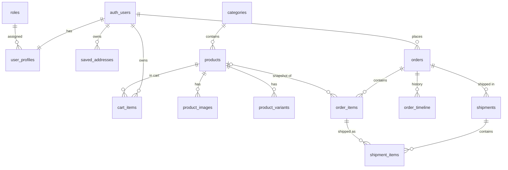

# Crystal Wall Art — Project Analysis

> Reverse-engineered handover documentation.
> Analysis date: 2026-09-25 · Branch analysed: `main` @ `91404fb` · Method: static code reading only (no `.env`, no DB access, app not run).
>
> Every statement below is derived from the code in this repository. Where something cannot be known from the code it is marked **"Cannot be determined from the current codebase."**

---

## Table of Contents

1. [What the Project Is](#1-what-the-project-is)
2. [Repository Structure](#2-repository-structure)
3. [Technology Stack](#3-technology-stack)
4. [Architecture](#4-architecture)
5. [Frontend (Storefront) Analysis](#5-frontend-storefront-analysis)
6. [Admin Panel Analysis](#6-admin-panel-analysis)
7. [Backend / API Analysis](#7-backend--api-analysis)
8. [Database Analysis](#8-database-analysis)
9. [Authentication & Authorization](#9-authentication--authorization)
10. [E-commerce Workflow](#10-e-commerce-workflow)
11. [Payment Integration (Razorpay)](#11-payment-integration-razorpay)
12. [Image / File Upload System](#12-image--file-upload-system)
13. [Environment Variables](#13-environment-variables)
14. [Missing `.env` Configuration](#14-missing-env-configuration)
15. [Third-Party Services](#15-third-party-services)
16. [Scripts & Local Development](#16-scripts--local-development)
17. [Local Setup Guide](#17-local-setup-guide)
18. [Deployment](#18-deployment)
19. [Git & Branch Information](#19-git--branch-information)
20. [Important Business Logic](#20-important-business-logic)
21. [Error Handling](#21-error-handling)
22. [Security Concerns](#22-security-concerns)
23. [Performance Analysis](#23-performance-analysis)
24. [Dependency Analysis](#24-dependency-analysis)
25. [Known Issues & Unknowns](#25-known-issues--unknowns)
26. [Information I Need From the Previous Developer / Client](#26-information-i-need-from-the-previous-developer--client)
27. [Quick Start for New Developer](#27-quick-start-for-new-developer)
28. [Project Flow Summary (5-minute explanation)](#28-project-flow-summary-5-minute-explanation)

---

## 1. What the Project Is

**Crystal Wall Art** is an Indian e-commerce website for personalised wall décor (acrylic UV prints, canvas prints, spiritual artwork, photo restoration). According to the static policy pages it is *"the consumer-facing brand of Crystal Glass Art"*, shipping across Kerala, India and selected international destinations.

The codebase is a **single Next.js 16 (App Router) application** that contains:

- the **customer storefront** (browse categories → product → cart → checkout → pay → track order),
- an **admin panel** at `/admin/*` (products, categories, homepage content/banners, orders & shipments),
- the **backend API** as Next.js Route Handlers under `/api/*`,
- a **PostgreSQL** data layer written with raw SQL (`pg` driver, no ORM).

Payments go through **Razorpay**, images are stored on **Cloudinary**, authentication uses **NextAuth v4 (credentials + JWT)**.

Original author (per `README.md` and git history): **Jibi George** (`JibiGeorge`), with PR merges done by the GitHub account `projectinshahi`. Development ran from 2026-03-12 to 2026-09-09.

---

## 2. Repository Structure

There is **one application** — no monorepo, no separate backend/admin projects.

```text
Crystal Wall Art  (single Next.js 16 app, TypeScript)
│
├── Storefront (customer UI)      app/(client)/**           → route group, own root layout
├── Admin Panel                   app/(admin)/admin/**      → route group, own root layout
├── Backend / API                 app/api/**                → Next.js Route Handlers
├── Data layer (PostgreSQL)       lib/db.ts, lib/db/**      → raw SQL: queries/ → repositories/ → dto/
├── Auth                          app/api/auth/[...nextauth], middleware.ts, lib/api/auth.ts
├── Payments (client orchestration) lib/payment.service.ts, lib/razorpay.ts
├── Image storage                 lib/cloudinary.service.ts, app/api/coudinary/**
└── Other services                none (no workers, cron, queues, email, SMS)
```

Directory map:

| Path | What it holds |
|---|---|
| `app/(client)/` | Storefront pages + client root layout (`<html>`, Razorpay script, header/footer/cart). |
| `app/(admin)/` | Admin pages + admin root layout (sidebar, fonts, toaster). |
| `app/api/` | All REST endpoints (see §7). |
| `components/` | UI. `components/Admin/**` = admin UI; rest = storefront; `components/ui/**` = shadcn/Radix primitives. |
| `lib/api/` | API framework: `withHandler` wrapper, CORS, rate limit, errors, auth guards. |
| `lib/db.ts` | Two `pg` connection pools (reader + writer), transaction helpers. |
| `lib/db/queries/` | Raw SQL strings grouped by audience (`admin/`, `public/`, `user/`). |
| `lib/db/repositories/` | Functions that execute the SQL. |
| `lib/db/dto/` | Row → response mappers. |
| `lib/db/content.db.ts` | Older, standalone content data functions (used by public `/api/content`). |
| `schema/` | Zod schemas (address, category, checkout, content, product). |
| `store/cartStore.ts` | Zustand cart persisted in `localStorage`. |
| `hooks/` | Cart DB sync, Cloudinary upload/delete, UI helpers. |
| `types/` | TS types incl. NextAuth module augmentation and Razorpay window typings. |
| `providers/loading-provider.tsx` | Admin global spinner context. |
| `config/steps.ts` | Step config (appears unused by current product form). |
| `public/` | Fonts, logos, static demo images (`categories/`, `products/`, `images/`, `frames/`). |
| `middleware.ts` | Route protection via `next-auth/middleware`. |

Files **not present**: `.env*`, `.env.example`, `Dockerfile`, `docker-compose*`, `vercel.json`, `render.yaml`, `.github/workflows`, SQL schema / migrations / seeds, tests. None of these exist on **any** remote branch either.

---

## 3. Technology Stack

| Technology | Version (installed) | Where | Why |
|---|---|---|---|
| **Next.js** (App Router) | 16.1.6 | Whole app | Renders storefront + admin, and hosts the API as Route Handlers. Uses route groups `(client)` / `(admin)` with two separate root layouts. |
| **React** | 19.2.3 | UI | Mix of Server Components (home sections, product page fetch) and Client Components (`"use client"`). |
| **TypeScript** | 5.9 (`strict: true`) | Everywhere | Path alias `@/*` → repo root. |
| **Node.js** | Not pinned (no `engines`/`.nvmrc`). Local machine has v20.20.0 | Runtime | `bcrypt` is a native addon → Node ≥ 18 with build toolchain or prebuilt binary. |
| **PostgreSQL** via **`pg`** | pg 8.20 | `lib/db.ts` | Raw SQL, no ORM. Two pools: `readPool` (max 20) and `writePool` (max 10) using **different DB users**. SSL comment says "handles DigitalOcean self-signed CA"; default port `25060` is DigitalOcean Managed Postgres' port. |
| **NextAuth.js** | 4.24.14 | `app/api/auth/[...nextauth]/route.ts`, `middleware.ts` | Two Credentials providers (`admin-login`, `client-login`), JWT session strategy, 7-day session cookie. |
| **bcrypt** | 6.0 | Signup, login, password change/reset | Password hashing (cost 10). |
| **Razorpay** (Node SDK + Checkout.js) | razorpay 2.9.6 | `app/api/razorpay/create-order`, `app/api/orders/verify-payment`, `lib/payment.service.ts`, client layout `<Script>` | Online payments in INR (UPI/cards/netbanking/wallets). Uses `one_click_checkout: true` (Magic Checkout). |
| **Cloudinary** | 2.9.0 | `lib/cloudinary.service.ts`, `app/api/coudinary/*` | Stores product, category and content (banner) images. |
| **Tailwind CSS** | 4.2 via `@tailwindcss/postcss` | `app/(client)/globals.css`, `app/(admin)/globals.css` | Styling. No `tailwind.config.*` (Tailwind v4 CSS-first config). |
| **shadcn/ui + Radix UI** | radix-ui 1.4.3, shadcn 4.0.8 | `components/ui/*`, `components.json` (style `radix-nova`) | UI primitives (dialog, sheet, select, sidebar, tabs…). |
| **Zustand** (+ `persist`) | 5.0.12 | `store/cartStore.ts` | Cart state, persisted to `localStorage` key `crystal-cart`. |
| **react-hook-form + zod** | 7.72 / 4.3 | Admin forms, profile form, checkout validation | Form state & validation (`@hookform/resolvers`). |
| **sonner** | 2.0.7 | Both layouts | Toast notifications. |
| **embla-carousel** (+ autoplay) | 8.6 | Home hero, product gallery | Carousels. |
| **jsbarcode** | 3.12 | `components/Admin/ShippingLabel.tsx` | Barcode of tracking ID on printable shipping labels. |
| **lucide-react** | 0.577 | Everywhere | Icons. |
| **ESLint** | 9 + `eslint-config-next` | `eslint.config.mjs` | Linting (`core-web-vitals` + `typescript`). |
| Email / SMS / analytics / maps / CMS | — | — | **None found in code.** |
| Firebase Auth | — | Only on unmerged branch `origin/feature/firebase-auth` | Not used on `main`. |

---

## 4. Architecture

### 4.1 High-level

```mermaid
flowchart TD
    Customer((Customer browser)) --> SF[Storefront pages<br/>app/(client)]
    Admin((Admin browser)) --> AP[Admin pages<br/>app/(admin)/admin]
    SF -->|fetch /api/*| API[Next.js Route Handlers<br/>app/api/**]
    AP -->|fetch /api/admin/*| API
    SF -. server components fetch<br/>NEXT_PUBLIC_URL/api/* .-> API
    MW[middleware.ts<br/>next-auth JWT check] --- SF
    MW --- AP
    API --> RH[withHandler<br/>CORS · rate limit · auth]
    RH --> REPO[lib/db/repositories + raw SQL]
    REPO --> RP[(PostgreSQL<br/>reader user)]
    REPO --> WP[(PostgreSQL<br/>writer user)]
    API -->|upload / destroy| CLD[Cloudinary]
    API -->|orders.create| RZP[Razorpay API]
    SF -->|Checkout.js popup| RZP
```

Everything runs in **one Next.js process**. The "frontend" and "backend" communicate over HTTP on the **same origin** (`/api/...`). Some **server components** call the app's own API over HTTP using `process.env.NEXT_PUBLIC_URL` as the base URL (e.g. home hero, categories, product page, admin content page), so `NEXT_PUBLIC_URL` must point to a URL the server itself can reach.

### 4.2 Request flow (typical API call)

```text
Browser ─fetch('/api/…', cookies)─▶ Route handler wrapped in withHandler()
   1. OPTIONS → 204 with CORS headers
   2. Origin check (isAllowedOrigin) — all origins allowed when NODE_ENV=development
   3. In-memory rate limit per `${access}:${ip}` (default 100 req/min)
   4. Auth: access 'user' → getToken() must exist; 'admin' → token.role.name === 'admin'
   5. Handler → repository → readQuery()/writeQuery() on pg pool
   6. Response JSON  { success: true, ...data }  or  { success: true, data, meta }
   Errors: ApiError → {error}, status; anything else → 500 {error:'Internal Server Error'}
```

Not every route uses `withHandler` (see §7.10).

### 4.3 How the admin talks to the backend

Admin pages are client components that `fetch('/api/admin/...')` with the NextAuth session cookie. Some admin server components (e.g. `app/(admin)/admin/content/page.tsx`, `products/[id]/page.tsx`) forward the incoming `cookie` header when calling `${NEXT_PUBLIC_URL}/api/admin/...`.

### 4.4 Data storage

- **PostgreSQL** holds everything (users, roles, products, variants, images refs, categories, contents, cart, addresses, orders, items, timeline, shipments).
- **Cloudinary** holds image binaries; DB stores JSON `{ "url": "...", "public_id": "..." }` (as text/JSON — exact column type cannot be determined).
- **Browser `localStorage`** holds the cart (`crystal-cart`) for everyone; logged-in users additionally sync it to `cart_items`.

### 4.5 Payments & orders (summary — details in §10–11)

Order row is created **before** payment (`status='pending'`, `payment_status='pending'`), then a Razorpay order is created, the Razorpay popup collects payment, and the browser posts the signature to `/api/orders/verify-payment`, which marks the order `paid` / `confirmed`. **No webhooks.**

---

## 5. Frontend (Storefront) Analysis

Root layout: `app/(client)/layout.tsx`
- Loads `https://checkout.razorpay.com/v1/checkout.js` with `strategy="beforeInteractive"` on **every** page.
- Wraps with `SessionProvider` (`components/Admin/providers.tsx`) and `LayoutContext`.
- `LayoutContext` (`components/common/LayoutContext/LayoutContext.tsx`) decides header mode per path (full / back / none), renders `Header`, `CartSidebar`, `Footer`, and runs `useCartSync()` (cart ↔ DB sync).

### 5.1 Routes

| Route | File | Rendering | Auth | Purpose |
|---|---|---|---|---|
| `/` | `app/(client)/page.tsx` | Server (`force-dynamic`) | Public (see issue: middleware redirects logged-in users) | Home: Hero carousel, About, Categories, Premium photos, "Shop the look", 3D frames slider. |
| `/products?category=<id>` | `app/(client)/products/page.tsx` | Server + client list | Public | Products of one category. |
| `/product/[id]` | `app/(client)/product/[id]/page.tsx` | Server fetch + client detail | Public | Product details, option selection, add to cart. |
| `/checkout` | `app/(client)/checkout/page.tsx` | Server guard + client | Logged-in (server `getServerSession`, redirect `/auth/login`) | Address, email, payment, place order. |
| `/order-success/[slug]` | `app/(client)/order-success/[slug]/page.tsx` | Server | None | Static "Order confirmed" screen showing the slug. |
| `/order/[slug]` | `app/(client)/order/[slug]/page.tsx` → `components/OrderDetails` | Client | None enforced | Order details, items, timeline for order **id**. |
| `/track-order` | `app/(client)/track-order/page.tsx` | Client | Public | Look up an order by **order number**. |
| `/account` | `app/(client)/account/page.tsx` → `components/UserAccountProfile.tsx` | Client | Client-side redirect to `/auth/login` if unauthenticated | Profile, orders list, edit profile, change password, logout. |
| `/auth/login` | `app/(client)/auth/login/page.tsx` → `components/AuthForm.tsx` | Client | Public | Login / Sign up / Forgot password (3 modes in one form). |
| `/about` | `app/(client)/about/page.tsx` | Static | Public | Brand story. |
| `/privacy-policies`, `/terms-and-conditions`, `/refund-policy`, `/shipping-policy`, `/photo-upload-policy` | `app/(client)/*/page.tsx` | Static | Public | Legal/policy content (hard-coded text). |
| (special) `error.tsx`, `not-found.tsx`, several `loading.tsx` | `app/(client)/` | — | — | Error boundary, 404, loading screens. |

Links in the UI that point to **routes that do not exist**: `/login` and `/profile` (middleware + NextAuth `pages.signIn`), `/admin` (middleware), `/products` with no `category` (mobile drawer "Shop" link). `/contact`, `/wishlist`, `/offers`, `/blogs`, `/faq`, `/store` are commented out in menus.

### 5.2 Important pages in detail

**Home (`/`)**
- `HeroSection` (server): `GET ${NEXT_PUBLIC_URL}/api/content?type=hero_section&&active=true` → sorts by `priority`, parses `item.image` JSON → carousel of image URLs. Reads `slidesRes.data.data` because `/api/content` wraps a `DBResponse` object (see issues).
- `CategoriesSection` (server): `GET ${NEXT_PUBLIC_URL}/api/category?active=true` → parses `image_url` JSON → tiles linking to `/products?category=<id>`.
- `AboutSection`, `PremiumPhotos`, `ShopLookSection`, `Frames3DSlider`: static content with images from `/public`.

**Products list (`/products?category=`)**
- Server: `GET /api/category/<category>` for the title. If `success` is false → page renders `null` (blank).
- Client `ProductList`: `GET /api/products/<categoryId>/category?active=true` → grid of `ProductCard` (click → `/product/<id>`). No pagination, no search, no sort.

**Product details (`/product/[id]`)**
- Server: `GET ${NEXT_PUBLIC_URL}/api/products/<id>` (active, non-deleted only). If not `success` → renders `null`.
- Client: builds chip selectors from product arrays `sizes`, `thickness`, `mounting_methods`, `orientations` (first value pre-selected); `GET /api/products/<id>/variants`.
- **Price logic**: find variant where `size` and `thickness` match (case-insensitive). `price = variant.price ?? product.price`; `discount = variant.discount_price ?? product.discount_price`; **effective price = discount if present else price**. Orientation and mounting method do **not** affect price.
- "Add to Cart" → `cartStore.addItem({product_id, title, image(thumbnail url), size, thickness, mounting_method, orientation, price: effectivePrice, quantity: 1, variant_id})` and opens the cart sidebar. No stock check.

**Cart (sidebar, `components/CartSidebar.tsx`)**
- Quantity ±, remove, clear, subtotal/total = Σ price × qty, shipping shown as "Free".
- Coupon input + "Apply" button exist but have **no handler** (coupon feature not implemented).
- "Checkout" → `/checkout`.

**Checkout (`/checkout`)**
- `DeliveryAddressSection`: `GET /api/user/address` (saved addresses), `POST /api/user/address` (add new, validated by `schema/address.schema.ts`). Selecting fills the form.
- `ContactSection`: email.
- `PaymentSummaryCard`: shows items, subtotal, shipping (`₹0` if subtotal > 999 else `₹99`) — **but Total displayed = subtotal**, and the order is placed with `shipping: 0`.
- `PaymentMethod`: only **Razorpay** is selectable (COD button is commented out; COD code path still exists).
- "Place Order" → validates with `schema/checkout.schema.ts` → `handleRazorpaySubmit(...)` in `lib/payment.service.ts` (see §11).

**Account (`/account`)**
- `useSession()`; unauthenticated → `router.push('/auth/login')`.
- `GET /api/orders` → list of user's orders (link to `/order/<id>`).
- Edit profile → `PATCH /api/user/account/profile` (user_name, email, phone) then `session.update(...)`.
- Change password → `PATCH /api/user/account/password`.
- Logout → `signOut({ callbackUrl: '/auth/login' })`.

**Order details (`/order/[id]`)** — `GET /api/orders/<id>`, `/api/orders/<id>/itemsData`, `/api/orders/<id>/timelineData`.

**Track order (`/track-order`)** — `GET /api/track-orders?orderNumber=...`; shows status stepper with keys `pending → processing → shipping → delivered` (note: `processing`/`shipping` are never written by the backend; see §20).

**Login / Signup / Forgot (`/auth/login`)**
- Login → `signIn('client-login', {email, password, redirect:false})` → `router.push('/')`.
- Signup → `POST /api/auth/signup` then auto-login.
- Forgot → `POST /api/auth/forgot-password` with **email + new password** (no email verification; see Security).

### 5.3 Client state

| State | Where | Persistence |
|---|---|---|
| Cart | `store/cartStore.ts` (Zustand) | `localStorage['crystal-cart']` (version 3, dedup on hydrate) + DB `cart_items` for logged-in users via `hooks/useCartSync.ts` |
| Session | NextAuth `SessionProvider` | HTTP-only JWT cookie |
| Layout overrides | `LayoutContext` React context | memory |
| Admin global loading | `providers/loading-provider.tsx` | memory |

**Cart sync (`hooks/useCartSync.ts`)**: on login → `POST /api/cart/merge` (local items added into DB, quantities summed) → `GET /api/cart` → replaces local cart with DB cart. Afterwards every cart change is debounced 800 ms → `POST /api/cart/sync` (full replace: insert/update/delete to match local). Note `GET /api/cart` does not return `variant_id` and returns the **product base price** (`p.price`), so after sync the cart price can differ from the variant/discount price chosen on the product page.

---

## 6. Admin Panel Analysis

Root layout: `app/(admin)/layout.tsx` → `components/Admin/AdminLayout.tsx` (server). If there is no admin session it renders children without sidebar (used for the login page); otherwise renders `AdminSidebar` + content inside `LoadingProvider`.

Protection: `middleware.ts` redirects any `/admin/*` (except `/admin/login`) to `/admin/login` unless `token.role.name === 'admin'`. API routes under `/api/admin/*` enforce `access: 'admin'` via `withHandler` — **except `/api/admin/content/[id]` PUT/PATCH/DELETE** (see Security).

Sidebar menu (`components/Admin/AdminSidebar.tsx`): **Products, Categories, Orders, Content**. Dashboard, Frames, Inventory, Customers, Discounts, Coupons, Reports, Admin Users, Shipping, Settings are commented out — **those modules do not exist.**

| Module | Route | UI components | APIs | DB entities | Notes |
|---|---|---|---|---|---|
| **Login** | `/admin/login` | `components/Admin/LoginForm.tsx` | NextAuth `signIn('admin-login')` | `auth_users`, `user_profiles`, `roles` | On success → `/admin/products`. Note: the `admin-login` provider does **not** itself check role; a non-admin can "log in" but middleware then blocks `/admin/*`. |
| **Dashboard** | `/admin` | — | — | — | **No page exists** (`app/(admin)/admin/page.tsx` missing) → 404. |
| **Products – list** | `/admin/products` | `ProductPage/*`, `TableData/*`, `Filters.tsx` | `GET /api/admin/product?page&limit&category&status&search`, `GET /api/admin/category`, `PATCH /api/admin/product/[id]` `{is_active}` | `products`, `categories` | Paginated table; toggle active/inactive. |
| **Products – view** | `/admin/products/[id]` | `ProductPage/ProductDetails.tsx` | `GET /api/admin/product/[id]` (server-side with forwarded cookie) | `products`, `product_images`, `product_variants`, `categories` | Read-only details. |
| **Products – add/edit** | `/admin/products/new` and `/admin/products/new?id=<id>` | `AddProducts/ProductStepperForm.tsx` (2 steps: details → images; plus variants) | `POST /api/admin/product`, `PUT /api/admin/product/[id]`, `GET /api/admin/category`, `GET /api/admin/product/[id]` | same | Images are converted to **base64 data URIs in the browser** and sent in JSON; server uploads to Cloudinary folder `product_images`. Edit **deletes and re-inserts** all images and variants. |
| **Categories** | `/admin/categories` | `CategoryPage/*` | `GET/POST /api/admin/category`, `PUT/PATCH/DELETE /api/admin/category/[id]` | `categories` | Multipart form with image (≤5 MB, jpeg/png/webp) → Cloudinary folder `categories`. Delete = soft delete. Duplicate title check. |
| **Content (banners/hero)** | `/admin/content` | `ContentPage/*` | `GET/POST /api/admin/content`, `PUT/PATCH/DELETE /api/admin/content/[id]` | `contents` | Types offered in UI: `banner`, `hero_section`. `hero_section` items feed the home carousel. |
| **Orders – list** | `/admin/orders` | `OrderManagement/*` | `GET /api/admin/orders?page&limit&status&payment&search` | `orders` | Search by name/email/phone/order number. |
| **Orders – detail** | `/admin/orders/[id]` | `OrderManagementDetails/*` | `GET /api/admin/orders?id=`, `GET .../[id]/items`, `.../shipments`, `.../timeline`, `.../shipment-items?shipment_ids=` | `orders`, `order_items`, `order_timeline`, `shipments`, `shipment_items` | Shows customer, summary, items, timeline. **No way to change order status, cancel or refund.** |
| **Shipments** | inside order detail | `OrderedItemsDetails/Shipments.tsx` | `POST/PATCH/DELETE /api/admin/orders/[id]/shipments` | `shipments`, `shipment_items` | Split an order into shipments (choose items + qty, courier, tracking ID). Update shipment status (`pending, packed, shipped, out_for_delivery, delivered, cancelled`) — sets `shipped_at`/`delivered_at` client-side. |
| **Shipping labels** | inside order detail | `components/Admin/ShippingLabel.tsx` | — | — | Opens a print window with A4/A6 labels and a Code128 barcode of the tracking ID (sender shown as "Crystal Art"). |

Customers, users, reports, coupons, settings, inventory: **not implemented.**

---

## 7. Backend / API Analysis

All routes are in `app/api/`. Unless noted, routes use `withHandler(handler, { access, rateLimit })` from `lib/api/handler.ts`.

Response conventions:
- `ok(data)` → `{ success: true, ...data }`
- `okList(rows, meta)` → `{ success: true, data: rows, meta }`
- `err(msg, status)` → `{ success: false, error: msg }`
- Thrown `ApiError` → `{ error }` with its status; other thrown errors → `500 { error: 'Internal Server Error' }`.

### 7.1 `/api/auth`

| Method | Endpoint | Auth | Request | Response | DB / Logic |
|---|---|---|---|---|---|
| GET/POST | `/api/auth/[...nextauth]` | — | NextAuth protocol | NextAuth | Providers `admin-login`, `client-login` (both: email+password vs `auth_users.password_hash`, require `is_active = true`). JWT session 7 days. |
| POST | `/api/auth/signup` | Public (**not** wrapped in `withHandler`: no rate limit / CORS check) | `{ firstName, lastName, email, password }` | `201 { success, user }` / `400 {error}` | Checks email exists; bcrypt hash; inserts `auth_users` then `user_profiles` with **hard-coded role id `d45bfdd1-7607-40d8-9146-84596828ab2c`**. No password length validation, no email normalisation. |
| POST | `/api/auth/forgot-password` | Public | `{ email, new_password, confirm_password }` | `{ success, message }` / `400 {error}` | Looks up user by email and **directly sets the new password**. No token/OTP/email. **Critical — see Security.** |

### 7.2 `/api/user`

| Method | Endpoint | Auth | Request | Logic |
|---|---|---|---|---|
| PATCH | `/api/user/account/profile` | user | `{ user_name?, email?, phone?, avatar_url?, metadata? }` | `UPDATE auth_users` (email/phone via COALESCE) + `UPDATE user_profiles`. No validation / uniqueness check of new email. |
| PATCH | `/api/user/account/password` | user | `{ current_password, new_password, confirm_password }` | Verifies current password with bcrypt, then updates hash. |
| GET | `/api/user/address` | user | — | `saved_addresses WHERE user_id`. |
| POST | `/api/user/address` | user | `{ type, name, phone, address, city, state, pincode }` | Inserts with `is_default=false`. **No server-side validation.** |

### 7.3 `/api/category` & `/api/products` (public catalogue)

| Method | Endpoint | Response | Logic |
|---|---|---|---|
| GET | `/api/category` | `okList(categories)` | Active & non-deleted, `ORDER BY priority, created_at DESC`. (`?active=` param ignored.) |
| GET | `/api/category/[id]` | `ok({ data })` | Active & non-deleted category by id. **No `access` option → defaults to public (fine).** |
| GET | `/api/products/[id]` | `ok({ data })` | Active, non-deleted product + images (`image_url ->> 'url'`). |
| GET | `/api/products/[id]/variants` | `okList(variants)` | All variants of product (no stock returned). |
| GET | `/api/products/[id]/category` | `okList(products)` | `[id]` is a **category id**. Active non-deleted products in that category. No pagination. |

### 7.4 `/api/content`

| Method | Endpoint | Auth | Logic |
|---|---|---|---|
| GET | `/api/content?type=&active=` | Public | Uses `lib/db/content.db.ts#getContents`, which **string-interpolates `type` into SQL** (`type = '${type}'`) → **SQL injection**. Returns `okList(DBResponse)` so the payload is `{ success, data: { success, data: rows, error, meta }, meta }`. |

### 7.5 `/api/cart` (all `access: user`)

| Method | Endpoint | Request | Logic |
|---|---|---|---|
| GET | `/api/cart` | — | `cart_items JOIN products` → `id, product_id, size, thickness, mounting_method, orientation, quantity, title, price (product base price), image (thumbnail url)`. |
| POST | `/api/cart/merge` | `{ items: CartItem[] }` | Dedup, insert new rows, **add** quantities to existing rows. |
| POST | `/api/cart/sync` | `{ items: CartItem[] }` | Make DB equal to incoming list (delete/insert/update). |
| POST | `/api/cart/update` | `{ quantity, product_id, size, thickness, mounting_method, orientation }` | Set quantity. (Not called by UI.) |
| POST | `/api/cart/change` | `{ delta, ... }` | quantity += delta. (Not called by UI.) |
| POST | `/api/cart/delete` | option keys | Delete one line. (Not called by UI.) |
| POST | `/api/cart/clear` | — | Delete all. (Not called by UI.) |

`CartRepository` runs its **write** statements through `readQuery` (reader pool). Whether that works depends on the reader DB user's privileges — cannot be determined.

### 7.6 `/api/orders`, `/api/razorpay`, `/api/track-orders`

| Method | Endpoint | Auth | Request | Response | Logic |
|---|---|---|---|---|---|
| POST | `/api/orders/create` | user | `{ orderNumber, items[], form{name,email,phone,address,city,state,pincode,notes?}, subtotal, tax, shipping, total, appliedCoupon, paymentMethod }` | `{ success, order }` | Inserts `orders` (status & payment_status `pending`), `order_items` (one per cart line, `options` JSON), `order_timeline` (`pending`). **All amounts and prices are taken from the client**; no stock check/decrement; **not in a transaction**. `payment_method` column is not set (only written into `notes`). |
| POST | `/api/razorpay/create-order` | user | `{ amount, currency='INR', receipt, notes, line_items, customer }` | `{ order, key_id }` | `razorpay.orders.create({ amount: Math.round(amount)*100, currency, receipt, notes })`. `line_items`/`customer` are received but not forwarded. Amount is client-supplied. |
| POST | `/api/orders/verify-payment` | user | `{ razorpay_order_id, razorpay_payment_id, razorpay_signature, order_id, shipping_address?, billing_address? }` | `{ verified: true }` / `400 {verified:false}` | HMAC-SHA256(`order_id|payment_id`, `RAZORPAY_KEY_SECRET`) must equal signature → `UPDATE orders SET payment_status='paid', status='confirmed', razorpay ids, addresses` + timeline `confirmed`. Does **not** check that the Razorpay order belongs to this DB order, that amounts match, or that the order belongs to the caller. |
| GET | `/api/orders` | user | — | `okList` | Current user's orders (id, number, status, total, created_at). |
| GET | `/api/orders/[id]` | **public** | — | `ok({data})` | Full order (name, email, phone, addresses, totals, Razorpay ids) by id, **no ownership check**. SQL has a missing comma (`billing_address status`) → `status` column is not returned and `billing_address` is aliased as `status`. |
| GET | `/api/orders/[id]/itemsData` | **public** | — | `okList` | Items of any order. |
| GET | `/api/orders/[id]/timelineData` | **public** | — | `okList` | Timeline of any order. |
| GET | `/api/track-orders?orderNumber=` | public | — | `ok({data})` | Order id, number, customer name, status, payment status, total, items. |

### 7.7 `/api/admin/*` (all `access: admin` unless flagged)

| Method | Endpoint | Request | Logic |
|---|---|---|---|
| GET | `/api/admin/product?page&limit&category&status&search` | — | Paginated list (limit ≤100). |
| POST | `/api/admin/product` | JSON `{ product_details{title,category,description,price,discount_price,stock_quantity,sizes[],thickness[],mounting_methods[],orientation[],status,images[],thumbnail}, product_variants[] }` | Required: title, category, price, stock_quantity, status, ≥1 image. Uploads base64 images to Cloudinary (`product_images`), inserts product, images, variants in a transaction (uploads happen **before** the transaction, so a DB failure leaves orphan Cloudinary files). |
| GET | `/api/admin/product/[id]` | — | Product + images + variants + category title. |
| PUT | `/api/admin/product/[id]` | same shape as POST | Uploads new base64 images, deletes Cloudinary images no longer referenced, then in a transaction updates product and **replaces** all `product_images` and `product_variants` rows. |
| PATCH | `/api/admin/product/[id]` | `{ is_active: boolean }` | Sets `status` to `active`/`inactive`. |
| GET/POST | `/api/admin/category` | POST: multipart `title, description, priority, is_active, folder, file` | Create requires image; duplicate title check (LIKE match). |
| PUT/PATCH/DELETE | `/api/admin/category/[id]` | PUT multipart; PATCH `{is_active}` | Update / toggle / soft-delete. |
| GET/POST | `/api/admin/content` | POST multipart `type, title, description, link_url, priority, folder, file` | Create requires image. |
| PUT/PATCH/DELETE | `/api/admin/content/[id]` | PUT multipart (+`remove_image`) | **⚠ No `access` option → these three are PUBLIC.** |
| GET | `/api/admin/orders?page&limit&status&payment&search&id` | — | Paginated orders. |
| GET | `/api/admin/orders/[id]/items` | — | Order items. |
| GET | `/api/admin/orders/[id]/timeline` | — | Timeline. |
| GET/POST/PATCH/DELETE | `/api/admin/orders/[id]/shipments` | POST multipart `shipmentNumber, courier, trackingId, items(JSON [{order_item_id, quantity}])`; PATCH/DELETE `?shipment_id=` | Create shipment (+items, not in a transaction), update (courier, tracking_id, status, notes, shipped_at, delivered_at), delete. |
| GET | `/api/admin/orders/[id]/shipment-items?shipment_ids=a,b` | — | Items per shipment. |

### 7.8 `/api/coudinary` (sic — misspelled "cloudinary")

| Method | Endpoint | Auth | Logic |
|---|---|---|---|
| POST | `/api/coudinary/upload` | **None** (plain handler) | Multipart `file`, `folder` → uploads anything to Cloudinary. No type/size check. |
| POST | `/api/coudinary/delete` | **None** | `{ public_id }` → `cloudinary.uploader.destroy`. **Anyone can delete any image.** |

Used by `hooks/useCloudinaryUpload.ts` / `useCloudinaryDelete.ts`; no component currently imports those hooks (admin forms upload through the admin APIs instead).

### 7.9 `/api/health`

`GET /api/health` (public) → `{ status: 'ok'|'degraded', db: { reader, writer }, timestamp, version }`, 503 when a pool is down. **Use this first when you get the `.env`.**

### 7.10 Routes that bypass `withHandler`

`/api/auth/signup`, `/api/coudinary/upload`, `/api/coudinary/delete` — no auth, no CORS/origin check, no rate limiting.

### 7.11 Called by the frontend but **do not exist**

- `POST /api/coupons/use` (`lib/payment.service.ts`) — only called when a coupon is applied; coupons are never applied, so it is dormant.
- `POST /api/admin/signin` (`lib/auth.ts#adminLogin`) — dead code, not imported anywhere.

---

## 8. Database Analysis

**Technology:** PostgreSQL (driver `pg`). Host defaults to port `25060` and the SSL helper mentions a DigitalOcean CA → very likely **DigitalOcean Managed PostgreSQL**, but the actual host cannot be determined.

**There is no schema file, migration or seed in the repository.** The table list below is reconstructed from the SQL statements in the code. Column **types, constraints, defaults, indexes and foreign keys cannot be determined from the current codebase** except where SQL implies them.

**Row-Level Security hint:** `lib/db.ts#withUserSession` sets `app.current_user_id` for RLS, but it is **never called**. Whether RLS policies exist in the database cannot be determined.

**Two DB users:** `APP_READER_DB_USER` (read pool) and `APP_WRITER_DB_USER` (write pool) → the database has at least two roles with different privileges.

### 8.1 Tables

| Table | Columns referenced in code | Purpose | Relationships (inferred) | Used by |
|---|---|---|---|---|
| `auth_users` | id, email, phone, password_hash, is_active, is_email_verified, is_phone_verified, last_login_at, created_at, updated_at | Login identity | 1–1 `user_profiles.user_id` | NextAuth authorize, signup, forgot/change password, profile |
| `user_profiles` | user_id, first_name, last_name, user_name, avatar_url, role_id, metadata, created_at, updated_at | Profile + role | `user_id → auth_users.id`, `role_id → roles.id` | Auth, signup, profile |
| `roles` | id, name | Roles; code checks names `'admin'` and `'user'` | referenced by `user_profiles.role_id` | Auth / authorization |
| `categories` | id, title, description, image_url (JSON {url, public_id}), priority, is_active, deleted, created_at, updated_at | Product categories | 1–N `products.category_id` | Storefront, admin |
| `products` | id, title, description, price, discount_price, stock_quantity, category_id, status (`draft`/`active`/`inactive`), sizes[], thickness[], mounting_methods[], orientations[], thumbnail (JSON or URL), deleted, created_at, updated_at | Products; option arrays are Postgres arrays | `category_id → categories.id`; 1–N images, variants | Storefront, admin, cart join |
| `product_images` | id, product_id, image_url (JSON string {url, public_id}) | Gallery images | `product_id → products.id` | Product page, admin |
| `product_variants` | id, product_id, size, thickness, price, discount_price, orientation, stock_quantity, created_at, updated_at | Price per size × thickness (× orientation) | `product_id → products.id` | Product page price, admin |
| `contents` | id, type (`banner`, `hero_section`, …), title, description, link_url, image (JSON), priority, is_active, deleted, created_at, updated_at | Homepage CMS blocks | — | Home hero, admin content |
| `cart_items` | id, user_id, product_id, variant_id, size, thickness, mounting_method, orientation, quantity, created_at, updated_at | Server-side cart | `user_id → auth_users.id`, `product_id → products.id`. `ON CONFLICT (user_id, product_id, size, thickness, mounting_method, orientation)` in an **unused** upsert implies a unique constraint may exist. | Cart sync |
| `saved_addresses` | id, user_id, type (`Home`/`Work`/`Other`), name, phone, address, city, state, pincode, is_default | Address book | `user_id → auth_users.id` | Checkout |
| `orders` | id, order_number, user_id, customer_name, customer_email, customer_phone, shipping_address (jsonb — cast `::jsonb` in SQL), billing_address (jsonb), status, payment_status, subtotal, tax, shipping_cost, total, notes, payment_method, razorpay_order_id, razorpay_payment_id, created_at, updated_at | Orders | `user_id → auth_users.id`; 1–N items, timeline, shipments | Checkout, account, admin, tracking |
| `order_items` | id, order_id, product_id (nullable), variant_id, product_title, product_image, size, thickness, mounting_method, orientation, quantity, unit_price, total_price, options (JSON), created_at | Snapshot of purchased lines | `order_id → orders.id`, `product_id → products.id` | Orders, shipments |
| `order_timeline` | id, order_id, status, note, created_at | Status history | `order_id → orders.id` | Order detail, admin |
| `shipments` | id (uuid — `::uuid[]` cast), order_id, shipment_number, courier, tracking_id, status, notes, shipped_at, delivered_at, created_at, updated_at | Physical shipments | `order_id → orders.id` | Admin |
| `shipment_items` | id, shipment_id, order_item_id, quantity, created_at | Which items/qty in which shipment | `shipment_id → shipments.id`, `order_item_id → order_items.id` | Admin |

IDs appear to be **UUIDs** (hard-coded role UUID, `::uuid[]` cast for shipments).

### 8.2 Relationships



### 8.3 Query style

- Raw parameterised SQL (`$1…`) everywhere except `lib/db/content.db.ts#getContents` (interpolated — SQL injection).
- Aggregation with `json_agg/json_build_object` for product images/variants and order tracking.
- Soft delete via `deleted` boolean on `categories`, `products`, `contents`.
- Pagination only on admin products and admin orders.
- `withTransaction` used for category/content create/delete and product create/update only.

---

## 9. Authentication & Authorization

**Mechanism:** NextAuth v4, two **Credentials** providers, **JWT** session strategy (no DB sessions, no refresh tokens, no OAuth/social login). The provider id `client-login` is named "Client OTP" but actually uses email + password.

### 9.1 Registration
1. `AuthForm` (signup mode) → `POST /api/auth/signup { firstName, lastName, email, password }`.
2. Server checks duplicate email, bcrypt-hashes (cost 10), inserts `auth_users` and `user_profiles` with default role id `d45bfdd1-…` (the role's name is not in code; it must be `'user'` for the middleware user checks to apply).
3. Browser immediately calls `signIn('client-login')`.

### 9.2 Login
1. `signIn('client-login' | 'admin-login', { email, password, redirect:false })`.
2. `authorize()` validates email format and password length 8–72, loads user + profile + role, `bcrypt.compare`, requires `is_active === true`.
3. Returns `{ id, email, phone, role:{id,name}, profile:{user_name, avatarUrl} }`.
4. `jwt` callback copies these into the token; `session` callback exposes them as `session.user`.
5. Cookie: `__Secure-next-auth.session-token` (prod) / `next-auth.session-token` (dev), `httpOnly`, `sameSite=lax`, `secure` in prod, **maxAge 7 days**. Signed/encrypted with `NEXTAUTH_SECRET`.

Both providers run the **same query**; neither restricts by role. Role separation is enforced later by middleware and API guards.

### 9.3 Token verification
- **Pages**: `middleware.ts` (matcher `/`, `/login`, `/profile/:path*`, `/admin/:path*`) reads the JWT via `withAuth`.
- **APIs**: `lib/api/auth.ts#getAuthUser` → `getToken({ req, secret: NEXTAUTH_SECRET })`; `requireAdmin` → `token.role.name === 'admin'`.
- **Server components**: `getServerSession(authOptions)` in `AdminLayout`; `getServerSession()` (without options) in `/checkout`.
- `lib/session.ts#requireAuth/requireAdmin` exist but are **unused**.

### 9.4 Session update
`useSession().update({ email, phone, profile })` after profile edit → `jwt` callback `trigger === 'update'` merges fields. **It also accepts `session.role`** from the client — see Security.

### 9.5 Logout
`signOut()` (NextAuth) from account page and admin sidebar. JWTs are stateless: role changes / deactivation in DB take effect only after the 7-day token expires.

### 9.6 Authorization matrix

| Area | Guard |
|---|---|
| `/admin/*` pages | middleware: admin role required (else → `/admin/login`) |
| `/checkout` page | server `getServerSession` → `/auth/login` |
| `/account` page | client-side redirect only |
| `/order/[id]`, `/track-order` | none |
| `/api/admin/*` | `access:'admin'` — **except `/api/admin/content/[id]` PUT/PATCH/DELETE (public)** |
| `/api/cart/*`, `/api/user/*`, `/api/orders` (list), `/api/orders/create`, `/api/orders/verify-payment`, `/api/razorpay/create-order` | `access:'user'` (any logged-in user, including admins) |
| `/api/orders/[id]`, `/itemsData`, `/timelineData`, `/api/track-orders`, catalogue, `/api/content`, `/api/health`, `/api/auth/forgot-password` | public |
| `/api/auth/signup`, `/api/coudinary/*` | no guard at all |

---

## 10. E-commerce Workflow

```text
Home (hero + categories from DB)
  ↓ click category
/products?category=<id>          (active products of category)
  ↓ click product
/product/<id>                    (choose size / thickness / mounting / orientation → price from variant)
  ↓ Add to Cart
Cart (Zustand + localStorage; synced to cart_items when logged in)
  ↓ Checkout (login required)
/checkout                        (pick/add saved address, email, payment = Razorpay)
  ↓ Place Order
POST /api/orders/create          → orders(pending/pending) + order_items + timeline(pending)
POST /api/razorpay/create-order  → Razorpay order (amount = cart total × 100 paise)
Razorpay Checkout popup (Magic Checkout)
  ↓ success handler
POST /api/orders/verify-payment  → orders(confirmed/paid) + timeline(confirmed)
  ↓ clear cart
/order-success/<orderNumber>
  ↓
Admin: /admin/orders → order detail → create shipments, set courier/tracking, update shipment status, print label
  ↓
Customer: /account (orders) → /order/<id>, or /track-order by order number
```

Feature status (only what exists):

| Feature | Status |
|---|---|
| Product variants | Yes — `product_variants` keyed by size × thickness (+ orientation stored). Mounting method & orientation are selectable but do not change price. |
| Stock management | `stock_quantity` stored on products and variants and editable in admin, but **never checked or decremented** on add-to-cart or order. |
| Pricing | Effective price = variant/product `discount_price` if set, else `price`. Computed **in the browser** and trusted by the server. |
| Discounts | Only per-product/variant `discount_price`. |
| Coupons | **Not implemented** (UI input without handler; `/api/coupons/use` does not exist). |
| Shipping cost | Checkout card shows ₹99 if subtotal ≤ 999, but order is saved and charged with `shipping: 0`; cart shows "Free". |
| Tax | Always `0`. |
| Cart persistence | localStorage for all; DB (`cart_items`) for logged-in users. |
| Wishlist | Not implemented (menu item commented out). |
| Order cancellation | Not implemented. |
| Refunds | Not implemented (policy page only; `payment_status` type allows `refunded`, nothing sets it). |
| Order tracking | Yes — timeline + shipments; public lookup by order number. |
| COD | Code exists (`handleCODSubmit`) but the option is hidden in UI. If re-enabled it would send `total: 0` and redirect to `/order-success/<order.id>`. |
| Guest checkout | No — `/api/orders/create` requires login. |
| Emails / notifications | None. |

---

## 11. Payment Integration (Razorpay)

**Provider:** Razorpay (India, INR). **Mode:** Standard Orders API + Checkout.js with `one_click_checkout: true` (Magic Checkout). **Webhooks:** none. **Refunds:** none.

**Files:** `lib/payment.service.ts` (client orchestration), `lib/razorpay.ts` (script loader), `app/(client)/layout.tsx` (script tag), `app/api/razorpay/create-order/route.ts`, `app/api/orders/verify-payment/route.ts`, `types/razorpay.d.ts`.

**Config from `.env`:** `RAZORPAY_KEY_ID` (returned to browser as `key_id`), `RAZORPAY_KEY_SECRET` (server only; used by SDK and for HMAC verification). Whether they are test (`rzp_test_…`) or live (`rzp_live_…`) keys cannot be determined.

### Flow

```mermaid
sequenceDiagram
    participant B as Browser (checkout)
    participant API as Next.js API
    participant DB as PostgreSQL
    participant R as Razorpay
    B->>API: POST /api/orders/create (items, amounts, address)
    API->>DB: INSERT orders(pending,pending), order_items, order_timeline
    API-->>B: { order }
    B->>API: POST /api/razorpay/create-order { amount: total, receipt: orderNumber, notes.order_id }
    API->>R: orders.create(amount*100 paise)
    R-->>API: rzp order
    API-->>B: { order, key_id }
    B->>R: Checkout.js popup (Magic Checkout)
    R-->>B: handler(razorpay_order_id, payment_id, signature, shipping_address?)
    B->>API: POST /api/orders/verify-payment
    API->>API: HMAC_SHA256(order_id|payment_id, KEY_SECRET) == signature?
    API->>DB: UPDATE orders SET paid/confirmed, ids, addresses; INSERT timeline(confirmed)
    API-->>B: { verified: true }
    B->>B: clear cart → /order-success/<orderNumber>
```

- **Failure / dismiss:** `payment.failed` and `modal.ondismiss` only show a toast. The DB order **stays `pending/pending` forever** (no cleanup, no retry of the same order).
- **Order ↔ payment link:** `orders.razorpay_order_id`, `orders.razorpay_payment_id`, and Razorpay `notes.order_id` / `receipt = order_number`.
- **Gaps:** amount is client-computed; `Math.round(amount)*100` rounds to whole rupees; verification doesn't bind the Razorpay order to the DB order or its amount; if the browser closes after paying but before verify, the order stays pending (no webhook to recover).

---

## 12. Image / File Upload System

**Provider:** Cloudinary (`cloudinary` v2 SDK), configured in `lib/cloudinary.service.ts` and again in each `app/api/coudinary/*` route from `CLOUDINARY_CLOUD_NAME`, `CLOUDINARY_API_KEY`, `CLOUDINARY_API_SECRET`.

| Upload source | Frontend | Backend | Cloudinary folder | DB reference | Display |
|---|---|---|---|---|---|
| Category image | Admin category form, `ImageUpload` keeps a pending `File` + blob preview; sent as `multipart/form-data` field `file` | `POST/PUT /api/admin/category[/id]` → `uploadToCloudinary(file, folder)`; ≤5 MB; jpeg/png/webp | `categories` (or client-supplied `folder`) | `categories.image_url` = `{url, public_id}` | Home categories via `next/image` |
| Content/banner image | Admin content form, multipart | `POST/PUT /api/admin/content[/id]` | client-supplied `folder` (default `categories`) | `contents.image` = `{url, public_id}` | Home hero carousel |
| Product images | Admin product stepper → converts to **base64 data URI** in browser → JSON body | `POST/PUT /api/admin/product` → `uploadBase64ToCloudinary(img, 'product_images')` (no size/type check) | `product_images` | `product_images.image_url` = JSON string `{url, public_id}`; `products.thumbnail` = JSON or URL | Product gallery (`image_url ->> 'url'`), cart (`thumbnail ->> 'url'`) |
| Generic | `hooks/useCloudinaryUpload` (unused) | `POST /api/coudinary/upload` (unauthenticated) | client-supplied | — | — |

- Old images are deleted from Cloudinary on category update (see bug below), content update and product update.
- **No transformations/optimisation** parameters are used (no `f_auto`, `q_auto`, resizing). `next/image` is used only in some places (categories, loaders); most product/cart images use plain ``.
- `next.config.ts` allows remote images from `res.cloudinary.com`, `amljpeuchoyrncgwppwf.supabase.co`, `www.titan.co.in`, `cdn.shopify.com` (the last three look like leftovers from demos; nothing in code references Supabase).
- Customer photo upload for personalised prints: a **policy page exists** (`/photo-upload-policy`) but **no customer upload feature exists in code**.

---

## 13. Environment Variables

Found by searching the whole codebase for `process.env` / `import.meta.env` (no `import.meta.env` usage; no `.env*` file exists).

| Variable | Used where | Purpose | Required? | Expected format | Current status |
|---|---|---|---|---|---|
| `DB_HOST` | `lib/db.ts` | PostgreSQL host | **Yes** | hostname (e.g. `db-xxxx.db.ondigitalocean.com` style) | Missing |
| `DB_PORT` | `lib/db.ts` | PostgreSQL port | No (defaults `25060`) | number | Missing |
| `DB_NAME` | `lib/db.ts` | Database name | **Yes** | string | Missing |
| `APP_READER_DB_USER` | `lib/db.ts` | Read-pool DB user | **Yes** | string | Missing |
| `APP_READER_DB_PASSWORD` | `lib/db.ts` | Read-pool password | **Yes** | secret | Missing |
| `APP_WRITER_DB_USER` | `lib/db.ts` | Write-pool DB user | **Yes** | string | Missing |
| `APP_WRITER_DB_PASSWORD` | `lib/db.ts` | Write-pool password | **Yes** | secret | Missing |
| `DB_SSL_CERT` | `lib/db.ts` | CA certificate for DB SSL (newlines may be `\n`-escaped) | Optional (without it: SSL off in dev, `rejectUnauthorized:false` in prod) | PEM text | Missing |
| `NEXTAUTH_SECRET` | `middleware.ts`, `lib/api/auth.ts`, NextAuth options | Signs/encrypts JWT session | **Yes** | long random string (e.g. `openssl rand -base64 32`) — must match production value to keep existing sessions valid | Missing |
| `NEXTAUTH_URL` | *Not referenced in code*; read internally by NextAuth v4 | Canonical site URL for NextAuth callbacks | Recommended in production | `https://your-domain` / `http://localhost:3000` | Missing |
| `NEXT_PUBLIC_URL` | Server components (home, products, product, admin content/product pages), several client fetches, `hooks/useCloudinary*`, `lib/api/security.ts` (CORS fallback) | Absolute base URL of this app (used to call its own API) | **Yes** | `http://localhost:3000` (dev) / `https://your-domain` (prod), no trailing slash | Missing |
| `ALLOWED_ORIGINS` | `lib/api/security.ts` | Comma-separated CORS allow-list (falls back to `NEXT_PUBLIC_URL`) | No | `https://a.com,https://b.com` | Missing |
| `RAZORPAY_KEY_ID` | `app/api/razorpay/create-order` | Razorpay public key id (sent to browser) | **Yes** for checkout | `rzp_test_…` / `rzp_live_…` | Missing |
| `RAZORPAY_KEY_SECRET` | `app/api/razorpay/create-order`, `app/api/orders/verify-payment` | Razorpay secret; HMAC key | **Yes** for checkout | secret | Missing |
| `CLOUDINARY_CLOUD_NAME` | `lib/cloudinary.service.ts`, `app/api/coudinary/*` | Cloudinary account | **Yes** for admin image uploads | string | Missing |
| `CLOUDINARY_API_KEY` | same | Cloudinary key | **Yes** for uploads | numeric string | Missing |
| `CLOUDINARY_API_SECRET` | same | Cloudinary secret | **Yes** for uploads | secret | Missing |
| `NODE_ENV` | `lib/db.ts`, `lib/api/security.ts`, NextAuth cookie options | Set automatically by `next dev` / `next start` | Auto | `development` / `production` | Auto |
| `npm_package_version` | `app/api/health` | Version string | Auto (set by npm) | — | Auto |

Only on unmerged branch `origin/feature/firebase-auth` (not needed for `main`): `FIREBASE_ADMIN_CLIENT_EMAIL`, `FIREBASE_ADMIN_PRIVATE_KEY`, `FIREBASE_ADMIN_PROJECT_ID`, `NEXT_PUBLIC_FIREBASE_API_KEY`, `NEXT_PUBLIC_FIREBASE_APP_ID`, `NEXT_PUBLIC_FIREBASE_AUTH_DOMAIN`, `NEXT_PUBLIC_FIREBASE_PROJECT_ID`.

**No secrets are hard-coded** in the current code, and a scan of the full git history found no committed keys, connection strings or private keys. The only hard-coded identifier is the default role UUID.

Template (values intentionally empty):

```dotenv
# --- Database (PostgreSQL) ---
DB_HOST=
DB_PORT=25060
DB_NAME=
APP_READER_DB_USER=
APP_READER_DB_PASSWORD=
APP_WRITER_DB_USER=
APP_WRITER_DB_PASSWORD=
DB_SSL_CERT=

# --- Auth ---
NEXTAUTH_SECRET=
NEXTAUTH_URL=http://localhost:3000

# --- App URL / CORS ---
NEXT_PUBLIC_URL=http://localhost:3000
ALLOWED_ORIGINS=

# --- Razorpay ---
RAZORPAY_KEY_ID=
RAZORPAY_KEY_SECRET=

# --- Cloudinary ---
CLOUDINARY_CLOUD_NAME=
CLOUDINARY_API_KEY=
CLOUDINARY_API_SECRET=
```

---

## 14. Missing `.env` Configuration

Ask the previous developer / client for:

1. **PostgreSQL** — `DB_HOST`, `DB_PORT`, `DB_NAME`, reader user + password, writer user + password, and the **CA certificate** (`DB_SSL_CERT`). Also ask whether a separate staging/dev DB exists, and whether your IP must be added to the DB's trusted sources.
2. **Database schema** — a `pg_dump --schema-only` (the repo has no schema/migrations), the `roles` table contents (confirm names `admin` / `user` and that id `d45bfdd1-7607-40d8-9146-84596828ab2c` exists), and any RLS policies/grants for the reader/writer roles.
3. **`NEXTAUTH_SECRET`** — the production value (changing it logs everyone out).
4. **Production URL** for `NEXT_PUBLIC_URL`, `NEXTAUTH_URL`, `ALLOWED_ORIGINS`.
5. **Razorpay** — `RAZORPAY_KEY_ID` and `RAZORPAY_KEY_SECRET` for **both test and live** modes, and whether Magic Checkout (1CC) is enabled on the account.
6. **Cloudinary** — cloud name, API key, API secret.
7. (Only if the Firebase branch is to be revived) the Firebase project credentials listed in §13.

---

## 15. Third-Party Services

| Service | Purpose | Used by | Credentials | Env vars | Key files |
|---|---|---|---|---|---|
| **PostgreSQL (likely DigitalOcean Managed DB)** | All data | All APIs | 2 DB users + CA cert | `DB_*`, `APP_*_DB_*` | `lib/db.ts`, `lib/db/**` |
| **Razorpay** | Online payments | Checkout | Key id + secret | `RAZORPAY_KEY_ID`, `RAZORPAY_KEY_SECRET` | `lib/payment.service.ts`, `app/api/razorpay/create-order/route.ts`, `app/api/orders/verify-payment/route.ts`, `app/(client)/layout.tsx` |
| **Cloudinary** | Image hosting | Admin product/category/content | Cloud name, key, secret | `CLOUDINARY_*` | `lib/cloudinary.service.ts`, `app/api/coudinary/*`, admin routes |
| **NextAuth (library, self-hosted)** | Auth | Whole app | Secret | `NEXTAUTH_SECRET`, `NEXTAUTH_URL` | `app/api/auth/[...nextauth]/route.ts`, `middleware.ts` |
| Firebase Auth | Experimental login | Unmerged branch only | Firebase project | `FIREBASE_*` | `origin/feature/firebase-auth:lib/firebase/*` |
| Email / SMS / Analytics / Maps / Shipping APIs / CMS | — | — | — | — | **None in code.** Couriers are free-text entered by admin. |

---

## 16. Scripts & Local Development

`package.json` scripts:

| Command | Does |
|---|---|
| `npm install` | Installs deps (**both `package-lock.json` and `yarn.lock` are committed** — pick one; the README mentions both). |
| `npm run dev` | `next dev` — dev server on **port 3000** (Next default; not overridden). Storefront `/`, admin `/admin/login`, API `/api/*` all on the same port. |
| `npm run build` | `next build`. |
| `npm run start` | `next start` (port 3000 unless `PORT`/`-p`). |
| `npm run lint` | `eslint`. |

- No test script, no DB migration script, no seed script, no type-check script.
- **Node version:** not pinned. Next 16 requires Node ≥ 20.9 (per Next.js 16 requirements); use **Node 20 LTS or newer**.
- **Required services:** a reachable PostgreSQL with the schema, Cloudinary (for admin image uploads), Razorpay (for checkout).
- **Dependencies between "services":** none — single process. But server components call `NEXT_PUBLIC_URL/api/...`, so `NEXT_PUBLIC_URL` must equal the URL where the app is running (e.g. `http://localhost:3000`).

---

## 17. Local Setup Guide

1. Install Node 20+ (`node -v`).
2. `npm install` (your working tree already shows `package-lock.json`/`yarn.lock` modified by a local install — review/revert before committing).
3. Create `.env.local` in the repo root from the template in §13 (it is git-ignored by `.env*`).
4. Obtain DB access (or restore a `pg_dump` into a local Postgres). For a **local** Postgres without SSL: leave `DB_SSL_CERT` empty; in development SSL is disabled automatically.
5. `npm run dev`.
6. Open `http://localhost:3000/api/health` → expect `{"status":"ok","db":{"reader":true,"writer":true}}`.
7. Storefront: `http://localhost:3000/` (home should show categories/hero from DB).
8. Admin: `http://localhost:3000/admin/login` with an admin account (must exist in DB with role name `admin`; there is **no** admin seeding/creation UI).
9. Use Razorpay **test** keys locally.

---

## 18. Deployment

- **No deployment configuration exists** in the repository (no Dockerfile, `vercel.json`, Render/Railway config, CI/CD workflows, PM2/nginx config).
- Clues only:
  - `.gitignore` contains `.vercel` (default create-next-app entry — not proof of Vercel use).
  - `lib/db.ts` targets a DigitalOcean-style managed Postgres (port 25060, self-signed CA comment).
  - `lib/api/security.ts#getClientIp` reads `cf-connecting-ip` → possibly behind Cloudflare.
- Build/start: `npm run build` then `npm run start` (port 3000 or `PORT`).
- Production specifics in code: secure cookie name `__Secure-next-auth.session-token`, DB SSL with `rejectUnauthorized:false`, CORS restricted to `ALLOWED_ORIGINS`/`NEXT_PUBLIC_URL`, security headers in `next.config.ts`.
- The in-memory rate limiter and pool reuse assume a **long-running Node server**; on serverless each instance has its own counters.

**Frontend/backend/admin hosting, domain, DNS and production env values: Cannot be determined from the current codebase.**

---

## 19. Git & Branch Information

- **Remote:** `origin → https://github.com/projectinshahi/crystal-wall-art.git`
- **Current branch:** `main` (164 commits; 106 by JibiGeorge, 58 merge commits by `projectinshahi`). First commit 2026-03-12, last 2026-09-09.
- **Local changes at hand-over:** `package-lock.json` and `yarn.lock` modified (from a local install), no other changes.
- **Branch convention** (README + actual branches): `main` (production), `develop` (integration), `feature/*`, `admin/develop` + `admin-main` + `admin/feature/*` for the admin panel, plus `fix`, `updates`, `main-db`.
- **All 27 remote branches are fully merged into `main`** (0 commits ahead) **except `origin/feature/firebase-auth`** (1 commit ahead, 2026-05-30, "user login changed to firebase") — an abandoned experiment replacing login with Firebase.
- Several branches are far behind `main` and can likely be deleted after confirmation (e.g. `feature/navbar` 158 behind, `main-db` 108 behind).
- `.next/` exists locally (`.next/dev`) — build artefact, git-ignored.

---

## 20. Important Business Logic

| Rule | Where | Plain-language behaviour |
|---|---|---|
| Product visibility | public product queries | Customers only see products with `status = 'active'` and `deleted = false`, in categories with `is_active = true` and `deleted = false` (category check applies to category listing only; a product link works even if its category is inactive). |
| Product status | admin | `draft` / `active` / `inactive`. The admin toggle maps to `active`/`inactive`. |
| Soft delete | categories, contents (products have `deleted` flag but no delete endpoint) | Delete sets `deleted = true, is_active = false`. |
| Variant price | `components/ProductDetails/index.tsx` | Variant chosen by size + thickness; discount price wins if present. |
| Discount validation | `schema/product.schema.ts` | Discount must be < price (client-side only). |
| Stock | — | Stored, never enforced or decremented. |
| Shipping | `PaymentSummaryCard` | Displays ₹99 below ₹1000 but not charged; effectively free. |
| Tax | checkout | 0. |
| Order number | browser | `ORD-` + base36 timestamp, generated client-side; uniqueness in DB cannot be determined. |
| Order status transitions | backend | Only `pending` (create) → `confirmed` (payment verified). Types allow `processing, shipped, delivered, cancelled, returned` but **no code sets them**. |
| Payment status | backend | `pending` → `paid`. `failed`/`refunded` never set. |
| Shipment status | admin | `pending → packed → shipped → out_for_delivery → delivered / cancelled`, chosen freely by admin; `shipped_at`/`delivered_at` set from the admin's browser clock. |
| Shipment quantity | admin UI | UI limits selection to remaining (unshipped) quantity per item; **server does not validate**. |
| Roles | auth | `admin` vs `user` by `roles.name`. New signups get the hard-coded default role. |
| Password rules | `lib/validation.ts` | 8–72 characters (enforced at login, change and reset; **not** at signup). |
| Address rules | `schema/address.schema.ts` | Indian phone `^[6-9]\d{9}$`, 6-digit pincode (client-side only). |
| Image rules | admin category/content APIs | ≤5 MB, jpeg/png/webp (product images unchecked). |
| Cart identity | cart store / APIs | A cart line is unique by product + size + thickness + mounting + orientation (+ variant). |

---

## 21. Error Handling

- **API:** `withHandler` catches everything. `ApiError` subclasses (`ValidationError` 400, `UnauthorizedError` 401, `ForbiddenError` 403) return `{ error }` with status; any other error returns `500 { error: 'Internal Server Error' }` and logs `[API ERROR]`. Several routes instead catch locally and return `err(message, 400)`, exposing internal messages (e.g. "No account found for this email").
- **Validation:** Zod on admin category/content (`"Validation failed"` without details); manual checks elsewhere; many endpoints have none.
- **Zod parse errors vs `lib/validation.ts#ValidationError`:** the latter is a plain `Error` with `status` — not an `ApiError`, so if thrown inside `withHandler` it becomes a 500.
- **Auth errors:** 401/403 JSON from APIs; middleware redirects for pages. NextAuth `authorize` returns `null` on any error → "Invalid credentials".
- **DB:** `runQuery` logs `[DB] Query error` and rethrows; logs slow queries > 3 s. Pool `error` events logged.
- **Payment:** Razorpay errors → 500 `{ error: description }`; client shows toast. No server-side handling of abandoned payments.
- **Frontend:** `app/(client)/error.tsx` boundary; `not-found.tsx`; toasts via `sonner`; pages often render `null` (blank page) when an API returns `success:false`. Admin has `NetworkAlert` for offline state. No admin `error.tsx`.
- **Logging:** heavy `console.log` of request bodies, cart contents, customer PII and Razorpay signatures in both browser and server. No external logging/monitoring (Sentry etc.).

---

## 22. Security Concerns

Severity: **Critical / High / Medium / Low**. All items are backed by the cited code.

| # | Issue | Location | Why it matters | Recommended action | Severity |
|---|---|---|---|---|---|
| S1 | Password reset needs only an email address — no token, OTP or email | `app/api/auth/forgot-password/route.ts` | Anyone who knows a customer's **or admin's** email can set a new password and log in → full account/admin takeover. | Disable the endpoint immediately; implement token-by-email (or OTP) reset. | **Critical** |
| S2 | SQL injection in public content API | `lib/db/content.db.ts` (`type = '${type}'`), reached by `GET /api/content?type=` | Unauthenticated attacker can run arbitrary SQL with the reader DB user (read any table incl. password hashes). | Parameterise the query. | **Critical** |
| S3 | Admin content update/toggle/delete are public | `app/api/admin/content/[id]/route.ts` — `PUT`, `PATCH`, `DELETE` have no `{ access: 'admin' }` | Anyone can change/delete homepage banners and upload images to Cloudinary. | Add `access: 'admin'`. | **High** |
| S4 | Unauthenticated Cloudinary upload & delete | `app/api/coudinary/upload/route.ts`, `app/api/coudinary/delete/route.ts` | Anyone can upload arbitrary files to your Cloudinary account or delete any product/category image by `public_id`. | Remove (unused) or protect with admin auth + validation. | **High** |
| S5 | Order totals / Razorpay amount trusted from client | `app/api/orders/create`, `app/api/razorpay/create-order`, `lib/payment.service.ts` | A user can edit the request and pay ₹1 for any order; verify-payment will still mark it `paid`. | Recompute prices server-side from DB; create Razorpay order server-side from DB total; compare amount on verify. | **High** |
| S6 | verify-payment doesn't bind Razorpay order to DB order/user | `app/api/orders/verify-payment/route.ts` | A valid signature from one (cheap) payment can mark **any** `order_id` as paid. | Store `razorpay_order_id` at creation and check it (and `user_id`) on verify; fetch payment from Razorpay to confirm amount/status; add webhook. | **High** |
| S7 | Order details publicly readable by id (IDOR) | `app/api/orders/[id]/route.ts`, `/itemsData`, `/timelineData` (`access: 'public'`) | Exposes customer name, email, phone, addresses, payment ids. UUIDs are hard to guess but ids are shown in URLs/links. | Require user + ownership (or admin). | **High** |
| S8 | Client can set its own role in the JWT | `jwt` callback: `if (session.role) token.role = session.role` on `trigger === 'update'` | Any logged-in user can call NextAuth's session update endpoint with `{ role: { name: 'admin' } }` and gain admin access to `/admin` and `/api/admin/*`. (NextAuth v4 `update()` posts client-supplied data to the `jwt` callback.) | Never accept role from client; reload from DB. | **Critical** (verify at runtime) |
| S9 | Track-order exposes order by guessable number | `GET /api/track-orders?orderNumber=` | Order numbers are `ORD-<base36 timestamp>` → enumerable; reveals customer name, items, total. | Require email/phone + order number, rate-limit. | Medium |
| S10 | Signup lacks validation & rate limit | `app/api/auth/signup/route.ts` (not in `withHandler`) | Weak passwords, un-normalised emails (case duplicates), account spam. | Use `withHandler`, `validateEmail`, `validatePassword`. | Medium |
| S11 | Profile update can change email without verification / uniqueness | `app/api/user/account/profile/route.ts` | Email takeover conflicts; combined with S1 increases risk. | Validate and verify email changes. | Medium |
| S12 | DB TLS without certificate verification | `lib/db.ts` (`rejectUnauthorized: false` always) | MITM on DB connection possible. | Use `rejectUnauthorized: true` with the provided CA. | Medium |
| S13 | Sensitive data in logs | `lib/payment.service.ts`, `verify-payment` (logs expected signature), `orders/create`, cart routes, signup | PII and payment data in browser console and server logs. | Remove debug logs. | Medium |
| S14 | In-memory rate limiting only | `lib/api/rateLimit.ts` | Resets on restart, per instance; no limit on NextAuth login endpoint (brute force). | Use shared store (Redis) and protect login. | Medium |
| S15 | CORS allows requests with no `Origin` and all origins in development | `lib/api/security.ts` | Acceptable for same-origin app; note that non-browser clients bypass origin checks. | Informational. | Low |
| S16 | Product image upload has no type/size validation | `app/api/admin/product/*` | Admin-only; large base64 payloads could exhaust memory. | Validate MIME/size server-side. | Low |
| S17 | Deactivated users/role changes not enforced until JWT expiry (7 days) | NextAuth JWT strategy | Removing an admin doesn't revoke access immediately. | Re-check user/role in `jwt` callback periodically. | Low |
| S18 | Razorpay script loaded `beforeInteractive` on every page; CSP header only on API responses | `app/(client)/layout.tsx`, `lib/api/security.ts` | No page-level CSP. | Add CSP for pages. | Low |

Passwords: bcrypt cost 10 ✔. No hard-coded secrets ✔. `npm audit` was **not run** during this analysis — run it.

---

## 23. Performance Analysis

| Concern | Location | Recommendation |
|---|---|---|
| Server components call their own API over HTTP (`NEXT_PUBLIC_URL/api/...`) | Home sections, product page, products page, admin pages | Call repository functions directly in server components (removes an HTTP hop, avoids dependency on `NEXT_PUBLIC_URL`). |
| All public APIs set `Cache-Control: no-store`; home is `force-dynamic` | `app/api/*`, `app/(client)/page.tsx` | Cache categories/products/hero (ISR / `revalidate`). |
| No pagination on storefront product list / category products | `/api/products/[id]/category` | Add pagination. |
| `LIKE '%...%'` searches on orders/products | admin repositories | Add trigram indexes if data grows (indexes cannot be verified). |
| Product images sent as base64 in JSON | `ProductStepperForm.tsx` | ~33 % larger payloads; may exceed host body limits. Use direct/signed Cloudinary uploads or multipart. |
| Sequential Cloudinary uploads in product PUT; N separate UPDATE/DELETE queries in cart sync/merge | `app/api/admin/product/[id]`, `app/api/cart/sync`, `merge` | Parallelise / batch. |
| Cart sync posts the **whole cart** after every change (debounced 800 ms) | `hooks/useCartSync.ts` | Acceptable; could send diffs. |
| No image optimisation (plain ``, no Cloudinary `f_auto,q_auto`) | cart, product gallery, labels | Use `next/image` or Cloudinary transformations. |
| Razorpay SDK loaded before hydration on every page | `app/(client)/layout.tsx` | Load only on checkout (`lib/razorpay.ts` already lazy-loads). |
| Heavy `console.log` in hot paths (cart store `addItem`, cart APIs) | various | Remove. |
| `useMemo` deps in `LoadingProvider` missing callbacks; minor re-renders | `providers/loading-provider.tsx` | Minor. |
| Rate-limit map never evicts keys | `lib/api/rateLimit.ts` | Memory growth over time on long-running server. |

---

## 24. Dependency Analysis

| Package | Installed | Latest seen | Notes |
|---|---|---|---|
| next | 16.1.6 | 16.3.6 | Patch/minor updates available. Next 16 deprecates `middleware.ts` in favour of `proxy.ts` (still works with a warning — verify on build). `images.domains` in `next.config.ts` is deprecated → use `images.remotePatterns`. |
| react / react-dom | 19.2.3 | 19.3.0 | OK. |
| next-auth | 4.24.14 | 4.24.15 | v4 is in maintenance; Auth.js v5 is the successor. |
| pg | 8.20.0 | 8.23.0 | OK. |
| bcrypt | 6.0.0 | — | Native addon; `bcryptjs` avoids native builds if deployment has issues. |
| razorpay | 2.9.6 | 2.9.8 | OK. |
| cloudinary | 2.9.0 | 2.11.0 | OK. |
| zod | 4.3.6 | 4.6.5 | Code uses internal `_def.shape` in `app/api/admin/content/[id]/route.ts` — fragile across Zod versions. |
| zustand | 5.0.12 | 5.0.15 | OK. |
| tailwindcss | 4.2.1 | 4.3.3 | OK. |
| lucide-react | 0.577 | 1.48 | Major available. |
| typescript | 5.9.3 | 7.0.2 | Major available; don't upgrade blindly. |
| eslint | 9.39 | 10.x | Major available. |
| shadcn | 4.0.8 | 4.21.0 | This is a **CLI** — it belongs in `devDependencies`. |
| tailwindcss-animate **and** tw-animate-css | both installed | — | Duplicated purpose; one is likely unused. |
| @types/node | ^20 | — | Matches Node 20. |

No `engines` field. **Two lockfiles** (`package-lock.json`, `yarn.lock`) — choose one package manager. Nothing was updated during this analysis.

---

## 25. Known Issues & Unknowns

### Confirmed Issues (verifiable from code)

Security (details in §22): S1 password reset without verification · S2 SQL injection in `/api/content` · S3 public admin content mutations · S4 unauthenticated Cloudinary upload/delete · S5 client-trusted prices/amount · S6 unbound payment verification · S7 public order detail endpoints · S8 client-writable role in JWT update callback (runtime confirmation recommended).

Functional bugs:

1. **Missing comma in order-details SQL** — `lib/db/queries/user/order.user.queries.ts` (`billing_address\n  status,`) → `status` is not selected and `billing_address` is returned under the name `status`. Customer order detail page shows wrong status/billing.
2. **`/profile` and `/login` routes don't exist**, but `middleware.ts` redirects logged-in users with role `user` from `/` to `/profile`, and NextAuth `pages.signIn` is `/login`. After customer login, `AuthForm` pushes to `/` → middleware → `/profile` → **404** (if the default role's name is `user`).
3. **`/admin` page doesn't exist**, but middleware redirects admins from `/` and `/admin/login` to `/admin` → 404.
4. **Order status never progresses** beyond `confirmed`; admin has no order-status/cancel/refund API. Track-order UI expects `processing`/`shipping` which are never written.
5. **Shipping shown ≠ charged** — checkout card shows ₹99 under ₹1000 but order total and Razorpay amount exclude it; cart says "Free".
6. **Razorpay amount rounding** — `Math.round(amount) * 100` drops paise.
7. **COD path** (hidden) would create orders with `total: 0` and redirect to `/order-success/<uuid>` instead of order number.
8. **`orders.payment_method` never written** (only in `notes`); `order_items.size/thickness/mounting_method/orientation` columns never written (only `options` JSON) — admin reads these columns.
9. **Order creation not transactional** — order, items and timeline are separate writes; a failure mid-way leaves partial orders. Same for shipment + shipment items.
10. **Abandoned payments leave `pending` orders** forever; no retry/cleanup/webhook.
11. **Stock never checked or decremented.**
12. **Cart price drift** — `GET /api/cart` returns product base `price` (not variant/discount price) and drops `variant_id`, so after login/sync the cart can show and charge a different price than the product page.
13. **Category update**: `existing` is an array but code checks `existing.deleted` / `!existing` (never true → 404/409 paths dead) and reads old image from `existing.image_url` (undefined) → **old Cloudinary image is never deleted**. `JSON.parse(existing[0].image_url)` will throw if the column returns an object (jsonb).
14. **Same array-vs-object bug** in category PATCH/DELETE and content PATCH/DELETE existence checks; product PATCH is correct.
15. **DTO mapping bugs** — `toAdminOrderedItemsDTO` sets `order_id: row.id`; `toAdminOrderedShipmentsDTO` sets `notes: row.status`; `toPublicUserDTO` reads `row.profile.*` but `userByEmail` returns flat columns → names always `null`.
16. **Admin product POST**: on a failed image upload, `err(...)` (a `NextResponse`) is placed into the images array instead of aborting; Cloudinary uploads happen outside the DB transaction (orphans on failure).
17. **`/api/content` response shape** is double-wrapped (`data.data`) because a `DBResponse` is passed to `okList`; home hero relies on this quirk.
18. **`/products` without `category`** (mobile drawer "Shop" link) calls `/api/category/undefined` → page renders blank.
19. **Cart repository writes use the reader pool** (`readQuery`) — works only if the reader DB user has write rights (unused endpoints except `GET`).
20. **`contents` insert in `lib/db/content.db.ts#addContent`** lists 7 columns with 6 values (unused function, would fail).
21. **Dead code**: `lib/auth.ts` (calls nonexistent `/api/admin/signin`), `lib/session.ts`, `withUserSession`, `hooks/useCloudinary*`, `config/steps.ts`, unused cart endpoints, `/api/coupons/use` call.
22. **Coupon UI** in cart has no behaviour.
23. **Page metadata description** is still "Generated by create next app" in both layouts.
24. **README is outdated** (mentions `tailwind.config.js`, no mention of DB/auth/payments/env; says MIT license with no LICENSE file).
25. **Two lockfiles** committed.

### Potential Issues (need runtime confirmation)

- Whether the default role UUID exists and is named `user` (affects signup and issue #2).
- Whether the reader DB user can execute the cart writes routed through `readQuery`.
- Column types for image fields (text vs json/jsonb) — affects `JSON.parse` calls in category update and home sections.
- Whether `order_number` has a unique constraint.
- `getServerSession()` without `authOptions` in `/checkout` — should still detect a session via `NEXTAUTH_SECRET`, but verify.
- Next 16 behaviour with `middleware.ts` (renamed to `proxy.ts` in Next 16) and deprecated `images.domains`.
- Request-body size limits for base64 product images on the production host.
- Magic Checkout (`one_click_checkout`) requires account enablement and usually `line_items` on the Razorpay order; the server strips `line_items` — checkout popup behaviour must be tested.
- Whether the Razorpay handler's `shipping_address` fields are actually returned (depends on Magic Checkout).
- S8 (role escalation via session update) — confirm with a test user before fixing.

### Missing Information

- Database schema, indexes, constraints, RLS policies, existing data and admin accounts.
- Hosting platform(s), domain/DNS, production env values, CI/CD process.
- Razorpay account mode (test/live), Magic Checkout enablement, webhooks configured in dashboard (none in code).
- Cloudinary account and any upload presets/transformations configured in the dashboard.
- Whether Cloudflare sits in front (suggested by `cf-connecting-ip`).
- Business rules for shipping charges, tax/GST, COD availability, refunds — only described in static policy text.
- Status of the Firebase experiment (`feature/firebase-auth`).

---

## 26. Information I Need From the Previous Developer / Client

- [ ] **`.env` values** for every variable in §13 (production **and** a dev/staging set).
- [ ] **Database access**: host, port, DB name, reader & writer credentials, CA cert, trusted-IP whitelisting; a **schema dump** and ideally a sanitised data dump; the `roles` rows.
- [ ] **Admin credentials** (or an agreed way to create an admin user — no UI exists).
- [ ] **Hosting access**: which platform runs the Next.js app (and how it's built/started), environment-variable settings there, logs.
- [ ] **Database hosting access** (likely DigitalOcean) — backups, connection pooling settings.
- [ ] **Domain / DNS / Cloudflare** access and the production URL.
- [ ] **Razorpay dashboard** access (test + live keys, Magic Checkout status, settlement, any webhooks).
- [ ] **Cloudinary** account access.
- [ ] **GitHub**: admin/write access to `projectinshahi/crystal-wall-art`, branch protection rules, whether stale branches can be deleted.
- [ ] Confirmation whether **COD, coupons, shipping charges, tax/GST, customer photo upload** are expected features (code is partial or absent).
- [ ] Known production bugs / open tasks and any API documentation or design files (Figma) used.
- [ ] Whether the **Firebase login** branch should be kept or discarded (and Firebase project access if kept).

---

## 27. Quick Start for New Developer

Once you have the `.env` and credentials:

1. `nvm use 20` (or install Node 20+).
2. `git checkout -- package-lock.json yarn.lock` (discard accidental lockfile changes) then `npm ci` (or `npm install`).
3. Create `.env.local` from §13; set `NEXT_PUBLIC_URL=http://localhost:3000`, `NEXTAUTH_URL=http://localhost:3000`, Razorpay **test** keys.
4. Make sure the DB accepts your IP (or restore a dump into local Postgres).
5. `npm run dev`.
6. **Verify API ↔ DB:** `curl http://localhost:3000/api/health` → `reader:true, writer:true`.
7. **Storefront:** open `/` — hero & categories load; open a category and a product.
8. **Admin:** `/admin/login` → should land on `/admin/products`; open Categories, Content, Orders.
9. **Product flow:** create a test category + product (checks Cloudinary), view it on the storefront.
10. **Checkout flow:** sign up a test user at `/auth/login` (note: you may land on a 404 `/profile` — see issue #2; navigate to `/` manually or `/account`), add to cart, checkout with Razorpay test card/UPI, confirm the order turns `paid/confirmed` in admin.
11. **Shipment flow:** in admin order detail create a shipment, update status, print a label.
12. Before any public release, address **S1–S8** in §22.

---

## 28. Project Flow Summary (5-minute explanation)

> Crystal Wall Art is a **single Next.js 16 + TypeScript app** that is simultaneously the shop, the admin panel and the API. Pages live in two route groups — `app/(client)` for customers and `app/(admin)/admin` for staff — and the backend is a set of Route Handlers in `app/api`, all wrapped by a small home-grown `withHandler` that does CORS, in-memory rate limiting and role checks.
>
> Data lives in **PostgreSQL**, accessed with **raw SQL through `pg`** using two pools (a read user and a write user). SQL strings sit in `lib/db/queries`, are executed by `lib/db/repositories`, and mapped by `lib/db/dto`. There is no ORM and **no schema in the repo** — you need a DB dump to understand the tables (products, variants, images, categories, contents, cart_items, saved_addresses, orders, order_items, order_timeline, shipments, shipment_items, auth_users, user_profiles, roles).
>
> **Auth** is NextAuth v4 with email/password credentials and a 7-day JWT cookie; the token carries the user's role (`admin` or `user`). `middleware.ts` protects `/admin/*`, and API routes check the token.
>
> **Customers** browse categories and products (managed in admin), choose size/thickness/mount/orientation (price comes from a matching variant), add to a **Zustand cart** stored in localStorage and synced to the DB when logged in, then check out: the browser creates the order in the DB, asks the server to create a **Razorpay** order, opens Razorpay's popup, and posts the payment signature back to be verified, which flips the order to `paid/confirmed`. Customers can see their orders in `/account` or track by order number.
>
> **Admins** manage products (images uploaded to **Cloudinary**), categories, homepage hero/banner content, and orders — where they split orders into shipments, enter courier/tracking, update shipment status and print barcode labels.
>
> Missing pieces to know about: no stock control, no coupons, no tax/shipping charges, no order-status management, no emails, no webhooks, no tests, no deployment config — and several **serious security holes** (password reset without verification, SQL injection in `/api/content`, public admin content endpoints, public Cloudinary delete, client-trusted payment amounts) that should be fixed before anything else.
